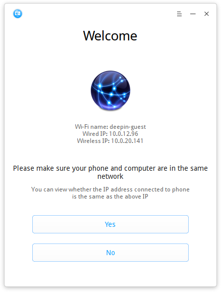
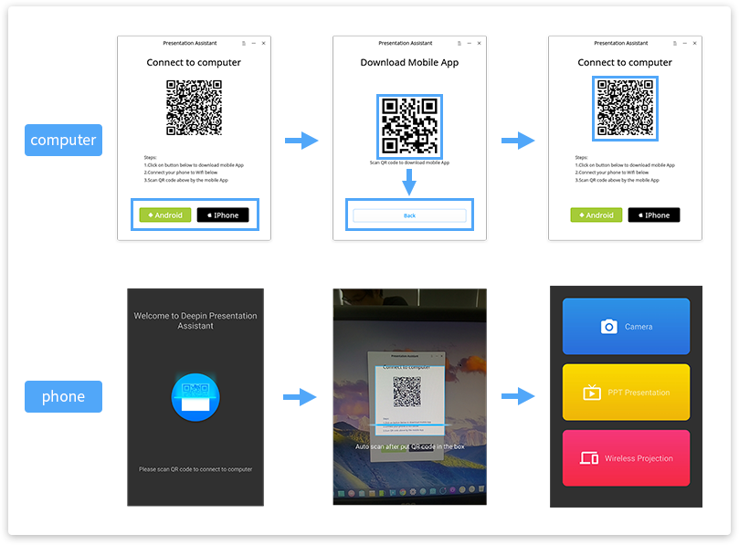
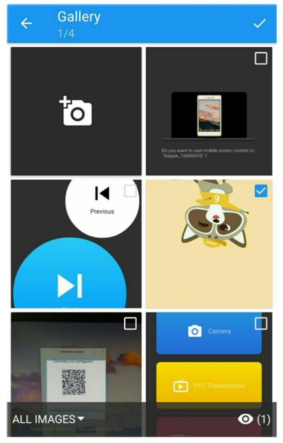
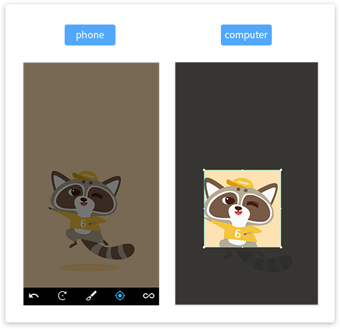
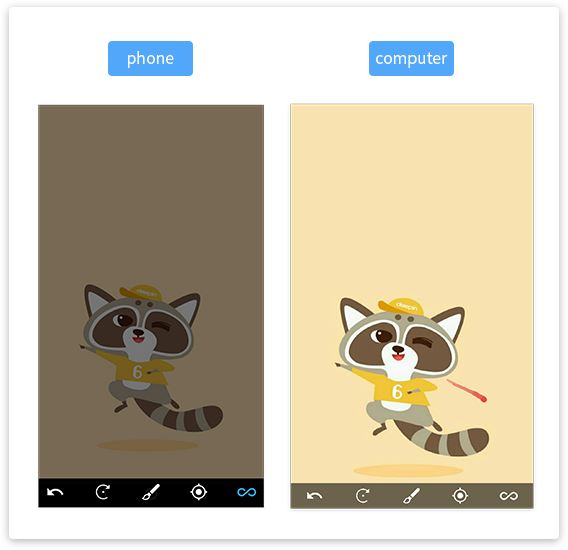
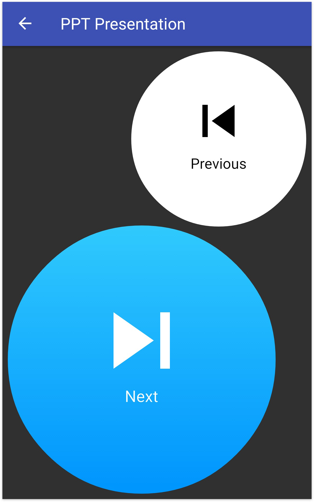
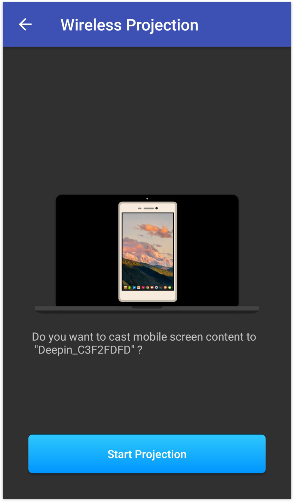
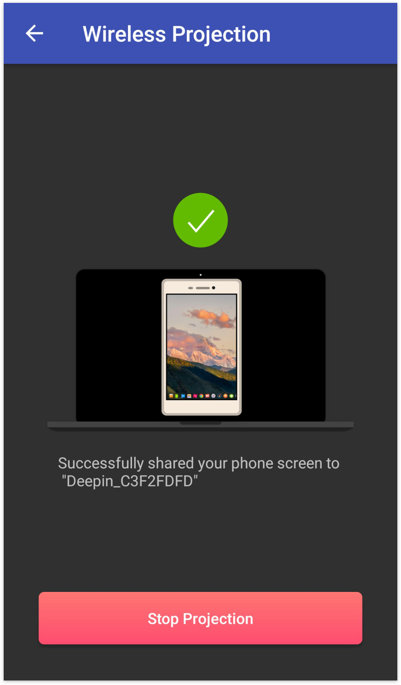
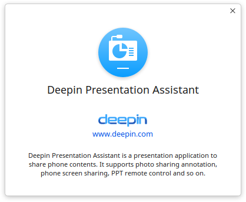
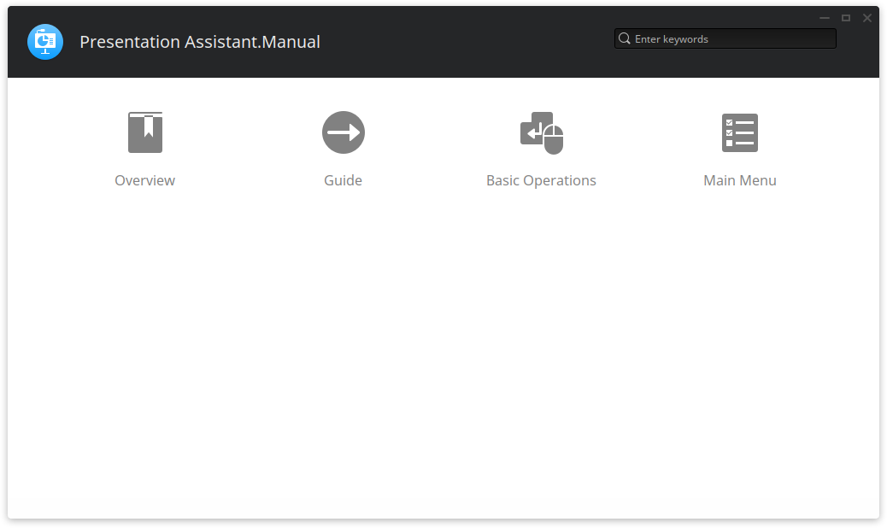

# Presentation Assistant|../common/presentation-assistant.svg|

## Overview|../common/icon_overview.svg|

Deepin Presentation Assistant is an application to share phone contents. It supports photo sharing annotation, phone screen sharing, PPT remote control and so on.

## Guide |../common/icon_guide.svg|

Deepin Link and Deepin Presentation Assistant should be in the same network. Wi-Fi is recommended, you can also connect to hotspot on computer or phone.

1. Click on  in Launcher to open Deepin Presentation Assistant.
2. Set your network according to needs:
   - Connect phone to the computer Wi-Fi, then click on **Yes**.
   - Click on **No**, connect phone to computer hotspot or connect computer to phone hotspot, then click on **Next** to continue.

> : Your computer should support wireless network if use phone or computer hotspot to connect Deepin Presentation Assistant. You also need to set hotspot connection manually if select **No**, then continue the next operations.

## Basic Operations|../common/icon_commoncoperat.svg|

### Installation and Connection 

2. Select your version and scan QR code to download and install.
3. Click on **Deepin Link** on your phone and scan QR code to connect to computer.
4. After connected, you can see the main interface.
5. Click on **Disconnect** to stop the connection.

> :Deepin Presentation Assistant will be preinstalled in editions after deepin 15.4. Please make sure your phone and computer are in the same LAN before connecting, or there will be a failure prompt and you can follow the steps to connect.

### Photo Sharing

You can share a photo from your phone albums or take a photo to share in computer.

1. Select **Camera** on Deepin Presentation Assistant interface.
2. Click on  to select a photo from albums or take a photo.
3. Click on  to select the photo to share in computer.
4. Then you can do some operations on it.

#### Rotating Tool

Click on  to rotate the photo, and every clicking will rotate 90° clockwise.

#### Annotating Tool

1. Click on  to enable the annotating tool.
2. Swipe finger on the phone screen to make annotations on the photo.
3. You can also select a color for the pen.

#### Focusing Tool

1. Click on  to focus an area on the photo.
2. Then swipe single finger to move the spotlight and pinch to zoom.
3. Click on  again to exit spotlight.

#### Tracking Tool

1. Click on  to enable the tracking tool.
2. Swipe single finger to move the track.
3. Your swiping track will be displayed in a short time.

### PPT Presentation
1. Open the PPT file in your computer.
2. Select **PPT Presentation** of Deepin Link interface on your phone.
3. The PPT will be demonstrated on the computer in fullscreen, you can click on  or  to page up or down.
4. Click the last page of the PPT to exit.

: You should firstly open the PPT in computer before enabling PPT Presentatiom function.

### Wireless Projection

1. Select **Wireless Projection** on Deepin Presntation Assistant.
2. Click on **Start Projection**.
3. When  is displayed, your phone screen has been projected to the computer.
4. You can start to show the phone contents.
5. Click on **Stop Projection** to end the projection.

## Main Menu|../common/icon_optionsetting.svg|

### About

You can click to view the version description.

1. On Deepin Presentation Assistant interface, click on .
2. Click on **About**.
3. View the version description.

### Help

You can click to view the manual, which will help you further know and use Deepin Presentation Assistant.

1. On Deepin Presentation Assistant interface, click on  .
2. Click on **Help**.
3. View the manual.

### Exit

You can click to exit Deepin Boot Maker.

1. On Deepin Presentation Assistant interface, click on .

2. Click on **Exit** to exit.
