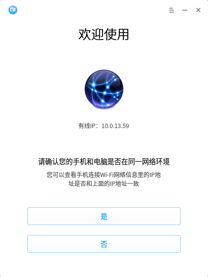
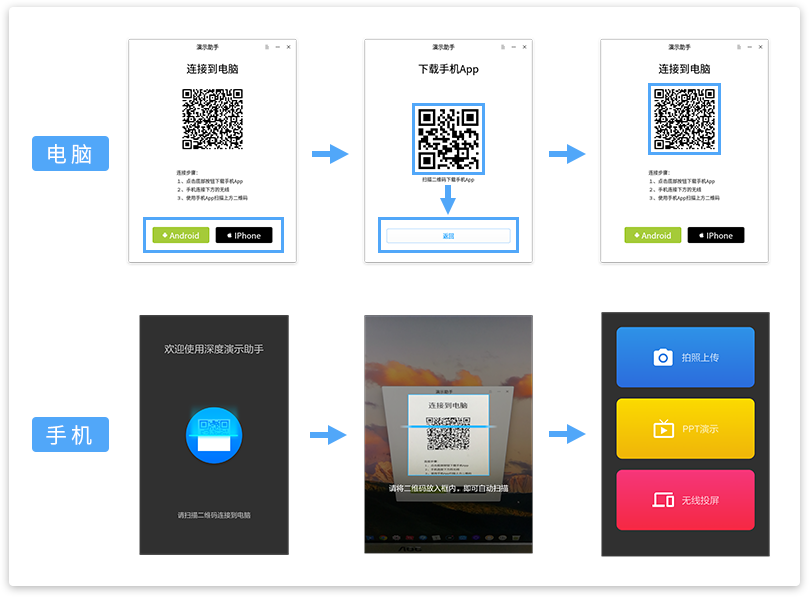
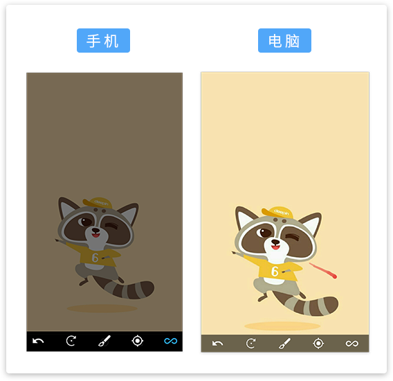
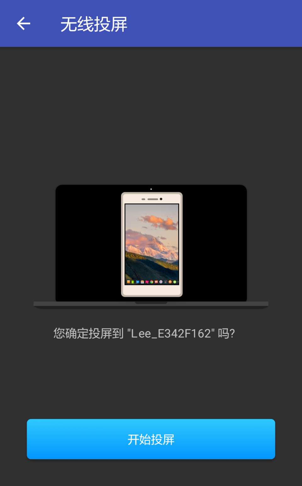

# 演示助手|../common/presentation-assistant.svg|

## 概述

演示助手是一款用于手机内容分享的演示工具。它支持照片分享功能，分享时可以对照片进行旋转、标记、聚焦等操作。甚至还可以直接将手机屏幕投射到电脑上，视频、游戏都轻松分享。另外还支持幻灯片远程控制，让您在演示幻灯片时无拘无束。

## 使用向导

演示助手的手机端和电脑端需要连接在同一个局域网中，默认推荐您使用WiFi网络连接,当然您也可以使用手机或电脑共享热点进行连接。

1. 在启动器中点击  打开演示助手电脑端。
2. 根据您的实际情况设置网络：
   - 将手机连接到电脑所在的WiFi网络，然后直接点击 **是**。
   - 点击 **否**，将手机连接到电脑的共享热点，或者将电脑连接到手机的共享热点，然后再选择对应的界面选项并点击 **确定**。

> ：使用手机或者电脑热点连接演示助手，需要电脑支持无线网络，选择 **否** 之后请自行完成热点连接操作再点击 **确定**。

## 操作介绍

### 安装和连接

1. 在启动器中点击  打开演示助手电脑端。
2. 根据[使用向导](使用向导)设置网络。
3. 根据您的手机型号选择手机端助手类型。
4. 在手机上安装演示助手手机端。
5. 在电脑上点击 **返回** ，使用手机端扫描电脑端的二维码。
6. 电脑端出现连接成功后，手机会跳转到演示助手功能界面。

### 照片分享
您可以使用手机拍摄照片或从手机相册中选择图片分享到电脑屏幕上。

1. 在演示助手功能界面，选择 **拍照上传**。
2. 点击  拍摄照片或者直接从相册中选择图片。
3. 点击左上角的   来确认分享，将照片分享到电脑屏幕上。
4. 您可以在手机上缩放或切换照片，也可以选择下方的工具来帮助您展示照片。

#### 旋转工具
在照片分享时，点击工具栏上的  来旋转当前照片，每点击一次照片会顺时针旋转90°。

#### 标记工具
1. 在照片分享时，点击工具栏上的  来标注图片。
2. 此时在手机屏幕上滑动手指，会留下画笔记号。
3. 您也可以选择记号笔的颜色，来切换标记颜色。

#### 聚焦工具
1. 在照片分享时，点击工具栏上的  照片上会出现聚光灯效果。
2. 您可以滑动调节聚焦位置或者缩放聚焦区域大小。
3. 再次点击  来退出聚焦模式。

#### 轨迹工具

在照片分享时，点击工具栏上的  ，照片上会短暂停留您的滑动轨迹。

### 幻灯片演示
您可以使用手机来远程控制电脑上的幻灯片。

1. 在电脑上打开您要演示的幻灯片。
2. 在演示助手功能界面，选择 **幻灯片演示**。
3. 此时电脑上的幻灯片会进入演示状态，您可以点击手机上的  、  来切换到上一页、下一页。
4. 幻灯片切换到最后一页后再次点击可以退出演示状态。

：需要先在电脑上打开幻灯片才能启动手机上的幻灯片演示功能。

### 无线投屏

您可以将手机屏幕投射到电脑上。

1. 在演示助手功能界面，选择 **无限投屏**。
2. 点击 **开始投屏**。
3. 当手机界面出现  提示时，您的手机屏幕已经投射到电脑上了。
4. 您可以返回手机主界面来展示手机内容。
5. 展示完成后回到演示助手，点击 **停止投屏** 来结束无线投屏。

## 主菜单

### 帮助

您可以点击帮助获取演示助手的帮助手册，通过帮助进一步让您了解和使用演示助手。

1. 在演示助手界面，点击 。
2. 点击 **帮助**。
3. 查看关于演示助手的帮助手册。

### 关于

您可以点击关于查看演示助手的版本介绍。

1. 在演示助手界面，点击 。
2. 点击 **关于**。
3. 查看关于演示助手的版本和介绍。

### 退出

您可以进入菜单栏点击退出演示助手。

1. 在演示助手界面，点击 。
2. 点击 **退出**。

