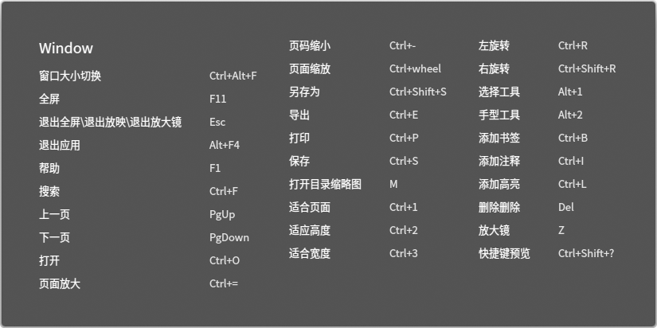

# 文档查看器|../common/deepin-reader.svg|

## 概述

文档查看器是一款功能强大、简单易用的文档查看软件。支持多种文档格式，让您能迅速查看文档。

## 使用入门

通过以下方式运行或关闭文档查看器，或者创建文档查看器的快捷方式。

### 运行文档查看器

1. 点击桌面底部的 ，进入启动器界面。
2. 上下滚动鼠标滚轮浏览或通过搜索，找到文档查看器 点击运行。
3. 右键单击 ，您可以：

 - 点击 **发送到桌面**，在桌面创建快捷方式。
 - 点击 **发送到任务栏**，将应用程序固定到任务栏。
 - 点击 **开机自动启动**，将应用程序添加到开机启动项，在电脑开机时自动运行该应用。

> ：您可以在控制中心中将文档查看器设置为默认的文档查看程序，具体操作请参考 [默认程序设置](dman:///dde#默认程序设置)。

### 关闭文档查看器

- 在文档查看器界面点击  ，退出文档查看器。
- 在任务栏右键单击 ，选择 **关闭所有** 来退出文档查看器。
- 在文档查看器界面点击  ，选择 **退出** 来退出文档查看器。

### 查看快捷键

在编辑器界面上，按下键盘上的  +  +  组合键来查看快捷键。您也可以在设置界面查看快捷键。熟练地使用快捷键，将大大提升您的操作效率。

## 基本功能

文档查看器具备基本的文件管理功能，对文件(夹)进行新建、复制、重命名、删除等操作都非常简单。

### 打开文件

您可采用以下方式打开文件

- 直接将文件拖拽到界面或其图标上。

- 右键单击文件，选择 **打开方式 > 选择默认程序**，在程序列表中选择文档查看器打开。

   > ：直接双击文件会使用默认程序打开文件，您可以右键单击文件，在 **属性 > 打开方式** 中选择一个默认程序，也可以到控制中心[默认程序设置](dman:///dde#默认程序设置)中去设置此类文件的全局默认程序。

- 在文档查看器界面，点击 > **打开文件**，选择文件。

- 在文档查看器界面，使用 + 组合键，选择文件打开。

文档查看器支持的文档格式有PDF、Postscript、 DJVU、 TIFF、 DVI、 DOC、ABW、PPS、PPT、ODT、ODS、ODP、ODG。

### 保存文件

对当前正在编辑、修改的文档进行保存。

- 使用 + 组合键保存当前文件。
- 点击 > **保存**，保存文件。
> ：您还可以使用 +  +  或点击 > **另存为**，另存文件。

### 打印文档

在编辑器中使用打印，需要您连接并配置好打印机。

1. 点击 > **打印**，也可以使用组合键 + 打开打印预览。
2. 在打印预览界面，您可以预览并设置打印页面。
3. 在打印预览界面，点击最右边的打印机图标，在弹出的窗口中选择打印机，并设置相关参数。
4. 点击 **打印** 即可将文件发送到打印机打印。

### 管理书签

- 添加书签
   - 右键单击文档查看器中的文件页，选择 **添加书签**，可以为当前正在浏览的页面添加书签。
   - 将鼠标移至浏览页面右上角显示，点击书签图标为当前页添加书签，书签图标变为填充色。
- 删除书签：
   - 右键单击书签，选择 **删除书签**来删除书签。
   - 鼠标移到书签位置, 点击有填充颜色的书签，可以取消(删除)该书签。

> ：鼠标移到书签位置附近才会显示书签图标。鼠标移出书签区域，书签图标消失。出现书签图标后，再点击，书签图标变成有填充颜色图标，当书签图标为有填充颜色时，不管鼠标有没有在书签附近，该图标一直显示。

### 管理注释

- 添加注释

   1.  使用选择工具选择文本内容后点击右键，选择 **添加注释**，弹出注释输入窗口。
   2.  将光标移动到注释窗口，点击鼠标左键，插入注释。
   3.  点击注释窗口 右上角的“ **x** "关闭按钮或其他空白区域，自动保存输入内容。

   ：

   * 如果注释窗口不输入内容，直接点击关闭，则添加注释不成功或该条注释自动删除。
   * 输入文本内容后，点击关闭图标，注释内容自动保存，并且收缩成小图标的形式。

- 复制注释
   -  在页面上，右键单击注释图标，在右键菜单中选择 **复制注释**，可以复制该条注释的全部内容。
   -  点击，在左侧选择注释目录，选定一个注释，右键单击选择 **复制**，可以复制这条注释的全部内容。

- 显示注释  
   1.  将鼠标悬停至注释图标上，在出现的浮框中显示部分注释内容。
   2.  点击注释图标，弹出注释窗口，可以查看、重新编辑注释内容。

- 删除注释：点击删除注释，可以删除 该条注释内容。
   - 右键点击注释图标，在右键菜单中选择删除注释，可以删除该条注释内容；
   - 当侧边栏显示，切换到注释，鼠标选中某条注释，在这条注释上右键菜单，出现复制和删除注释。点击删除注释，可以删除 这条注释，对应页面上的这条注释内容也删除；

### 管理标签

文档查看器的窗口支持多标签显示。

1. 在文档查看器界面上，右键单击文件夹。
2. 选择 **在新标签中打开**。
3. 当窗口有多个标签时，可以：

- 点击标签栏右侧的 + 继续添加标签。
- 点击标签上的 × 关闭标签。
- 将鼠标置于标签栏上，点击鼠标中键关闭标签。

> ：文档查看器窗口只有一个标签时，标签栏是隐藏的，您还可以使用快捷键 +  来新建标签。

## 常用操作

文档查看器具备很多特色功能，这些功能都是为了让文件管理更加简单、高效。

### 在文档中移动

您可以使用下列办法之一在文档的每页中移动：

- 使用鼠标滚轮向上或向下滚屏。
- 使用文档窗口的滚动条，向上或向下拖动滚动条。
- 使用您键盘的向上和向下键。
- 使用抓手工具，用鼠标拖挪页面，就像您正在抓住页面那样。

### 快速翻页

您能够使用下列方法之一在文档的页面中移动：

- 右键单击，在快捷菜单中选择  **前一页** 或 **下一页** 。
- 按下键盘上的    或  键。
- 转至指定页面：
  - 输入页码数并按回车键。
  - 如果您需要回到前面访问的页面，点击 或 。
  - 如果您想到文档的开头或结尾：右键单击，在快捷菜单中选择 **第一页** 或 **最后一页**。

### 切换目录

通过缩略图可以进行文档缩略图目录、书签目录、注释目录的切换。手动拖拽目录边框，缩略图跟随可拖拽宽度大小的变化而变化。

### 字号调整 

调整视图，选择在小A和大A之间进行滑动，可以对页面文字（页面整体）进行缩小、放大调整，向大A滑动，页面文字放大，向小A滑动，页面文字缩小。

### 放大和缩小

使用下列方法之一放大或缩小页面：

- 按下键盘上的 +  或 + 。
- 按下键盘上的 键的同时按住鼠标中键向上或向下滑动。
- 在文档查看器界面，点击> **放大** 或 > **缩小** 。

### 设置高亮

1. 在文档查看器界面，点击  ，选择 。

2. 选中文本，点击右键，出现右键菜单，选择高亮，此时有不同的高亮颜色可供选择。
   > ：如果文本还没有被高亮显示，则 **移除高亮** 显示菜单置灰。

3. 选定一种颜色，被选中的文本内容将以该颜色为底纹高亮显示。

4. 选中已经高亮显示的文本，点击 **移除高亮**，可以删除文字高亮显示效果。

：软件记住用户上次选择的高亮显示颜色，当下次用户再进行文本高亮显示操作时，默认使用用户上次选择的高亮颜色。用户可以根据喜好切换可供选择的高亮颜色。

### 调整页面视图

在菜单栏点击，在子菜单中您可以：

- 点击 双页视图，进入双页显示模式。
- 点击  自适应高度，页面高度在视窗内全部显示。
- 点击  自适应宽度，页面宽度在视窗内全部显示。 

### 旋转

1. 在文档查看器，选择已打开的文件。
2. 在菜单栏点击，在子菜单中选择 **左旋转** 或 **右旋转**，页面全部同时向左或向右旋转90°。

### 放大镜

可以使用放大镜功能，点击放大镜，鼠标移到相应的区域，该区域内容放大。

如当前已经使用放大镜功能，鼠标移动到顶部工具栏再点击一下放大镜图标可以取消放大镜功能，或者按键盘上的Esc键也可以取消放大镜功能。

### 搜索文件

1. 浏览文档时，点击鼠标右键，出现右键菜单项。
2. 点击 **搜索**，出现搜索功能。 
3. 在输入框中输入关键词进行搜索。
4. 点击侧边栏上的一条搜索结果，跳转到对应的页面，该页面的搜索结果高亮显示。

：只有在PDF文档是可搜索时。当有些PDF文档的文本编码成图片存储在文档中时是不可搜索的。

## 主菜单

在主菜单中，您可以保存、打印、搜索、切换窗口主题、查看帮助手册，了解文档查看器的更多信息。

### 保存

1. 在文档查看器界面，点击。
2. 点击 **保存**，对当前正在编辑、修改的文档进行保存。

### 另存为
1. 在文档查看器界面，点击。
2. 点击 另存为，弹出文件选择器输入名字，可将文件保存为新的文件。

### 打开所在文件夹
1. 在文档查看器界面，点击。
2. 点击 **打开所在目录**，在文件管理器中显示，和其他应用保持一致。

### 属性
1. 在文档查看器界面，点击。
2. 点击 **属性**，展示文档的属性相关参数信息。

### 搜索
1. 在文档查看器界面，点击。
2. 点击 **搜索**，出现搜索功能。

### 全屏
1. 在文档查看器界面，点击。
2. 点击 **全屏**，文档全屏幕展示。

### 放映
1. 在文档查看器界面，点击。
2. 点击 **放映**，文档全屏且以幻灯片的形式进行播放。

### 主题

窗口主题包含浅色主题、深色主题和系统主题，其中系统主题为默认设置。

1. 在文档查看器界面，点击。
2. 点击 **主题**，选择一个主题颜色。

### 帮助

查看帮助手册，通过帮助进一步让您了解和使用文档查看器。

1. 在文档查看器界面，点击 。
2. 点击 **帮助**。
3. 查看关于文档查看器的帮助手册。

### 关于

1. 在文档查看器界面，点击 。
2. 点击 **关于**。
3. 查看关于文档查看器的版本和介绍。

### 退出

1. 在文档查看器界面，点击 。
2. 点击 **退出**。

