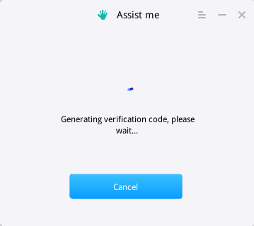
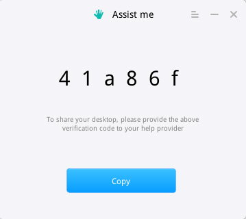

# Asistencia remota|../common/deepin-remote-assistance.svg|

## Vistazo
La asistencia remota se utiliza para ayudar a los usuarios y técnicos a resolver todo tipo de problemas y buscar ayuda cuando se detectan problemas. Con Asistencia remota, el trabajo remoto, la capacitación y la enseñanza interactiva se pueden realizar fácilmente.

## Asistirme

Si encontró un problema y necesita ayuda en línea, al iniciar Asistencia remota, puede compartir su escritorio con otro usuario para ayudarlo de manera remota.

1. Clic en  (por defecto en la parte inferior del escritorio). O también mueva el puntero del ratón en la parte superior izquierda de la pantalla (como esquina de acceso rápido) para entrar al Lanzador.
2. Localice y haga clic en .
3. En la interfaz de la Asistencia remota, clic en **Asistirme**.
4. El sistema generará al azar un código de verificación de 6 dígitos.
5. Clic en **Copiar**, después envie el código de verificación a otros para recibir asistencia.

> : "Conectando, por favor espere..." será mostrada en la interfaz, éste se ocultará automáticamente al muelle si se conecta con éxito.

## Asistir a otros

Si otro usuario solicita su asistencia, puede acceder al escritorio del otro usuario ingresando el código de verificación obtenido del usuario.

1. Obtenga el código de verificación del otro usuario.
2. Ingrese a la interfaz del Lanzador, clic en **Asistencia remota**.
3. En la interfaz de la Asistencia remota, clic en **Asistir a otros**, después ingrese manualmente o pegue el código de verificación.
4. Clic en **Conectar**, la aplicación se conectará automáticamente al escritorio de otros.

> : Si no usó el código de verificación oportunamente, o no puede conectarse por el código de verificación, obtenga uno nuevo.

## Establer conexión

### Ajustes del escritorio remoto

Después de ingresar el código de verificación, el sistema accederá al escritorio remoto, puede ejecutar las operaciones de control en el escritorio. Mientras tanto, puede configurar el efecto de visualización del escritorio remoto.

Después de conectar con éxito, clic en el menú expandible **Preferencias**, puede:
- Seleccionar **Optimizar calidad** para mejrorar la calidad de la resolución de pantalla del escritorio remoto.
- Seleccionar **Optimizar velocidad** para mejorar el rendimiento del asistente remoto.
- Seleccionar **Balance**, el escritorio remoto se mostrará en el estado de balance.
- Seleccionar **Pantalla completa** para cambiar al modo de pantalla completa y hacer fácil realizar sus operaciones remotas.

### Desconectar escritorio remoto

Cuando se completan las operaciones de control remoto, puede desconectarse con un botón en el escritorio remoto.

1. Se mostrará un botón de desconexión en el escritorio del otro usuario.
2. Clic en **Desconectar**, el sistema notificará si está seguro que desea desconectar el escritorio remoto.
3. Clic en **Confirmar** para finalizar la operación de asistencia remota.

> : También puede hacer clic en **Desconectar** la interfaz para "Asistirme" y cerrar la operación.

## Ajustes
### Acerca de
Puede hacer clic para ver la descripción de la versión.

1. En la la interfaz de Asistencia remota, clic en .
2. Seleccione **Acerca de**.
3. Observe la descripción de la versión.

### Ayuda
Puede hacer un clic para ver el manual, que le ayudará a conocer y usar la Asitencia remota.

1. En la la interfaz de Asistencia remota, clic en  .
2. Clic en **Ayuda**.
3. Observe el manual.

### Salir
Puede hacer clic para salir del Creador de arranque de Deepin.

1. En la la interfaz de Asistencia remota, clic en .
2. Clic en **Salir** para cerrar.
