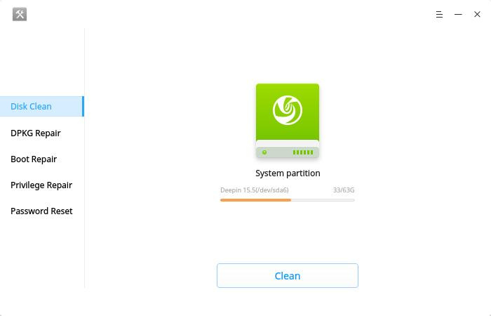
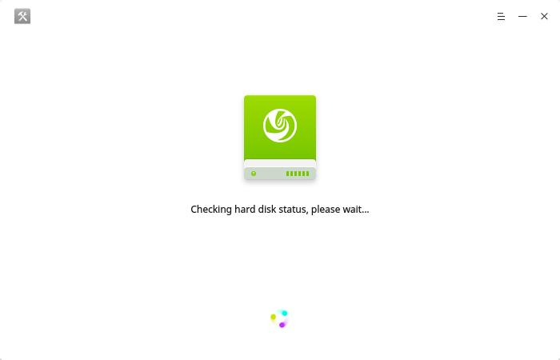
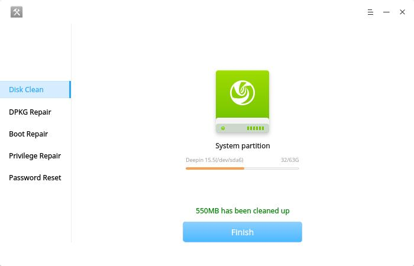
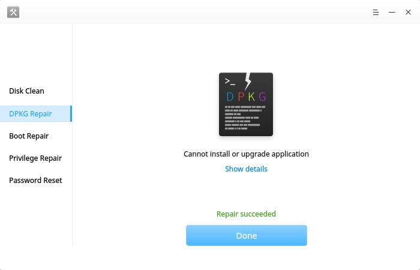
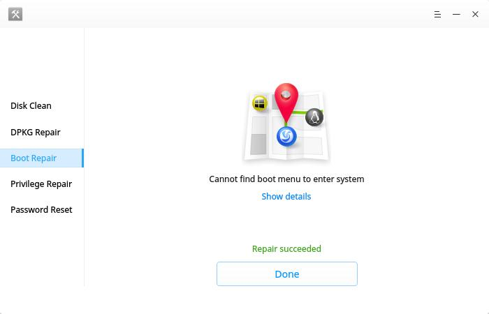
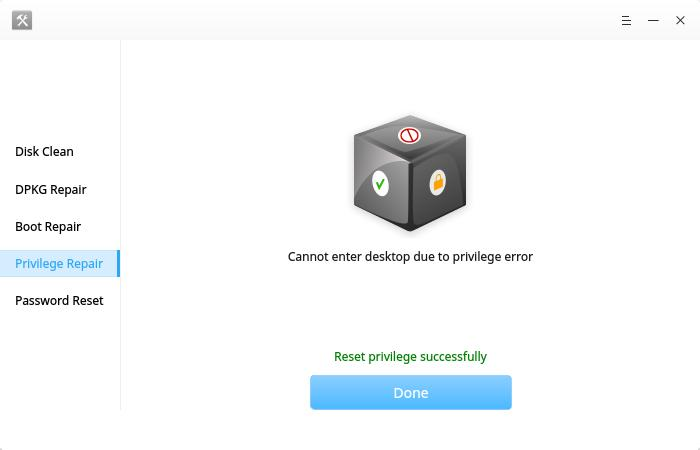
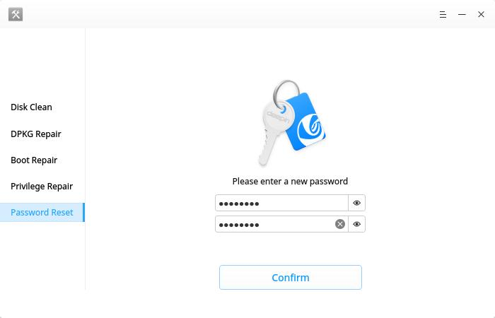

# Deepin Repair|../common/deepin-repair.svg|

## Vistazo

Deepin Repair (Reparación de Deepin) es una herramienta para ayudar a los usuarios a solucionar rápidamente algunos problemas en Deepin, incluida la detección de discos duros, la limpieza de datos, la reparación de DPKG, la reparación de arranque, la reparación de privilegios de administrador, el restablecimiento de contraseñas, etc.

## Operaciones básicas
En caso que no consiga usar el menú de arranque, tiene problemas con los privilegios de administrador o se le olvidó la contraseña de inicio de sesión, es posible que no pueda ingresar a al escritorio de Deepin. Entonces, debe ingresar al modo Recovery para ejecutar Deepin Repair.

### Detectar y reparar disco

Inicie **Deepin Repair**, después introduzca la contraseña de la cuenta y automáticamente dectectará su unidad de disco. Si encontró un error, aparecerá un aviso para repararlo. Si no lo encuentra, puede seguir los siguientes pasos.

1. Si solicita reparar el disco duro, clic en **Reparar** para iniciar.

2. Cuando finalice, clic en **Reiniciar ahora** para que tenga efecto la reparación de disco.

### Limpiar disco

Limpiando regularmente su PC, consigue liberar espacio y mejorar el funcionamiento en el disco.

1. Clic en **Limpiar disco** en la interfaz.
2. Clic en **Limpiar** para borrar archivos innecesarios en el disco.
3. Clic en **Aceptar** para finalizar la limpieza en disco.

### Reparar DPKG

Si no puede instalar aplicaciones o actualizar el sistema operativo, el software DPKG se habría corrompido. Entonces necesitas reparar el DPKG.

1. Clic en **DPKG Repair** en la interfaz.
2. Clic en **Reparar** para iniciar, clic en **Mostrar detalles** para ver el proceso de reparación.
3. Clic en **Aceptar** para finalizar la reparación de DPKG.

: DPKG es un software crítico del sistema para gestionar paquetes en Debian y sus derivados. Se utiliza para instalar, eliminar y proporcionar información sobre paquetes .deb. Cuando hay algunos problemas con el  DPKG, es posible que no pueda instalar, actualizar o desinstalar aplicaciones; por eso, puede usar Deepin Repair para repararlo.
### Repair boot menu

Si no puede encontrar el menú de arranque para entrar al sistema operativo, puede ingresar al modo Recovery e iniciar **Reparar arranque** para corregir el menú de arranque.

1. Clic en **Reparar arranque** en la interfaz.
2. Clic en **Reparar** para iniciar, clic en **Mostrar detalles** para ver el proceso de reparación.
3. Clic en **Aceptar** para finalizar la reparación de arranque.

### Reparar privilegios

Si no puede entrar al escritorio debido a un error de credenciales, puede ingresar al modo Recovery e iniciar **Reparar privilegios** para corregir los privilegios.

1. Clic en **Reparar permisos** en la interfaz.
2. Clic en **Reparar** para iniciar.
3. Clic en **Aceptar** para finalizar la reparación de privilegios.

### Restablecer contrseña de ingreso

If you forgot account password and cannot login, you can go into Live system and run **Restablecer contraseña** to reset login password.

1. Clic en **Restablecer contraseña** en la interfaz.
2. Clic en **Restablecer contraseña**, ingrese la nueva contraseña y reescríbela.
3. Clic en **Confirmar** para cambiar la contraseña.
4. Clic en **Aceptar** para finalizar el restablecimiento de la contraseña.

## Main Menu

En **Menú principal**, el usuario puede ver el manual, obtener información de la aplicación y salir. En la interfaz de Deepin Repair, clic en  para ingresar al **Menú principal**.

### Ayuda

En el **Menú principal**, seleccione **Ayuda** para ver el manual de Deepin Repair.

### Acerca de

En el **Menú principal**, seleccione **Acerca de** para verificar la versión y presentación de Deepin Repair.

### Salir

En el **Menú principal**, seleccione **Salir** para salir de Deepin Repair.
