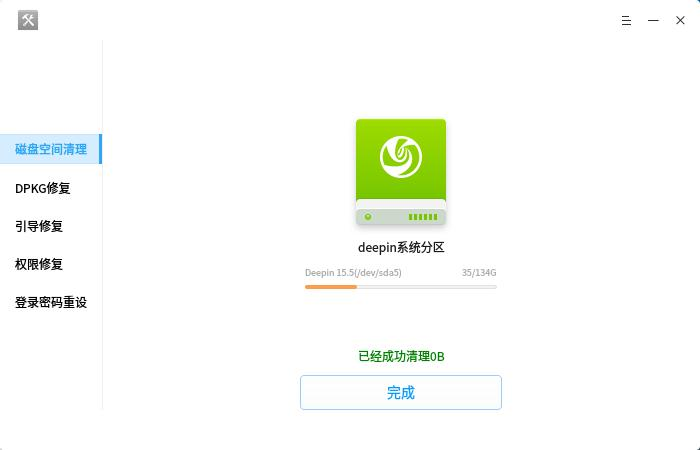

# 系统修复工具|../common/deepin-repair.svg|

## 概述

深度系统修复工具是一款帮助用户快速修复深度操作系统中某些问题的工具，其中包含硬盘检测、磁盘空间清理、引导修复、权限修复、登录密码重设等。

## 基本操作

当您的系统存在引导问题、权限问题或忘记密码时，可能无法登录当前系统桌面，此时您需要先进入Live系统来运行深度系统修复工具，并进行相关的修复操作。

### 硬盘检测和修复

当您打开深度系统修复工具后，提示需要授权打开，然后工具自动检测当前硬盘的状态。如果检测到磁盘损坏，请根据界面提示进行修复，如果硬盘正常，则跳过修复操作。

1. 当界面提示硬盘需要修复，点击　**修复**。
2. 等待修复工具进行修复过程。
3. 修复成功后点击　**重新启动**，重启电脑来完成修复操作。

### 磁盘空间清理

当系统使用一段时间后，临时文件、日志文件等会占用系统的磁盘空间，可以对磁盘空间进行清理。

1. 在界面上点击 **磁盘空间清理**。
2. 点击 **清理**，等待工具清理并提示信息。
3. 点击 **完成**。

### DPKG修复

当用户在安装或升级过程中，主动或意外中断了操作导致DPKG出现问题，可以通过DPKG修复进行处理。

1. 在界面上点击 **DPKG修复**。
2. 点击 **修复**，等待修复处理，可以点击显示详细过程进行查看。
3. 点击 **完成**。 

> :DPKG是一种系统底层命令行工具，主要用来安装、删除、构建和管理软件包，出现DPKG问题时您可能无法安装或卸载应用，此时您可以使用深度系统修复工具来进行DPKG修复。

### 引导修复

当用户启动系统没有找到引导项时，可以通过Live系统运行深度系统修复工具，来进引导修复操作。

1. 在界面上点击 **引导修复**。
2. 点击 **修复**，等待修复处理，可以点击显示详细过程进行查看。
3. 点击 **完成**。 

### 权限修复

当用户系统文件权限损坏后，不能进入桌面环境，可以通过Live系统运行深度系统修复工具，来进行修复权限操作。

1. 在界面上点击 **权限修复**。
2. 点击 **修复** ，等待修复处理并提示信息。
3. 点击 **完成**。 

### 登录密码重设

当用户忘记登录密码时，可以通过Live系统运行深度系统修复工具，来重置系统的登录密码。

1. 在界面上点击 **重置密码**。
2. 输入新的密码和重复密码确认，点击 **确定**。
3. 提示重设成功，点击 **完成**。

## 主菜单

### 帮助

您可以点击帮助获取深度系统修复工具的帮助手册，通过帮助进一步让您了解和使用深度系统修复工具。

1. 在深度系统修复工具界面，点击 。
2. 点击 **帮助**。
3. 查看关于深度系统修复工具的帮助手册。

### 关于

您可以点击关于查看深度系统修复工具的版本介绍。

1. 在深度系统修复工具界面，点击 。
2. 点击 **关于**。
3. 查看关于深度系统修复工具的版本和介绍。

### 退出

您可以进入菜单栏点击退出深度系统修复工具。

1. 在深度系统修复工具界面，点击  。
2. 点击 **退出**。
