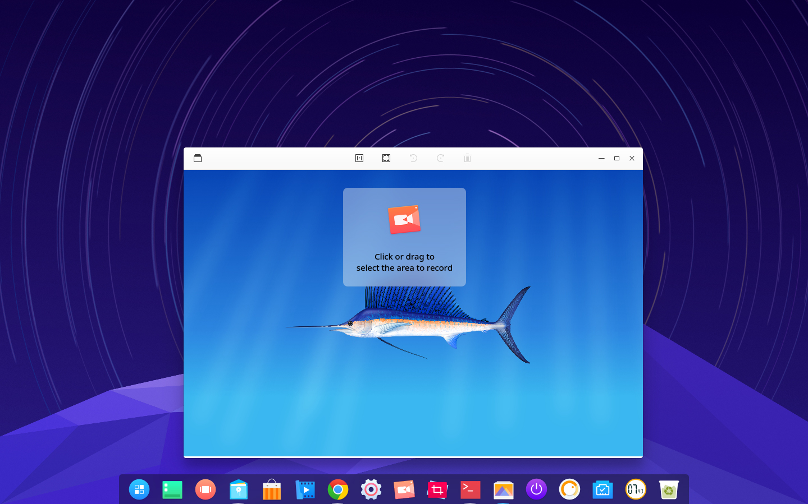
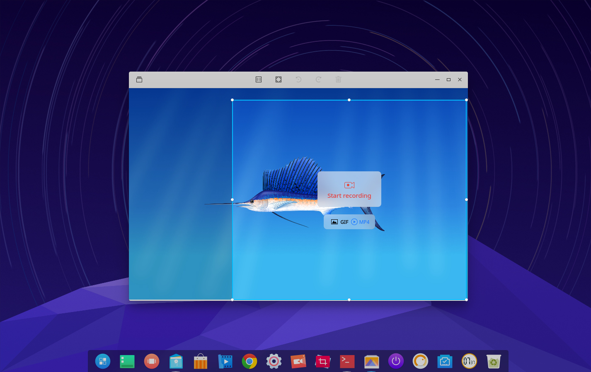

# Deepin Screen Recorder|../common/deepin-screen-recorder.svg|

## Vistazo

Deepin Screen Recorder es una herramienta de grabación de pantalla. Permite guardar la pantalla capturada en GIF y mp4. La ventana de grabación se puede establecer automáticamente, y también puede seleccionar manualmente el área a capturar. Para salvar las grabaciones al escritorio, solo controla el inicio y el final.

## Guía

Puede run and colse Deepin Screen Recorder by one of the following operations, and can also create shortcut for it.

### Iniciar Deepin Screen Recorder

1. Clic en  en el Muelle o mueva el puntero del ratón a la esquina superior izquierda de la pantalla para ingresar al lanzador.
2. Encuentre  para hacer clic, puede hacer:
  - Clic en **Envíar al escritorio** para crear un acceso directo al escritorio.
  - Clic en **Enviar al muelle** para fijar la aplicación al Muelle.
  - Clic en **Añadir al arranque** para añadir la aplicación en el arranque, esta se iniciará automáticamente cuando la computadora inicie.

> ：Si Deepin Screen Recorder ha sido anclado en el Muelle por defecto, puede también hacer clic en  para iniciar.

### Cerrar Deepin Screen Recorder

Deepin Screen Recorder saldrá después de terminar la grabación.

## Operaciones básicas

### Grabación en vídeo

Puede personalizar el área de grabación y seleccionar el formato de grabación antes de realizar la captura.

1. Seleccione el área de grabación después de iniciar Deepin Screen Recorder.
2. Seleccione un formato de grabación.
3. Clic en **Iniciar grabación** para iniciar.
4. Clic en el icono de Deepin Screen Recorder en el Muelle para finalizar.

> ：El video se guardará automáticamente en el escritorio después de terminar.

### Seleccionar el área de grabación

Después de ejecutar Deepin Screen Recorder, puede seleccionar el área de grabación; puede ser la pantalla completa, la ventana asignada automáticamente o una área personalizada.

- Pantalla completa y ventana de identificación automática: al seleccionar un área de grabación, identificará automáticamente la ventana de escritorio siguiendo el movimiento del mouse, luego haga clic para seleccionar la ventana actual para la grabación. Dado que, el escritorio también es una ventana, cuando el puntero del mouse está en el escritorio, se identificará como captura a pantalla completa.
- Área personalizada: Al establecer un área de grabación, puede usar el ratón para seleccionar cualquier área y luego ajustar la ubicación y el tamaño del borde del rectángulo, finalmente haga clic para seleccionar la ventana actual para la grabación.

### Seleccionar formato de grabación

Los vídeos de Deepin Screen Recorder son grabados en GIF o MP4. Después de seleccionar el área de grabación, puede definir la grabación con los botones GIF y MP4.

### Ver ayuda

Presione  para ver el manual después de iniciar Deepin Screen Recorder.
