# Captura de pantalla Deepin|../common/deepin-screenshot.svg|

## Vistazo

Captura de pantalla Deepin es una refinada capturadora de pantalla desarrollada por Wuhan Deepin Technology Co., Ltd. Esta se destaca por identificar inteligentemente las ventanas, temporizar capturas, seleccionar de color y añadir efectos de ofuscado y mosaico. Ya sea para trabajar o divertirse, puede tomar una captura de pantalla en cada momento maravilloso de su vida con Captura de pantalla Deepin.

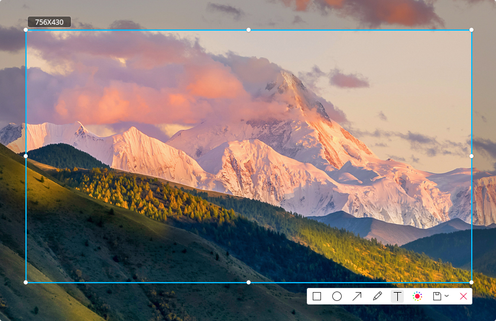

## Guía

Puede iniciar o salir de Captura de pantalla Deepin mediante los siguientes pasos. Se puede crear un acceso directo.

### Eniciar Captura de pantalla Deepin
1. Haga clic en  e el muelle para entrar al lanzador.
2. Encuentre  para hacer clic, puede:
  - Clic en **Envíar al escritorio** para crear un acceso directo al escritorio.
  - Clic en **Enviar al muelle** para fijar la aplicación al Muelle.
  - Clic en **Añadir al arranque** para añadir la aplicación en el arranque, esta se iniciará automáticamente cuando la computadora inicie.

> : Presione ++ en el teclado para rápidamente iniciar Captura de pantalla Deepin, y puede tomar una captura de pantalla desde el submenú.

### Captura temporizada

Las capturas temporizadas reservan 5 segundos para prepararse, lo que le ayuda a capturar los momentos más precisos.

Puede realizar capturas temporizadas de las siguientes formas:

1. Presione +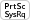 en el teclado.
2. En la esquina superior derecha de la pantalla, verá el mensaje "Captura de pantalla Deepin comenzará después de 5 segundos".
3. Automáticamente entrará al modo de captura de pantalla 5 segundos después, y luego toda la pantalla se oscurecerá.

> : Si tiene anclada la Captura de pantalla Deepin en el Muelle, clic derecho en  en el Muelle, y luego seleccione **Captura temporizada** para prolongar la duración de la captura.

### Salir de Captura de pantalla Deepin

En el modo de captura de pantalla, puede salir de la Captura de pantalla Deepin de la siguiente manera:

* Presione  en el teclado.

* Clic derecho y seleccione **Salir**.

* Clic en  para salir directamente.

> : Aparecerá un aviso de confirmación si presiona  después de editar.

## Atajos de teclado

Le ahorrará tiempo y esmero para operar con accesos directos.

1. En el modo de captura de pantalla, presione la combinación +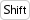+ para abrir la interfaz para previsualizar atajos de teclado.
2. En la interfaz para previsualizar atajos de teclado, puede ver todas las teclas de acceso rápido.

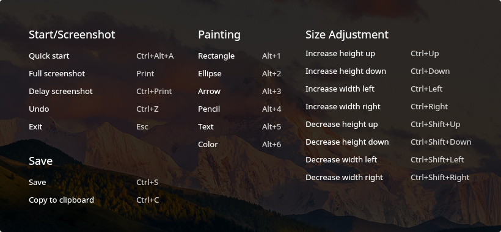

<table class="block2">

    <caption>Iniciar/Capturar</caption>

    <tbody>

        <tr>

            <td>Inicio rápido</td>

            <td>Ctrl+Alt+A</td>

        </tr>

        <tr>

            <td>Captura completa</td>

            <td>Print</td>

        </tr>

        <tr>

            <td>Captura temporizada</td>

            <td>Ctrl+Print</td>

        </tr>

        <tr>

            <td>Deshacer</td>

            <td>Ctrl+Z</td>

        </tr>

        <tr>

            <td>Salir</td>

            <td>Esc</td>

        </tr>

        <tr>

            <td>&nbsp;</td>

            <td>&nbsp;</td>

        </tr>

    </tbody>

</table>

<table class="block2">

    <caption>Dibujado</caption>

    <tbody>

        <tr>

            <td>Rectángulo</td>

            <td>Alt+1</td>

        </tr>

        <tr>

            <td>Eclipse</td>

            <td>Alt+2</td>

        </tr>

        <tr>

            <td>Flecha</td>

            <td>Alt+3</td>

        </tr>

        <tr>

            <td>Lápiz</td>

            <td>Alt+4</td>

        </tr>

        <tr>

            <td>Texto</td>

            <td>Alt+5</td>

        </tr>

        <tr>

            <td>Color</td>

            <td>Alt+6</td>

        </tr>

    </tbody>

</table>

<table class="block2">

    <caption>Ajustar tamaño</caption>

    <tbody>

        <tr>

            <td>Incrementar lado superior</td>

            <td>Ctrl+Up</td>

        </tr>

        <tr>

            <td>Incrementar lado inferior</td>

            <td>Ctrl+Down</td>

        </tr>

        <tr>

            <td>Incrementar lado izquierdo</td>

            <td>Ctrl+Left</td>

        </tr>

        <tr>

            <td>Incrementar lado derecho</td>

            <td>Ctrl+Right</td>

        </tr>

        <tr>

            <td>Reducir lado superior</td>

            <td>Ctrl+Shift+Up</td>

        </tr>

        <tr>

          <td>Reducir lado inferior</td>

          <td>Ctrl+Shift+Down</td>

        </tr>

        <tr>

            <td>Reducir lado izquierdo</td>

            <td>Ctrl+Shift+Left</td>

        </tr>

        <tr>

          <td>Reducir lado derecho</td>

          <td>Ctrl+Shift+Right</td>

        </tr>

    </tbody>

</table>

<table class="block2">

    <caption>Guardado</caption>

    <tbody>

        <tr>

            <td>Guardar</td>

            <td>Ctrl+S</td>

        </tr>

        <tr>

            <td>Copiar al portapapeles</td>

            <td>Ctrl+C</td>

        </tr>

        <tr>

            <td>&nbsp;</td>

            <td>&nbsp;</td>

        </tr>

        <tr>

          <td>&nbsp;</td>

          <td>&nbsp;</td>

        </tr>

        <tr>

            <td>&nbsp;</td>

            <td>&nbsp;</td>

        </tr>

        <tr>

          <td>&nbsp;</td>

          <td>&nbsp;</td>

        </tr>

        <tr>

            <td>&nbsp;</td>

            <td>&nbsp;</td>

        </tr>

        <tr>

          <td>&nbsp;</td>

          <td>&nbsp;</td>

        </tr>

    </tbody>

</table>

## Seleccionar área de captura

Actualmente hay tres tipos de áreas que se capturan comúnmente: la pantalla completa, la ventana del programa y el área personalizada. Cuando seleccione el área relevante a tomar, aparecerá un borde azul alrededor del área de captura de pantalla y se mostrará el resaltado.

> : Cuando la computadora está mostrando en varios monitores, multipantalla, puede usar la Captura de pantalla Deepin para tomar varias áreas en diferentes pantallas.

### Selección en pantalla completa

La selección de pantalla completa indica reconocer toda la parte visible en la pantalla.

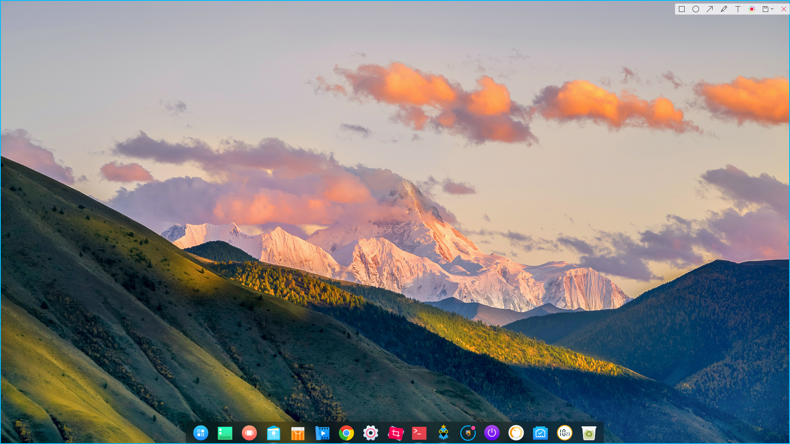

Puede seleccionar pantalla completa por los siguientes pasos:

1. Presione ++ en el teclado para entrar el modo de captura de pantalla.
2. Mueva el puntero del ratón en el escritorio y la Captura de pantalla Deepin seleccionará la pantalla completa automáticamente. El tamaño de el área actual de la captura de pantalla será mostrada en la esquina superior izquierda.
3. Clic en el escritorio y la barra de herramientas aparecerá en la esquina superior derecha.
4. Si desea salir de la captura, haga clic en  en la barra de herramientas o clic derecho y seleccione **Salir**.

> : Puede también hacer clic derecho en  en el Muelle para seleccionar **Captura completa** o presione  en el teclado.

### Selección de ventanas de aplicaciones

Selección de ventanas de programas hace reconocer la ventana de la aplicación actual automáticamente.

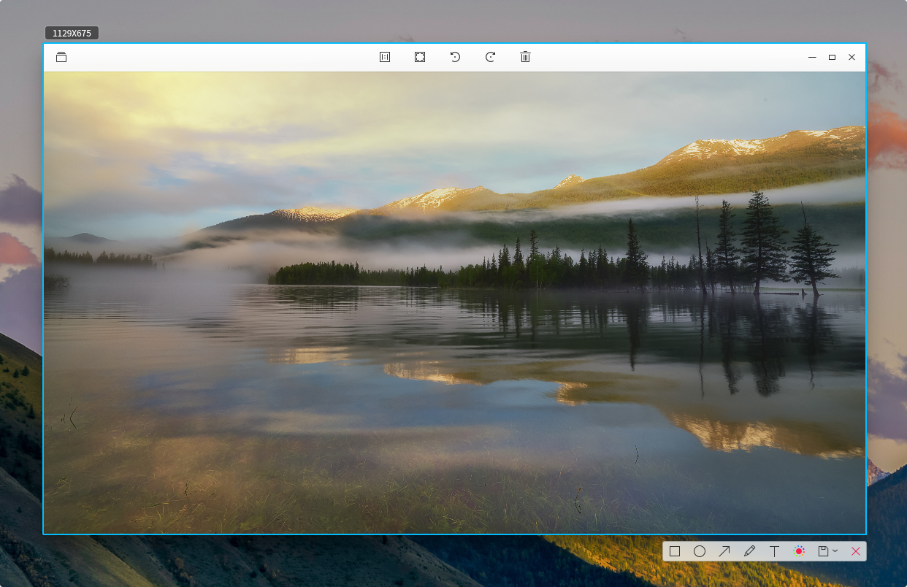

Puede seleccionar la ventana de la aplicación siguiendo estos pasos:

1. Presione ++ en el teclado para entrar el modo de captura de pantalla.
2. Mueva el puntero del ratón sobre la ventana de la aplicación en ejecución. La Captura de pantalla Deepin seleccionará la ventana automáticamente y muestra el tamaño de la actual area capturada en la esquina superior izquierda.
3. Clic en la ventana y la barra de herramientas aparecerá en la esquina inferior derecha.
4. Si desea salir de la captura, haga clic en  en la barra de herramientas o clic derecho para seleccionar **Salir**.

### Área personalizada

El área personalizada hace seleccionar libremente la zona donde será capturada con arrastrar el ratón.

Puede personalizar el área siguiendo estos pasos:

1. Presione ++ en el teclado para entrar el modo de captura de pantalla.
2. Presione y mantenga presionado el botón principal del ratón, y suéltelo para seleccionar el área de la captura de pantalla. El tamaño de el área actual de la captura de pantalla será mostrada al instante en la esquina superior izquierda.
3. Suelta el botón principal del ratón para finalizar la toma de la pantalla, y entonces la barra de herramientas aparecerá en la esquina inferior derecha de el área de la captura de pantalla.
4. Si desea salir de la captura, haga clic en  en la barra de herramientas o clic derecho y seleccione **Salir**.

## Ajustar el área de captura de pantalla

Puede refinar los ajustes al área de la captura de pantalla, por ejemplo, expandir o reducir el enfoque, mover la ubicación y otros más.

### Expandir o reducir el área de captura de pantalla

Posicione el puntero del ratón sobre the blue border de el área de la captura de pantalla, luego el puntero del ratón será como . Puede:

* Presionar y mantener presionado el botón principal del ratón, y soltarlo para expandir o reducir el área de la captura de pantalla.

* Presione + o  en el teclado para cambiar la extensión del área de captura hacia los lados superiores e inferiores, y + o  en el teclado para expandirlo hacia los costados.

### Mover captura de pantalla

Coloque el puntero del mouse sobre el área de la captura de pantalla, luego el puntero del mouse se convertirá en . Puede:

* Presionar y mantener presionado el botón principal del ratón, y soltarlo para mover el área de la captura de pantalla.

* Presione  o  en el teclado para mover el área de la captura hacia arriba y abajo, y pulse  o  en el teclado para mover el área hacia los costados.

## Editar captura de pantalla

La edición de imágenes se destaca en Captura de pantalla Deepin con marcado de gráficos, anotación en texto, etc; que puede cumplir sus necesidades diarias para elborar imágenes. También puede proteger su datos privados usando efectos en mosaico.

Puede hacer uno de los siguientes pasos para editar capturas:

* Aplicar la edición con los iconos de la barra de herramientas.

* Cambiar rápidamente entre herramientas edición con los atajos.

* Usar el botón derecho para seleccionar el tipo de herramienta después de seleccionar el área de captura.

### Descripción de la barra de herramientas

Cuando realiza una captura, puede hacer clic en los iconos en la barra para completar varias operaciones. Al iniciar y tomar desde la Captura de pantalla Deepin, la barra de herramientas aparecerá automáticamente debajo del área de la imagen capturada. También puede hacer con el clic derecho para seleccionar las herramientas.

> : Si ya ha configurado el ancho de línea, el tamaño de fuente o cualquier acción desde el panel extendido de la barra de herramientas, la Captura de pantalla Deepin los recordará. Cuando vuelva a iniciar la aplicación, se aplicará la configuración predeterminada que también se puede restablecer.

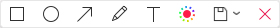

<table class="block1">

    <caption>Íconos descriptivos</caption>

    <tbody>

        <tr>

            <td></td>

            <td>Rectángulo</td>

            <td class="blank"></td>

            <td></td>

            <td>Eclipse</td>

	    <td class="blank"></td>

            <td></td>

            <td>Flecha</td>

        </tr>

          <tr>

            <td></td>
​

            <td>Lápiz</td>

            <td class="blank"></td>

            <td></td>

            <td>Texto</td>

            <td class="blank"></td>

            <td></td>
​

            <td>Color</td>

        </tr>

          <tr>

            <td></td>

            <td>Guardar</td>

            <td class="blank"></td>

            <td></td>

            <td>Salir</td>

             <td class="blank"></td>

            <td>&nbsp;</td>

            <td>&nbsp;</td>

        </tr>

    </tbody>

</table>

### Dibujado

Puede dibujar algunos gráficos simples en las imágenes capturadas, como rectángulo, elipse y varios más.

 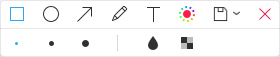

#### Rectángulo

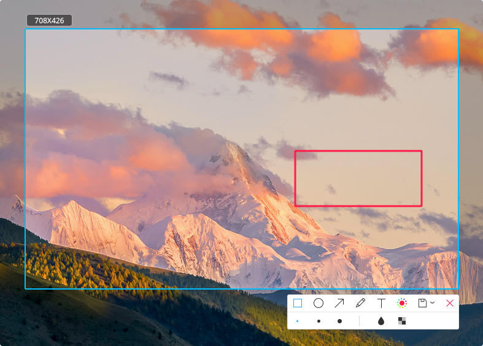

1. Clic en  en la barra de herramientas.
2. En el panel extendido de la barra de herramientas, escoga el grosor del rectángulo.
3. Coloque el puntero del ratón en el área de la captura de pantalla, y luego el puntero del ratón será como .
4. Presione y mantenga presionado el botón principal del ratón, suelte el ratón para finalizar el dibujado.
5. Si la captura de pantalla incluye información confidencial, haga clic en  o  en el panel extendido de la barra de herramientas para ocultar.

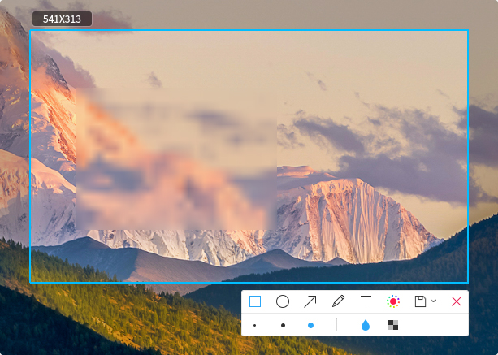

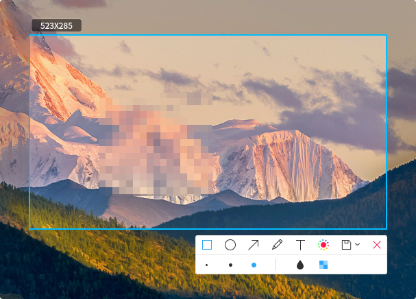

> : Presione y mantenga la tecla  en el teclado, y luego seleccione  para dibujar un rectángulo.

#### Eclipse

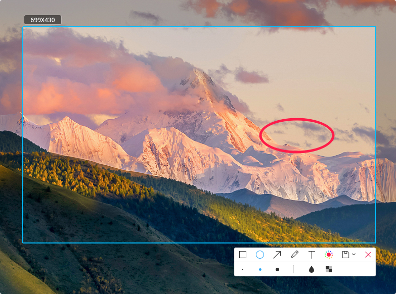

1. Clic en  en la barra de herramientas.
2. En el panel extendido de la barra de herramientas, escoga el grosor del elipse.
3. Coloque el puntero del ratón en el área de la captura de pantalla, y luego el puntero del ratón será como .
4. Presione y mantenga presionado el botón principal del ratón, suelte el ratón para finalizar el dibujado.
5. Si la captura de pantalla incluye información confidencial, haga clic en  o  en el panel extendido de la barra de herramientas para ocultar.

> : Presione y mantenga la tecla  en el teclado, y luego seleccione  para dibujar un círculo.

#### Flecha

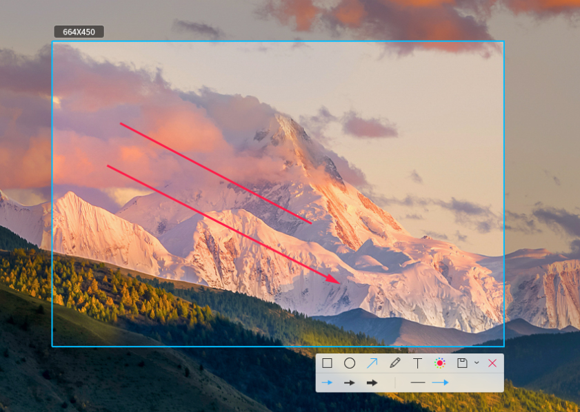

1. Clic en  en la barra de herramientas.
2. En el panel extendido de la barra de herramientas, escoga el grosor de la flecha.
3. Clic en  o  to switch between straight line and arrow.
4. Coloque el puntero del ratón en el área de la captura de pantalla, y luego el puntero del ratón será como .
5. Presione y mantenga presionado el botón principal del ratón, suelte el ratón para finalizar el dibujado.

> : Presione y mantenga presionado  en el teclado, y luego seleccione  o  para dibujar una línea recta o flecha en dirección horizontal o vertical.

#### Lápiz

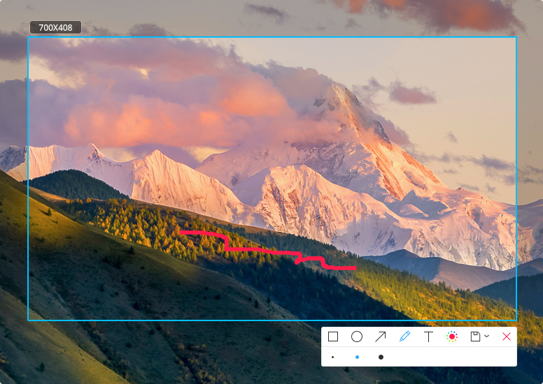

1. Clic en  en la barra de herramientas.
2. En el panel extendido de la barra de herramientas, escoga el tamaño del lápiz.
3. Coloque el puntero del ratón en el área de la captura de pantalla, y luego el puntero del ratón será como .
4. Presione y mantenga presionado el botón principal del ratón, suelte el ratón para finalizar el dibujado.

### Modificar gráficos

Si ha dibujado otros gráficos en la captura puede modificar la ubicación y su tamaño.

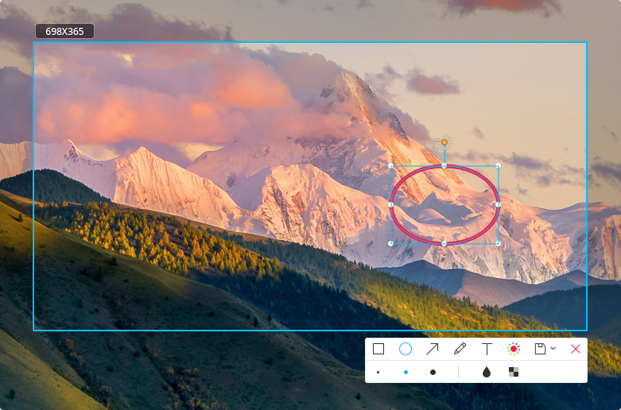

#### Mover gráficos

1. Posicione el puntero del ratón sobre the sideline of the graphics, y luego el puntero del ratón become .
2. Presione y mantenga presionado el botón principal del ratón, y puede move the graphics to any place in el área de la captura de pantalla.
3. Presione  o  en el teclado to move the graphics up and down, y press  o  en el teclado to move the graphics left and right.

#### Ediar gráficos

1. Posicione el puntero del ratón sobre the sideline of graphics.
2. Click para entrar the editing mode of graphics. Puede:

   - Presione  en el teclado to delete graphics.

   - Presione + en el teclado to return to the previous step.

   - Position the mouse pointer on the editing box, y luego el puntero del ratón becomes . Puede enlarge o reduce the graphic area by dragging the mouse pointer.

   - Presione + o  en el teclado to extend the graphic area up o down, y press + o  en el teclado to extend the graphic area left o right.

   - Position the mouse pointer on  of the editing box, y luego el puntero del ratón becomes . Puede rotate graphics by dragging the mouse pointer .

3. Click outside the editing box salir the editing mode.

### Add Texto Annotations

Supplement and add descriptions to the captured images, thus to help others understand them more clearly.

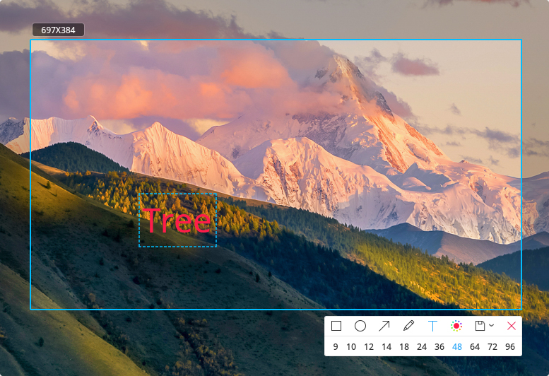

1. Clic en  en la barra de herramientas below el área de la captura de pantalla.
2. En el panel extendido de la barra de herramientas, select a needed font size.
3. Coloque el puntero del ratón on the captured images, y luego el puntero del ratón becomes .
4. Click where you want to add an annotation, y a text box to be input will appear.
5. Enter text in the text box.

> : En the text editing mode, it will not auto wrap, you need to press Enter.

### Modify Texto Annotations

If you have added a text annotation, puede modify and move the text annotation.

#### Move Texto Annotations

1. Posicione el puntero del ratón sobre the text, y luego el puntero del ratón becomes .
2. Presione y mantenga presionado el botón principal del ratón, y puede move the text to any place in el área de la captura de pantalla.

#### Edit Texto Annotations

1. Posicione el puntero del ratón sobre the text.
2. Click para entrar text-editing mode. Puede:

   - Presione  en el teclado to delete the text annotations.

   - Presione + en el teclado to return to the previous step.

   - Modify the text in the text box.

3. Click outside the text box salir editing mode.

### Set Colors

Captura de pantalla Deepin totally provides 16 colors for you. Puede choose different colors to mark.

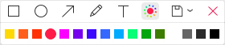

1. En la barra de herramientas below el área de la captura de pantalla, clic en .
2. Select a color en el panel extendido de la barra de herramientas.

> : The default color is red. When you select a new color, it será mostrada in a circle, the color icon in toolbar will be changed en tiempo real and so does the color of other tools.

## Guardar Screenshot

Guardar captured images as material for future use!

### Saving Method

Puede save captured images de la siguiente manera:

* Presione + en el teclado to save.

* En the captured images, clic derecho y seleccione **Guardar** o double-click the mouse to save.

> : After successfully saving a screenshot, puede see a prompt en la esquina superior derecha of el escritorio. Clic en **View** para abrir the storing folder.

### Saving Path

Puede click the drop-down options of  en la barra de herramientas below el área de la captura de pantalla:

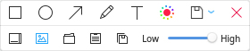

* Select  to save picture to desktop.

* Select  to auto save picture to the folder selected last time, the default directory is desktop at the first time.

* Select  to save picture to specified folder.

* Select  to copy picture to clipboard.

* Select  to save picture to system default folder and copy to clipboard.

> : Puede adjust the quality of the saved pictures by dragging the slider left o right.

### Saving Format

The captured images will be named after "DeepinScreenshot+image name+date and time".

The detailed kinds are in the following:

* When taking una captura de pantalla of la ventana, the saving format is "DeepinScreenshot+ window name+date and time".

* When taking una captura de pantalla of desktop components (such as Dock, Launcher and Control Center), the saving format is "DeepinScreenshot+desktop component name+date and time".

* When taking una captura de pantalla of free area, the saving format is "DeepinScreenshot+areaname+date and time".
