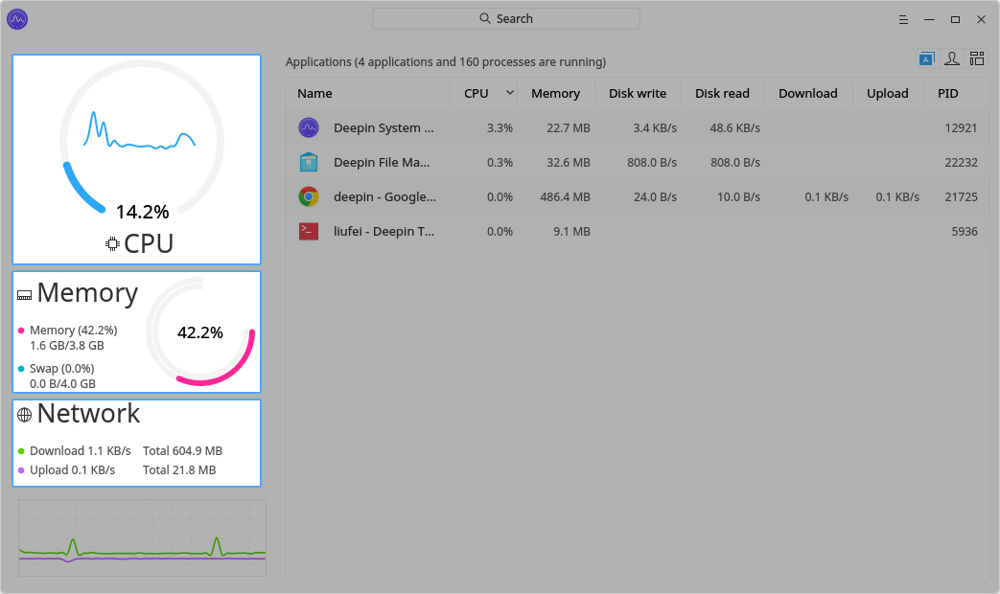
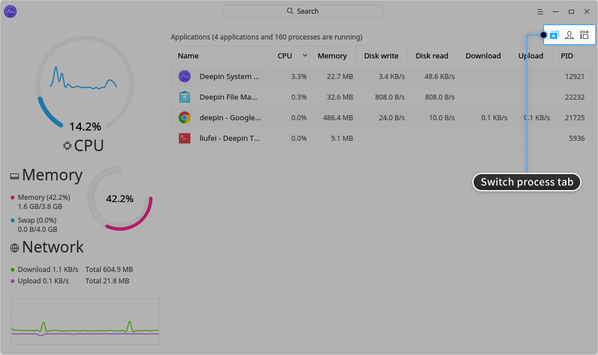
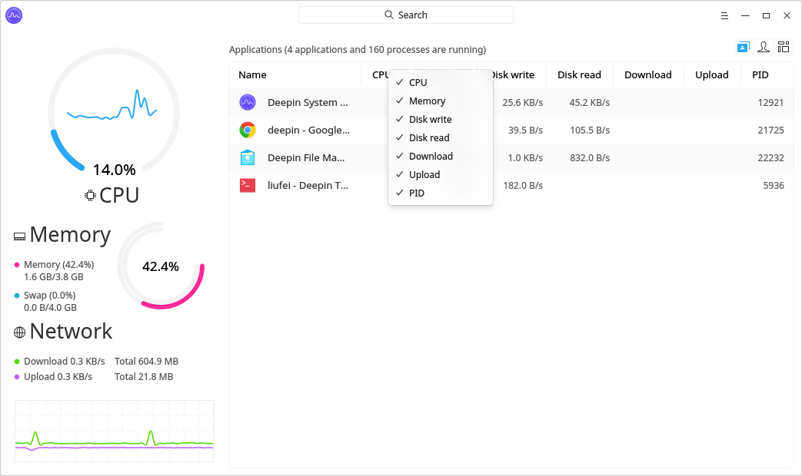
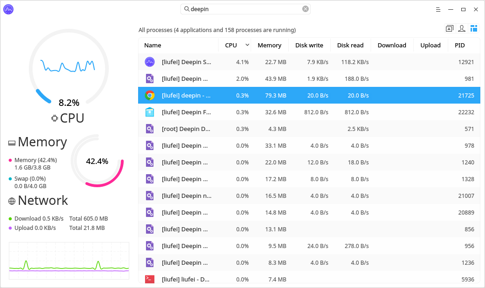
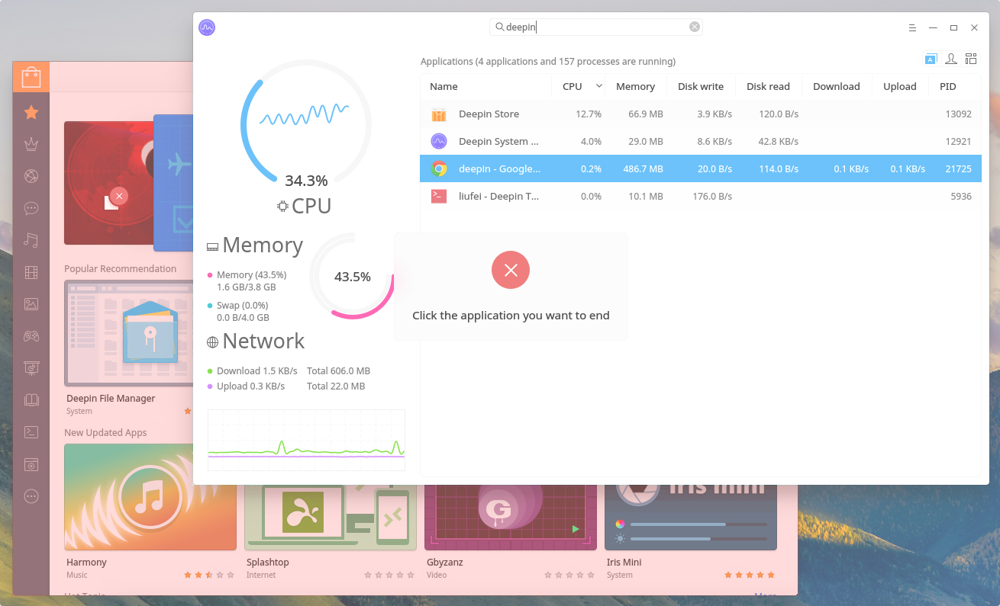
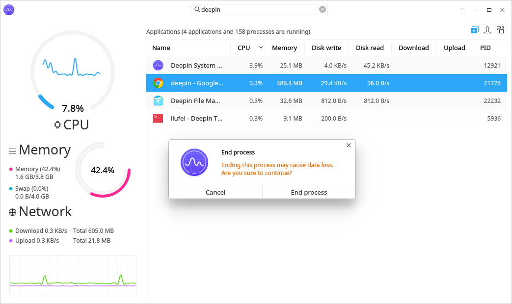
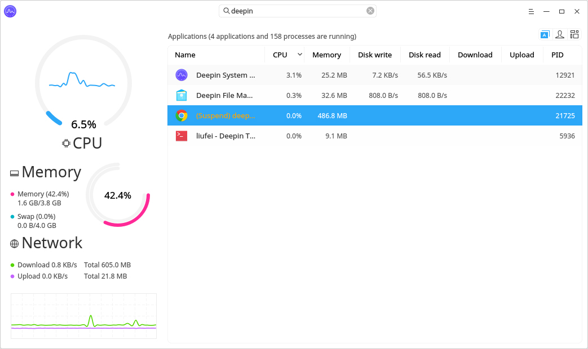
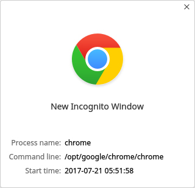
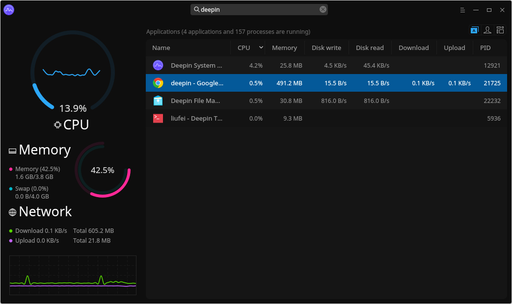

# Monitor del sistema de Deepin |../common/deepin-system-monitor.svg|

## Vistazo

Monitor del sistema Deepin (monitor del sistema) es una intuitiva y poderosa aplicación de monitoreo del sistema. Puede supervisar el proceso de la CPU, memoria, red, disco y otros estados. Puede también buscar, suspender, reanudar y finalizar procesos.

## Operaciones básicas

### Estado de monitoreo

Monitor del sistema Deepin puede revisar la CPU, memoria y la conexión de red de su sistema:

- Supervisión de la CPU, puede ver el uso de la CPU y las tendencias de uso a través de gráficos, números y curvas.
- Supervisión de la memoria, puede ver el tamaño de la memoria y el uso en tiempo real, el espacio de intercambio total y el uso en tiempo real.
- Monitoreo de red, puede ver la velocidad de descarga y carga, el tamaño total de descarga y carga, así como la tendencia del estado de la red.

### Gestión de procesos

#### Cambiar pestañas de procesos

Clic en las pestañas la parte superior derecha de la interfaz para cambiar la visualización entre los procesos de la aplicación, los del usuario y todos los procesos.

- Clic en  para ver los procesos de las aplicaciones.
- Clic en  para ver los procesos del usuario.
- Clic en  para ver todos los procesos.

#### Ajustar rrden de los procesos

Puede ajustar el orden de los procesos por nombre, CPU, memoria, lectura y escritura de disco, descarga, subida e identificación (PID).

1. En la interfaz del Monitor del sistema Deepin, clic en las pestañas superiores de la lista de procesos para ordenarlos.
2. Haga varios clic para ordenar de forma ascendente o descendente.
3. Clic derecho en las pestañas superiores para marcar o desmarcar.

#### Buscar procesos

Escriba el nombre del proceso en el cuadro de búsqueda superior en la interfaz de Monitor del sistema Deepin para buscar y localizar rápidamente el proceso.

#### Forzar a finalizar un proceso

1. En la interfaz del Monitor del sistema Deepin, clic en el menú principal.
2. Seleccione **Forzar el cierre de la aplicación**.
3. Clic en la ventana de la aplicación abierta para finalizarthe opened aplicación cuando el ratón indica que .
4. Clic en **Finalizar aplicación** en la ventana emergente para confirmar.

> : Solo puede finalizar procesos de aplicaciones con interfaz gráfica haciendo clic en **Forzar cierre de la aplicación**.

#### Finalizar proceso

1. En la interfaz del Monitor del sistema Deepin, clic derecho en el proceso que desea finalizar.
2. Seleccione **Finalizar proceso**.
3. Clic en **Finalizar proceso** en la ventana emergente para confirmar.

> : Puede seleccionar **Finalizar proceso** para finalizar todos los procesos.

#### Suspender/Continuar procesos

1. En la interfaz del Monitor del sistema Deepin, clic derecho en el proceso que desea suspender.
2. Seleccione **Suspender proceso**.
3. The proceso será pausado, y puede hacer clic derecho y seleccione **Reanurar proceso** para dejar de pausar.

#### Ver ubicación del proceso

1. En la interfaz del Monitor del sistema Deepin, clic derecho en el proceso que desea para ver.
2. Seleccione **Ver ubicación del proceso**.
3. La ubicación del proceso en ejecución será abierta.

#### Ver propiedades del proceso

1. En la interfaz del Monitor del sistema Deepin, clic derecho en el proceso que desea para ver.
2. Seleccione**Properties**.
3. Puede ver el nombre del proceso, command line and start time.

## Menú principal

### Cambiar tema

Puede cambiar el tema del Monitor de sistema Deepin.

1. En la interfaz del Monitor de sistema Deepin, clic en .
2. Seleccione **Tema oscuro**.
3. La interfaz cambiará al tema oscuro.

### Ayuda

Puede hacer un clic para ver el manual, que le ayudará a conocer y usar el instalador de fuentes de Deepin.

1. En la la interfaz de Monitor de sistema Deepin, clic en  .
2. Clic en **Ayuda**.
3. Observe el manual.

### Acerca de

Puede hacer clic para ver la descripción de la versión.

1. En la la interfaz de Monitor de sistema Deepin, clic en .
2. Seleccione **Acerca de**.
3. Observe la descripción de la versión.

### Salir

Puede hacer clic para salir del Creador de arranque de Deepin.

1. En la la interfaz de Monitor de sistema Deepin, clic en .
2. Clic en **Salir** para cerrar.
