# Terminal Deepin|../common/deepin-terminal.svg|

## Overview

Terminal Deepin es un emulador de terminal con interfaz simple, funciones enriquecidas y potentes creadas por Deepin Technology. Al instante, puede iniciar y cerrar Terminal Deepin sin problemas, como la ventana normal de archivos, que le permite ingresar comandos fácilmente y sin distracciones. Probemos el modo Quake, naveguemos por la web mientras ingresamos los comandos. Cuando hay varias tareas, puede agregar pestañas en la terminal para crear más espacios de trabajo, como en el navegador, o dividir el espacio de trabajo en varias ventanas. Es muy fácil subir y descargar archivos con la administración remota. ¡Más funciones poderosas están esperando que explores!

 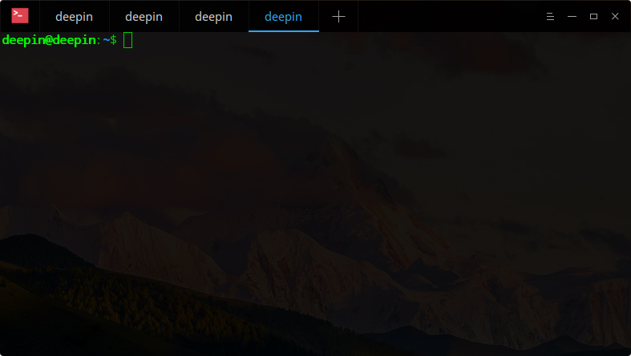

## Guía

Puede iniciar, salir o crear accesos directos para Terminal Deepin.

### Iniciar la terminal de Deepin ###

1. Clic en  en el muelle para entrar a la interfaz del lanzador.
2. Encuentre  para hacer clic allí, puede:
  - Clic en **Envíar al escritorio** para crear un acceso directo al escritorio.
  - Clic en **Enviar al muelle** para fijar la aplicación al Muelle.
  - Clic en **Añadir al arranque** para añadir la aplicación en el arranque, esta se iniciará automáticamente cuando la computadora inicie.

> : También, puede pulsar ++ para abrir Terminal Deepin.

### Salir de Terminal Deepin ###

1. En la interfaz de la Terminal Deepin, clic en  para salir.

2. Clic derecho en  en el Muelle y seleccione **Cerrar todo** para salir.

3. En la interfaz de la Terminal Deepin, clic en  y seleccione **Salir** para finalizar.

> : There will be a prompt when programs are still running en la terminal.

### Ver comandos personalizados ###

Puede pulsar ++ desde el teclado para abrir el apartado de comandos personalizados.

 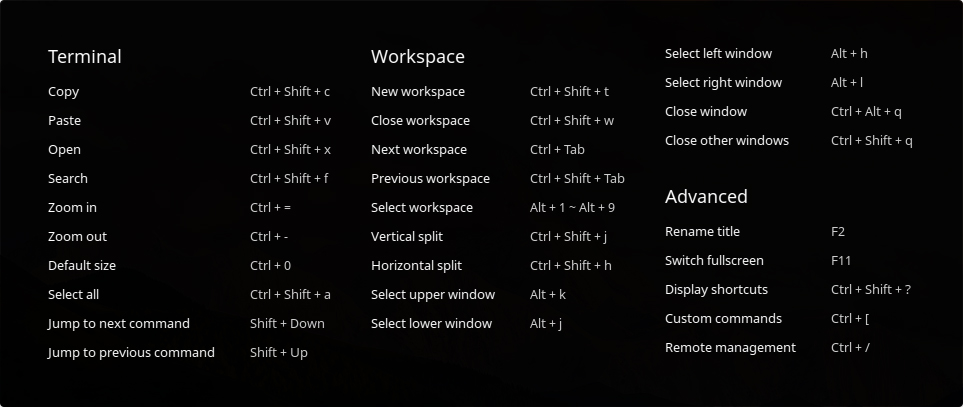

## Operaciones básicas

Puede hacer clic derecho en la interfaz de la Terminal Deepin para realizar operaciones frecuentes.

 

### Búsqueda ###

Puede use the search function to quickly search contents en la terminal.

1. Clic derecho en interfaz de la Terminal Deepin.

2. Clic en **Search**.

3. Escriba la palabra el cuadro de búsqueda y haga clic en .

4. Después, los resultaods de búsqueda serán resaltado.

5. Pulse  desde el teclado o haga clic en cualquier ubicación de la intefaz de la terminal para buscar.

> : Pulse  para encontrar a el comando más frecuente. También, puede clic en  y  para buscar.

### Buscar desde el motor de búsqueda ###

Puede buscar palabras claves con los motores de búsqueda Google, Bing, Duckduckgo y más en la terminal.

1. Escriba algunas palabras en la terminal.

2. Seleccione las palabras y haga clic derecho para elegir **Buscar en la web**.

3. Las palabras serán buscadas en los resultados de búsqueda de Google, Bing, Duckduckgo y otros.

### Copy/Paste ###

Puede libremente copiar y pegar los contenidos o comandos entre la terminal y en cualquier sitio.

1. Seleccione los comandos or contents to be copied.

2. Clic derecho y seleccione **Copy** to copy elsewhere.

3. If you want to paste on terminal, clic derecho y seleccione **Paste**.

> : If the content is a link, puede también clic derecho to copy by hovering on it even no contents selected.

### Modo Quake ###

Pulse  +  para abrir a una ventana quake (similar al videojuego), y después se oculta después de perder el foco.

> : También, puede clic en  en el Muelle y seleccione **Terminal Quake** para abrir a quake ventana.

### Abrir Archivo y Programa de la Aplicación ###

En la interfaz de la Terminal Deepin, seleccione el archivo en el directorio actual, haga clic derecho y seleccione **Abrir** para llamar a la aplicación del sistema que abra el archivo indicado.

1. En la interfaz de la Terminal Deepin, introduzca **ls -al** para mostrar los archivos in directorio actual.

2. Doble clic con el botón principal del ratón y seleccione el nombre del archivo.

3. Clic derecho.

4. Clic en **Abrir**.

 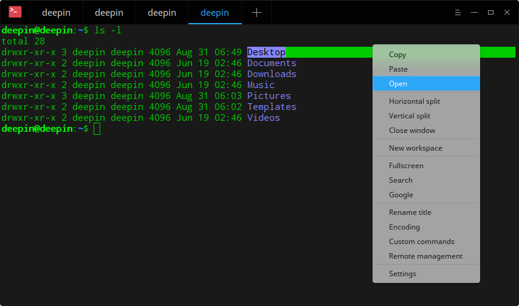

### Cambiar codificación ###

Puede rápidamente cambiar el codificado de caracteres acorde a sus necesidades.

1. Clic derecho en interfaz de la Terminal Deepin.

2. Seleccione **Codificación**.

3. Seleccione la codicicación para cambiar a la lista correspondiente.

 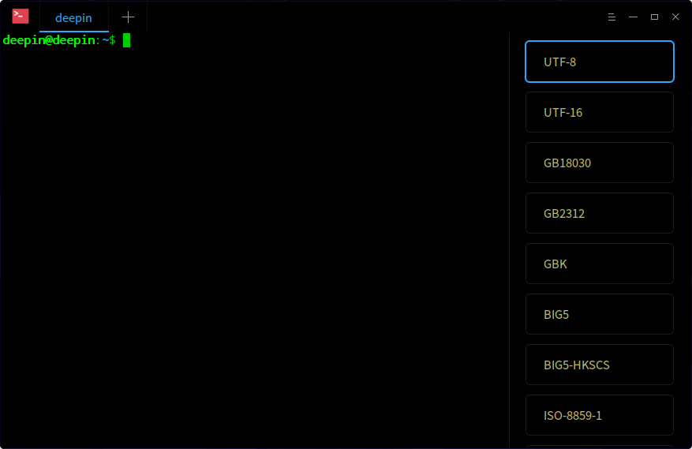

## Operaciones de ventana

La ventana es la base para que realice otras operaciones en la terminal. Puede crear varios espacios de trabajo y dividir más ventanas.

### Nueva ventana ###

Puede crear una ventana con los siguientes pasos:

1. Abra Terminal Deepin y haga clic en  y seleccione **Nueve Ventana**.

2. Clic en  on Muelle y seleccione **Nueve Ventana**.

3. Pulse ++ 1~9 del Teclado Numérico para abrir nuevas ventanas con diferentes colores.

 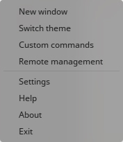

### Renombrar Ventana ###

1. Clic derecho en interfaz de la Terminal Deepin.

2. Seleccione **Renombrar título**.

3. Ingrese el nombre y haga clic en **Renombrar**.

> : También puede pulsar   to renombrar el título de la ventana.

 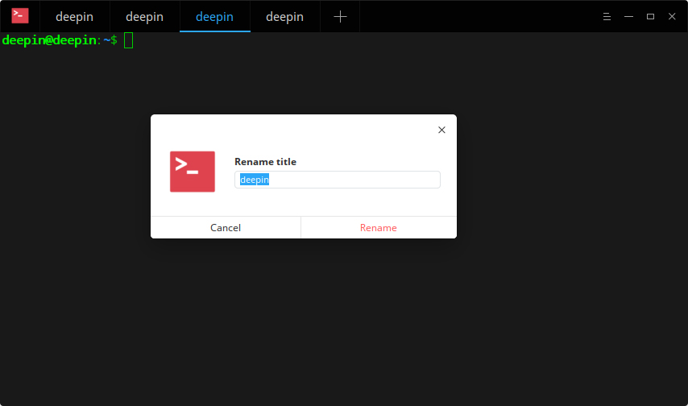

### Split Ventana ###

1. Haga clic derecho en interfaz de la Terminal Deepin.

  - Clic en **División vertical** para dividir la interfaz en partes izquierda y derecha.

  - Clic en **División horizontal** para dividir la interfaz en partes superior e inferior.

2. Puede introducir los comandos en cada ventana de la terminal, y además puede ver los resultados del comando realizado.

> : También puede pulsar ++ desde el teclado para dividir verticalmente, y pulsar ++ para dividir horizontalmente.

 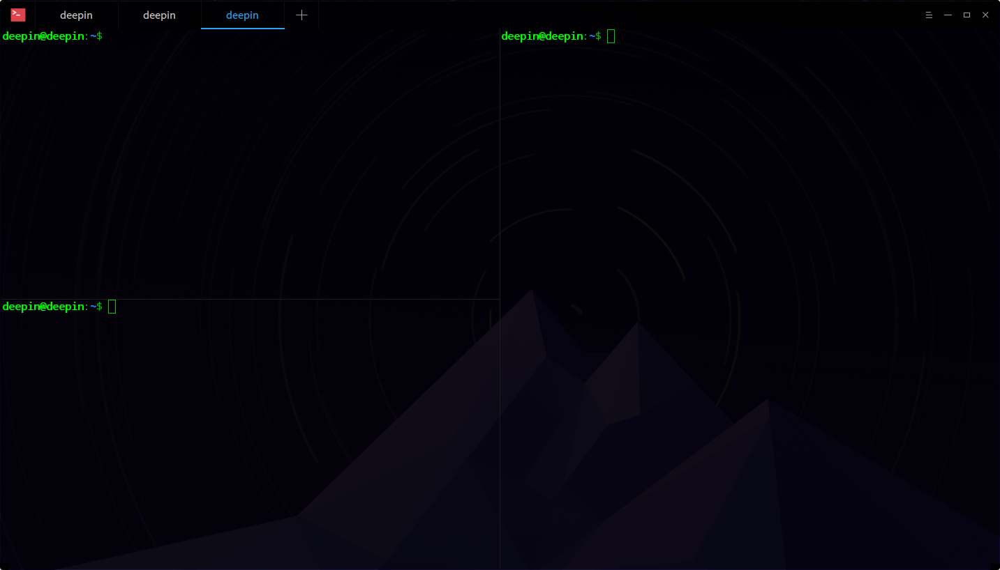

### Mostrar Ventana a Pantalla Completa ###

1. Abra la Terminal Deepin desde la interfaz del lanzador.

2. Pulse  para visualizar la Terminal Deepin a pantalla completa.

3. Si desea volver a la pantalla normal, por favor pulse .

> : También, puede clic derecho y seleccione **Pantalla completa** or **Salir de pantalla completa** en la interfaz de la Terminal Deepin.
> Para desarrolladores, puede usar el comando **-m --window-mode ** para ajustar el modo de ventana.

### Cerrar Ventana ###

Para varias ventanas divididas, puede ejecutar las siguientes operaciones For multiple splitting ventanas, you can execute the siguientes operaciones para cerrar:

1. En la intefaz de la terminal Deepin, mueve el puntero del ratón sobre una de las ventanas divididas.

2. Clic derecho, puede:

  - Seleccionar **Cerrar ventana** para finalizar la pantalla dividida.

  - Seleccionar **Cerrar otras ventanas** para cerrar otras ventanas dividias excepto la actual.

 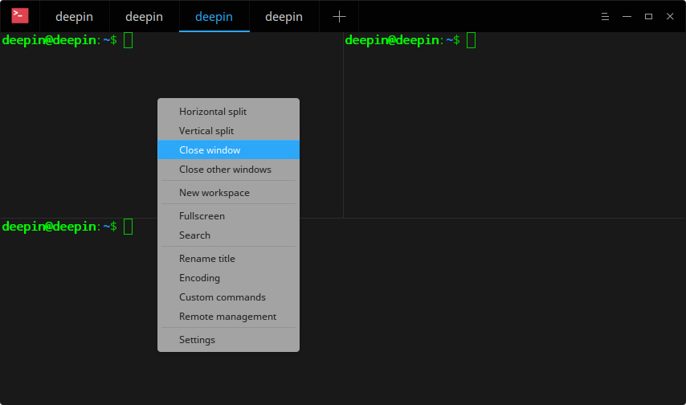

## Operaciones con el espacio de trabajo

El estado actual del espacio de trabajo se representará en diferentes colores de las pestañas de los mismos.

 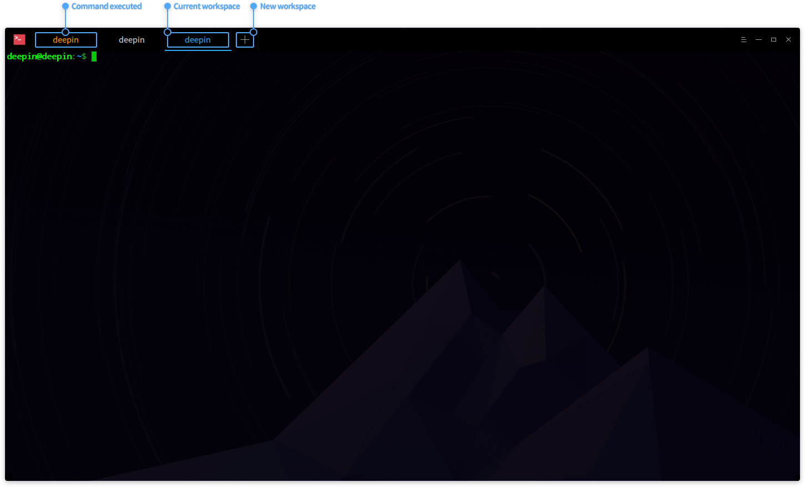

### New Espacio de trabajo ###

- Clic derecho en interfaz de la Terminal Deepin and select **New espacio de trabajo** to crear a new espacio de trabajo.

- Clic en  en la parte superior para crear un espacio de trabajo.

### Seleccionar Espacio de trabajo ###

Puede freely cambiar entre múltiples espacio de trabajos siguiendo las siguientes operaciones:

- Directly clic the espacio de trabajo tab y seleccione un espacio de trabajo.
- Pulse + to cambiar in sequence.
- Pulse + 1~9 del teclado numérico y seleccione the espacio de trabajo; when espacio de trabajos are more than 9, the last espacio de trabajo will be selected rather the ninth one.

### Cerrar Espacio de trabajo ###

- Move the puntero del ratón sobre la previsualización de ventana del espacio de trabajo, clic en  para cerrar el espacio de trabajo.

- Pulse ++

> : Cuando hay una sola ventana en el espacio de trabajo, puede también hacer clic derecho y seleccione **Cerrar ventana** para cerrar.

## Administrar desde un Servidor Remoto

Puede hacer clic derecho en el área en blanco o clic en el menú principal para abrir el panel de la administración remota y añadir servidores. El panel de la administración remota se ocultará automáticamente cuando ajuste el tamaño de ventana.

### Añadir Servidor ###

1. En la interfaz de la Terminal Deepin, clic derecho o haga clic en  in the top right corner.

2. Seleccione **Remote management** para abrir the panel.

3. Clic en **Añadir servidor** para rellenar:

  - Nombre del servidor
  - Dirección
  - Nombre de usuario (credencial)
  - Contraseña
  - Certificado de seguridad

4. Clic en **Añadir** para incluirlo.

5. Si necesita más parámetros, por favor haga clic en **Opciones avanzadas** para establecer, el archivo de certificado se encuentra por defeceto en ~/.ssh/id_rsa.

 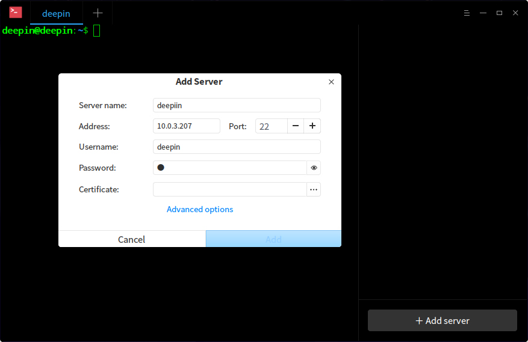

> : También puede pulsar + para abrir el panel de la administración remota.

### Editar Servidor ###

1. Deje el puntero del ratón sobre el servidor añadido, clic en  para entrar al apartado detallado.

2. Edite lo necesario.

3. Clic en **Guardar** para salvar la edición.

 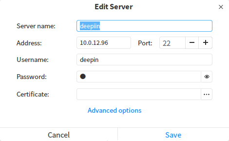

### Servidores en Grupo ###

Cuando establecemos un grupo para el servidor, se añadirá al grupo y se mostrará en el panel derecho de la administración remota.

1. Ingrese a la interfaz para  "Editar servidor".

2. Clic en **Opciones avanzadas**.

3. Indica a cuál grupo y haga clic en **Guardar**.

4. Then this servidor will be grouped.

 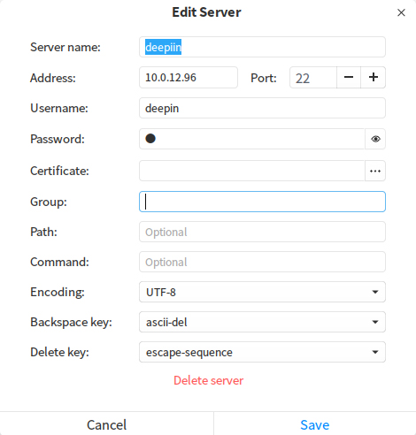

### Buscar Servidor ###

Cuando hay muchos servidores, la caja de búsqueda será mostrada en la parte superior del panel de la administración remota.

1. Ingrese el nombre del servidor y pulse .

2. Los resultados de búsquedas serán mostrados en el panel.

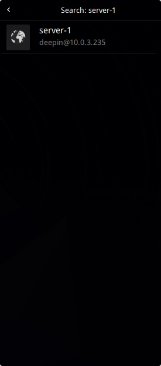

> : Puede especificar el nombre del servidor buscador acorde a sus necesidades.

### Subir/Descargar Archivo ###

Puede subir y descargar archivos después de ingresar en un servidor.

#### Subir Archivo ####

1. On the panel de la administración remota, clic ene of the servidores para ingresar sesión.

2. Clic derecho y seleccione **Subir archivo**.

3. Seleccione archivo a subir.

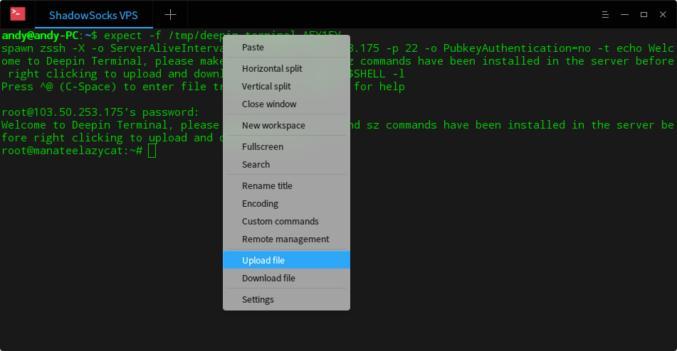

#### Descargar Archivo ####

1. En el panel de la administración remota, clic en uno de los servidores para ingresar sesión.

2. Clic derecho y seleccione **Descargar archivo**.

3. Seleccione archivo a descargar.

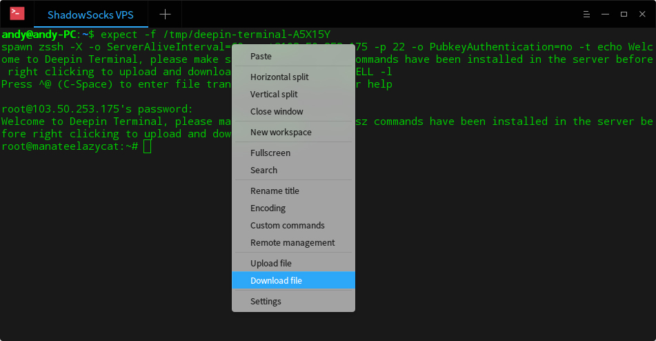

### Borrar Servidor ###

1. Ingrese a la interfaz para "Editar Servidor".

2. Clic en **Opciones avanzadas**.

3. Seleccione **Borrar servidor** en la parte inferior para borrar.

## Menú principal

### Cambiar tema ###

1. En la interfaz de la Terminal Deepin, clic en  en la esquina superior derecha.

2. Clic en **Cambiar tema**.

Los temas se visualizarán en la lista de la derecha, luego puede seleccionar uno para que tenga efecto en este momento.

 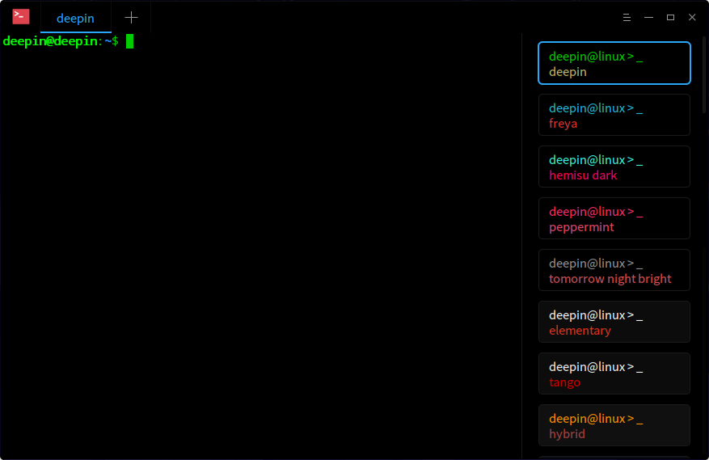

### Comandos personalizados ###

1. En la interfaz de la Terminal Deepin, clic en  en la esquina superior derecha.

2. Clic en **Comandos personalizados**.

3. Seleccione **Añadir comando**.

4. Ingrese **Nombre**, **Comando** y **Atajo de teclado**.

5. Clic en **Añadir**.

 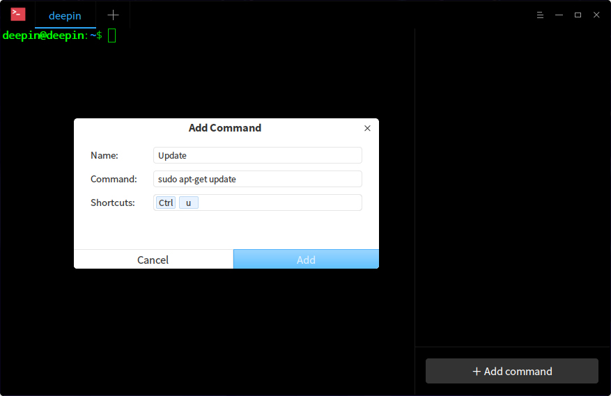

> : También, puede clic derecho en la interfaz de la Terminal Deepin y seleccione **Comandos personalizados** para añadir.

### Ajustes Básicos ###

1. En la interfaz de la Terminal Deepin, clic en  en la esquina superior derecha.

2. Clic en **Settings**.

3. En la sección **Básico**, puede:

  - Ajustar la transparencia del fondo de ventana.

  - Establecer la fuente y su tamaño.

 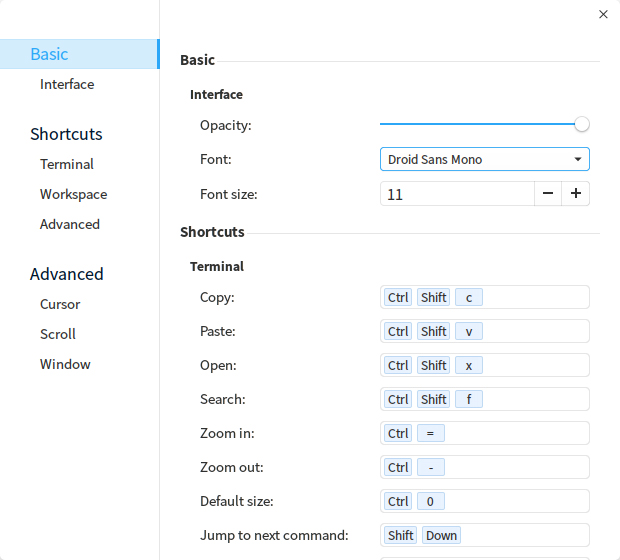

### Ajustes de atajos de teclado ###

1. En la interfaz de la Terminal Deepin, clic en  en la esquina superior derecha.

2. Clic en **Settings**.

3. En la sección **Atajos de teclado**, puede:

  - Clic en el atajo para modificarlo, e ingrese nuevos atajos por teclado.

  - Pulse  si desea desactivar el atajo.

 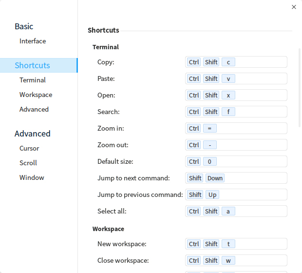

### Opciones Avanzadas ###

1. En la interfaz de la Terminal Deepin, clic en  en la esquina superior derecha.

2. Clic en **Ajustez**.

3. En la sección **Avanzado**, puede:

  - Establecer el estilo del cursor.

  - Activar o desactivar **Parpadear cursor**.

  - Activar o desactivar **Auto-ocultar cursor**.

  - Activar o desactivar **Desplazamiento de tecla**.

  - Activar o desactivar **Desplazamiento en la impresión**.

  - Establecer el modo de ventana al iniciar.

  - Activar o desactivar **Esconder el modo quake después de desenfocar**.

 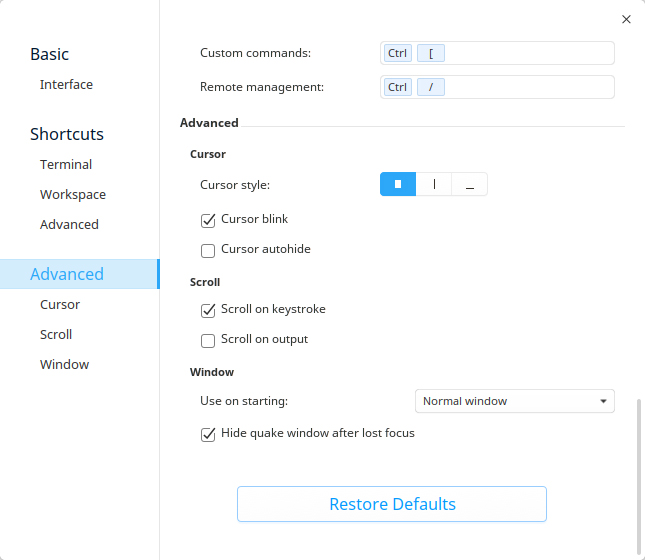

> : Si necesita restaurar todos los ajustes por defecto, haga clic en **Restaurar los valores predeterminados**.

### Ayuda ###

Puede hacer un clic para ver el manual, que le ayudará a conocer y usar Creador de arranque de Deepin.

1. En la interfaz de la Terminal Deepin, clic en  en la esquina superior derecha.
2. Clic en **Ayuda**.
3. Observe el manual.

### Acerca de ###

Puede hacer clic para ver la descripción de la versión.

1. En la interfaz de la Terminal Deepin, clic en  en la esquina superior derecha.
2. Seleccione **Acerca de**.
3. Observe la descripción de la versión.

### Salir ###

Puede hacer clic para salir de la Terminal Deepin.

1. En la interfaz de la Terminal Deepin, clic en  en la esquina superior derecha.

2. Clic en **Salir** para cerrar.
