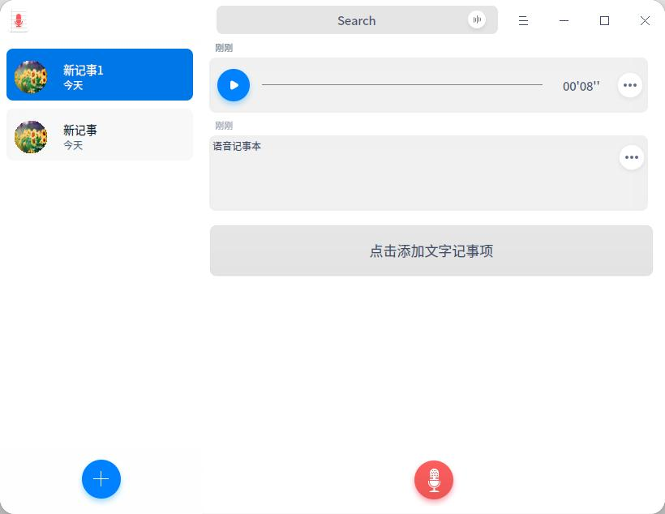
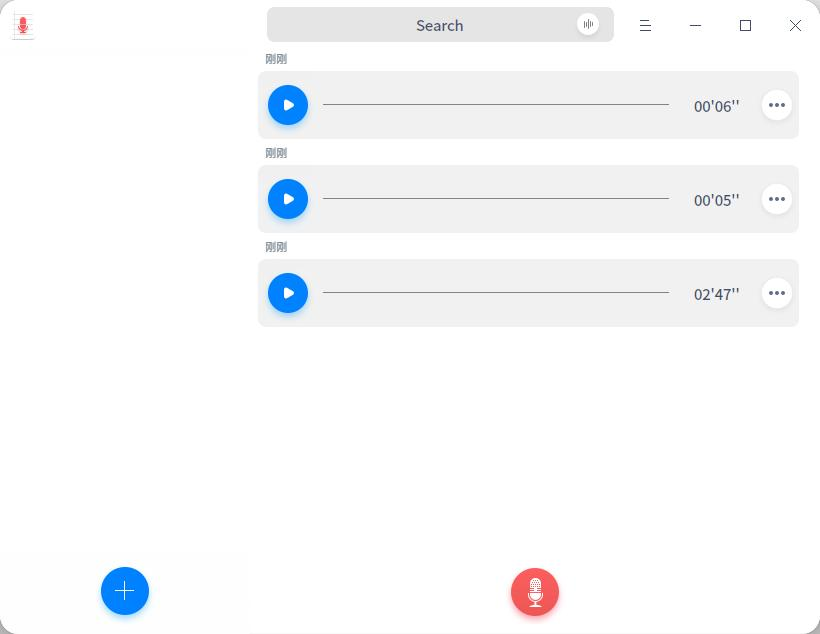
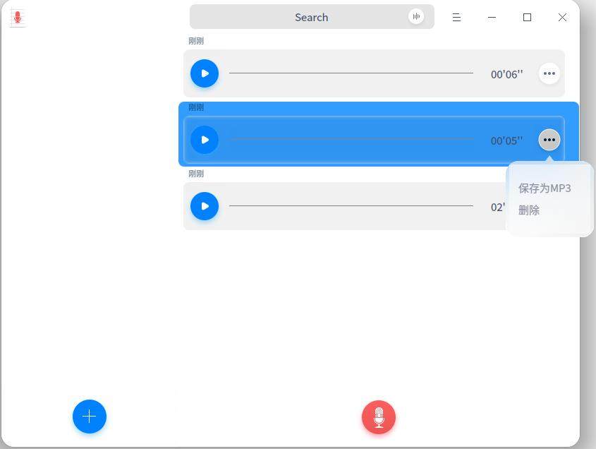
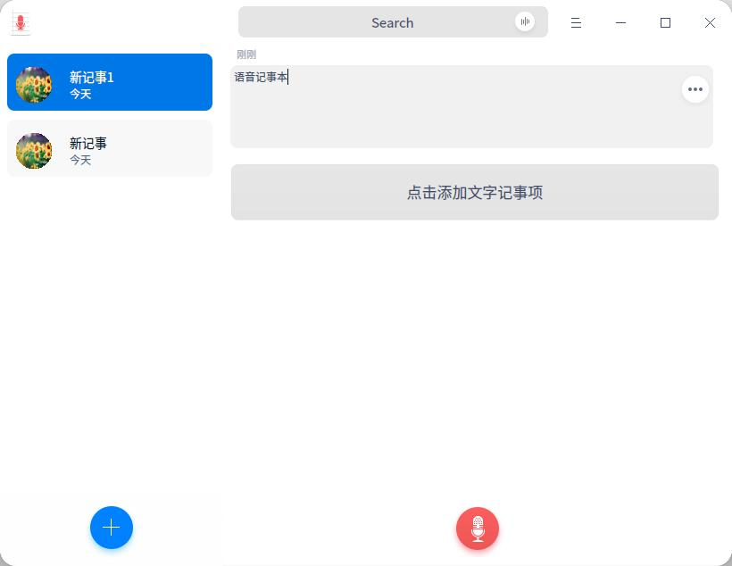
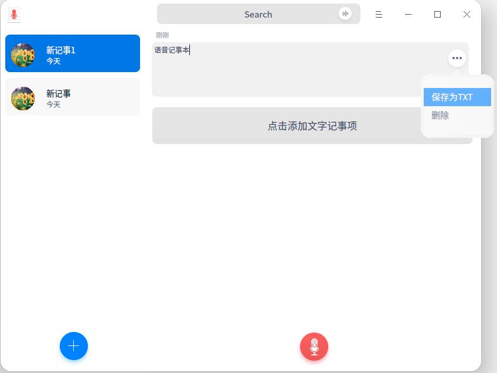
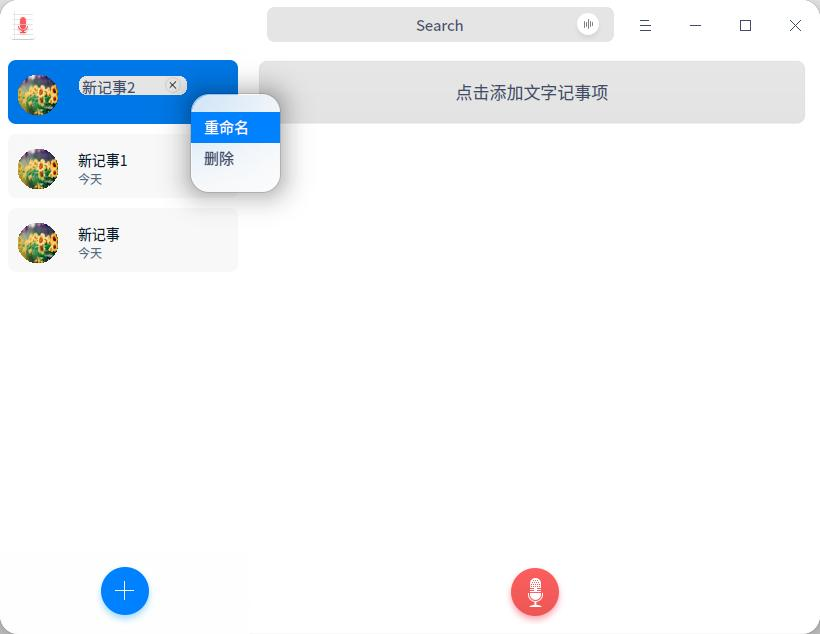
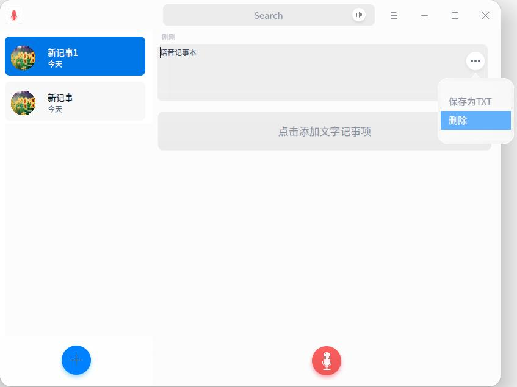
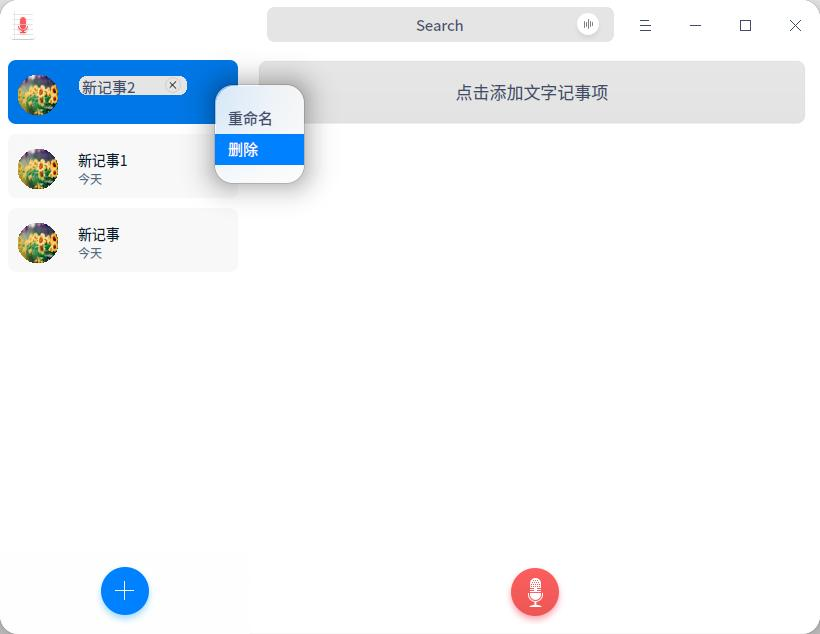

# 语音记事本|../common/deepin-voice-note.svg|

## 概述

语音记事本是一款设计简洁、美观易用的集文本、录音来记事的软件。用户可以将录音转存为 MP3，或者将录音转化为文字保存。

待完善...

## 使用入门

您可以通过以下方式运行、关闭语音记事本，同时还可以创建快捷方式。

### 运行语音记事本

1. 点击桌面底部的 启动器  ，进入启动器界面。
2. 上下滚动鼠标滚轮，通过浏览找到  进行点击运行。
3. 将鼠标指针置于语音记事本应用程序的图标上，右键点击图标，您可以：

- 点击 发送到桌面，在桌面创建快捷方式。
- 点击 发送到任务栏，将应用程序固定到任务栏。
- 点击 开机自动启动，将应用程序添加到开机启动项，在电脑开机时自动运行该应用程序。

> ：如果语音记事本已经默认固定在任务栏上，您也可以点击任务栏上的  来运行。

### 关闭语音记事本

- 在语音记事本界面点击   ，退出语音记事本。
- 在任务栏右键单击 ，选择 **关闭所有** 来退出语音记事本。
- 在语音记事本界面点击  ，选择 **退出** 来退出语音记事本。

## 操作介绍

### 录制音频

轻松两步，完成一段录音，基本录音步骤如下：

1. 在语音记事本界面上点击  图标，开始录音。
2. 点击  按钮完成录音。

> ：录音过程中您可以点击  按钮暂停录音，想继续录音时再点一下就可以了。

### 录音回放

录制完成后，录音以列表形式显示再语音记事本界面上，鼠标移动到一个录音文件上之后点击出现的播放按钮就可以收听录音回放。

> ：收听录音回放时可以点击按钮暂停或停止播放录音。

### 保存为PM3格式

1. 在语音记事本界面上，选择一个录音文件。

2. 点击 图标。

3. 选择 **保存为MP3**。

4. 将录音文件保存至储存设备中。

### 添加文字记事项

1. 在语音记事本界面上点击  图标，添加新记事。
2. 点击 **添加文字记事项**，输入需要记录的文字。

> ：在新记事中可以录制音频，详细操作请参考录制音频。

### 保存为TXT文件

1. 在语音记事本界面上，右键单击一个文字记事项。

2. 点击 图标。

3. 选择 **保存为TXT**。

4. 将录音文件保存至储存设备中。

### 重命名新记事

记事文件完成后，记事文件自动保存成名为“新记事（n）”的音频文件，您可以重命名记事文件。

1. 在语音记事本界面上，右键单击一个新记事文件。
2. 选择 **重命名**。
3. 输入文件名称。
4. 鼠标点击界面空白处或者按下键盘上的  键。

### 删除录音

1. 在语音记事本界面上，选择一个录音文件。

2. 点击 图标。

3. 选择 **删除**。

4. 在弹出的提示窗口中，点击 **删除**。

### 删除文字记录项

1. 在语音记事本界面上，右键单击一个文字记事项。

2. 点击 图标。

3. 选择 **删除**。

4. 在弹出的提示窗口中，点击 **删除**。

### 删除新记事

1. 在语音记事本界面上，右键单击一个新记事文件。
2. 选择 **删除**，删除记事文件。

## 主菜单

### 主题

主题包含浅色主题、深色主题和跟随系统主题，其中跟随系统主题为默认设置。

#### 浅色主题

1. 在深度字体管理器界面，点击。
2. 点击 **浅色主题**，来切换主题颜色。

#### 深色主题

1. 在深度字体管理器界面，点击 。
2. 点击 **深色主题**，来切换主题颜色。

#### 跟随系统主题

1. 在深度字体管理器界面，点击 。
2. 点击 **跟随系统主题**，来切换主题颜色。

### 帮助

您可以点击帮助获取语音记事本的帮助手册，通过帮助进一步让您了解和使用语音记事本。

1. 在语音记事本界面，点击   。
2. 点击 **帮助**。
3. 查看关于语音记事本的帮助手册。

### 关于

您可以点击关于查看语音记事本的版本介绍。

1. 在语音记事本界面，点击   。
2. 点击 **关于**。
3. 查看关于语音记事本的版本和介绍。
