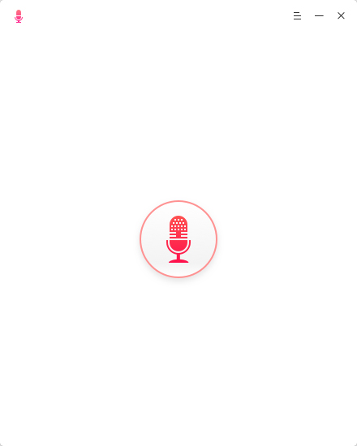
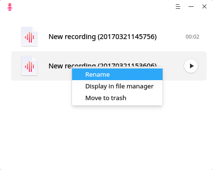
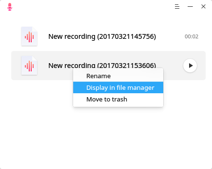
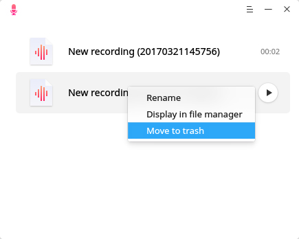
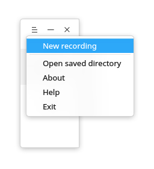
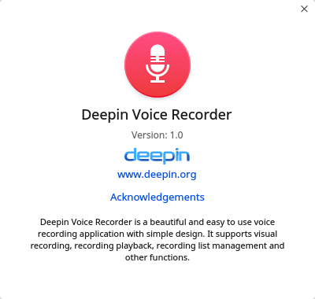

# Deepin Voice Recorder|../common/deepin-voice-recorder.svg|

## Overview|../common/icon_overview.svg|

Deepin Voice Recorder is a beautiful and easy to use voice recording application with simple design. It supports visual recording, recording playback, recording list management and other functions. Whatever to record singing, talking on a call or conference, Deepin Voice Recorder can do it for you, it will make your voice to be seen and saved.

## Guide|../common/icon_guide.svg|

You can run and close Deepin Voice Recorder by one of the following operations, and can also create shortcut for it.

### Run Deepin Voice Recorder

1. Click on  on Dock or move the mouse pointer to the top left corner of screen to enter Launcher interface.
2. Find  to click on, you can:

 - Click on **Send to desktop** to create a desktop shortcut.
 - Click on **Send to dock** to fix it on Dock.
 - Click on **Add to startup** to add it to startup, it will automatically run when the system starts up.

> : If Deepin Voice Recorder has been fixed on Dock by default, you can also click on  to run.

### Close Deepin Voice Recorder

- On Deepin Voice Recorder interface, click on  to exit Deepin Voice Recorder.
- Right click on  on Dock, select **Close all** to exit Deepin Voice Recorder.
- Click on  and select **Exit** to exit Deepin Voice Recorder.

## Basic Operations|../common/icon_commoncoperat.svg|

### Record Voice

Two steps to finish a recording:

1. On Deepin Voice Recorder interface, click on  to record.
2. Click on  to finish the recording.

> : During recording, you can click on  to pause and click it again to continue.

### Playback Recording

After recording finished, it will list vertically, then you can hover on it and click the play button for playback.

> : During playback, you can click the pause or stop button to do some operations.

### Rename Recording

After recording finished, it will be saved and named after "New recording (time)", then you can rename it.

1. On Deepin Voice Recorder interface, right click on a recording file.
2. Select **Rename**.
3. Input a file name.
4. Click the blank space on interface or press .

### View Saved Directory

After recording finished, it will automatically saved in wav, you can view the file saved location by following ways:

- On Deepin Voice Recorder interface, right click on a recording file to select **Display in file manager**.
- On Deepin Voice Recorder interface, click on  to select **Open saved directory**.

### Move to Trash

After recording finished, it will list vertically, then you can move any one to trash.

1. On Deepin Voice Recorder interface, right click on a recording file.
2. Select **Move to trash** to delete.

## Main Menu|../common/icon_optionsetting.svg|

### New Recording

1. On Deepin Voice Recorder interface, click on .
2. Click on **New recording**.
3. Start a new recording and the current recording will be saved if there is.

### Help

You can click to view the manual, which will help you further know and use Deepin Voice Recorder.

1. On Deepin Voice Recorder interface, click on  .
2. Click on **Help**.
3. View the manual.

### About

You can click to view the version description.

1. On Deepin Voice Recorder interface, click on .
2. Click on **About**.
3. View the version description.

### Exit

You can click on **Exit** to exit Deepin Voice Recorder.

1. On Deepin Voice Recorder interface, click on .

2. Click on **Exit** to exit.
