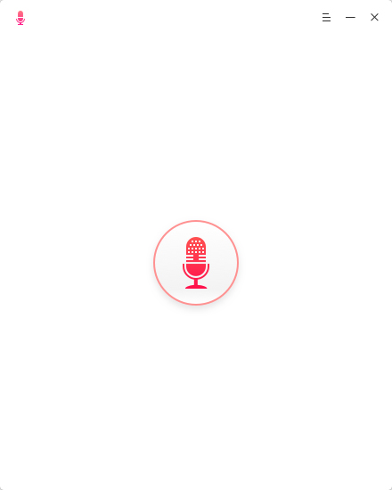
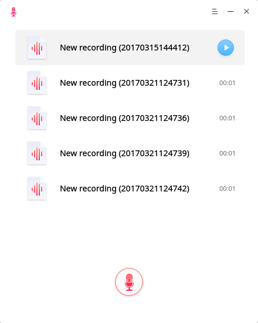
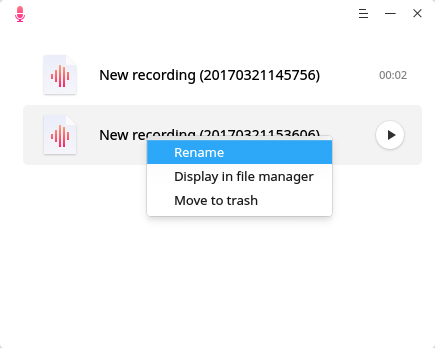
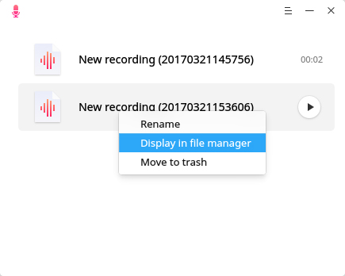
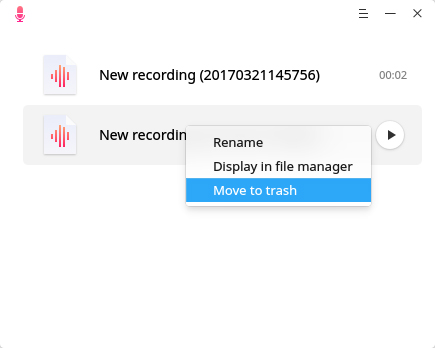
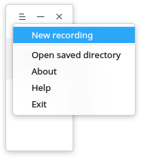

# Deepin Voice Recorder|../common/deepin-voice-recorder.svg|

## Vistazo

Deepin Voice Recorder es una aplicación hermosa y fácil de usar con un diseño simple. Admite gráficos del sonido, oir grabaciones, lista de reproducción y otras funciones. Independientemente de si desea grabar canciones, hablar en una llamada o conferencia, Deepin Voice Recorder puede hacerlo por usted, hará que su voz se escuche y se conserve.

## Guía

Puede ejecutar y cerrar Deepin Voice Recorder mediante una de las siguientes operaciones, y también puede crear un acceso directo para él.

### Iniciar Deepin Voice Recorder

1. Clic en  en el Muelle o mueve el puntero del ratón a la esquina superior derecha para entrar a la interfaz del Lanzador.
2. Encuentre  y haz clic, puede:

  - Clic en  **Envíar al escritorio** para crear un acceso directo al escritorio.
  - Clic en  **Enviar al muelle** para fijar la aplicación al Muelle.
  - Clic en  **Añadir al arranque** para añadir la aplicación en el arranque, esta se iniciará automáticamente cuando la computadora inicie.

> : Si Deepin Voice Recorder ha sido anclado en el Muelle by default, también puede hacer clic en  para iniciar.

### Cerrar Deepin Voice Recorder

- En la interfaz de Deepin Voice Recorder, haga clic en  para salir de Deepin Voice Recorder.
- Clic derecho en  en el Muelle, seleccione **Cerrar todo** para salir de Deepin Voice Recorder.
- Clic en  y eliga **Salir** para finalizar Deepin Voice Recorder.

## Operaciones Básicas

### Grabación de voz

Tiene dos pasos para realizar una grabación:

1. En la interfaz de Deepin Voice Recorder, clic en para grabar.
2. Clic en  para terminar la grabación.

> : Durante la grabación, puede hacer clic en  para pausar y clic de nuevo para continuar.

### Reproducir grabación

Después de finalizar la grabación, se incluirá en la lista vertical, después puede dirigirse al archivo y hacer clic en el botón play para reproducir.

> : Durante la reprodución, puede hacer clic en el botón de pausar o detener para realizar dichas acciones.

### Renombrar Grabación

Una vez finalizada la grabación, se guardará y nombrará después de "Nueva grabación (fecha y hora)", luego podrá cambiarle el nombre.

1. En la interfaz de Deepin Voice Recorder, clic derecho en un archivo grabado.
2. Seleccione **Rename**.
3. Ingrese el nombre del archivo.
4. Clic en el espacio en blanco de la interfaz o pulse .

### Ver carpeta de guardado

Después de finalizar la grabación, será guardada automáticamente en formato wav, puede ver la ubicación del archivo guardado con los siguientes pasos:

- En la interfaz de Deepin Voice Recorder, clic derecho en un archivo guardado para seleccionar **Mostrar en el gestor de archivos**.
- En la interfaz de Deepin Voice Recorder, clic en  y seleccione **Abrir directorio guardado**.

### Mover a la Papelera

Después de finalizar la grabación, se incluirá en la lista vertical, después puede mover uno de ellas a la papelera.

1. En la interfaz de Deepin Voice Recorder, right clic en a recording file.
2. Select **Mover a la papalera** para borrar.

## Menú principal

### Nueva grabación

1. En la interfaz de Deepin Voice Recorder, clic en .
2. Clic en **Nueva grabación**.
3. Inicie una nueva grabación y la grabación actual se guardará si se finaliza.

### Ayuda

1. En la interfaz de la Calculadora Deepin, clic en .
2. Seleccione **Ayuda**.
3. Observe el manual.

### Acerca de

1. En la interfaz de la Calculadora Deepin, clic en .
2. Seleccione **Acerca de**.
3. Observe la descripción de la versión.

### Salida

1. En la interfaz de la Calculadora Deepin, clic en .
2. Clic en **Salir** para cerrar.
