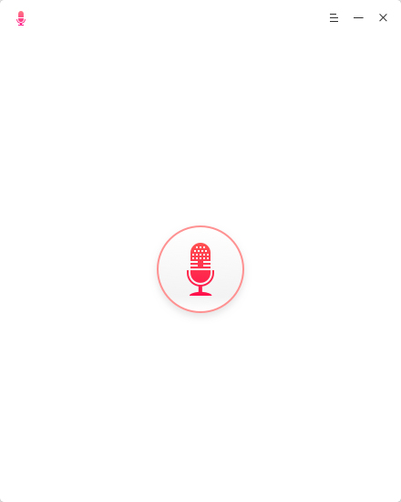
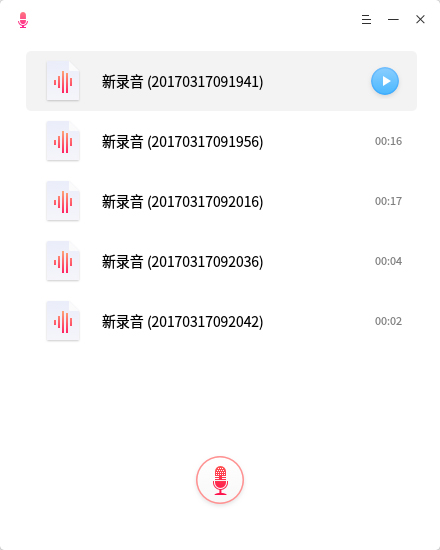
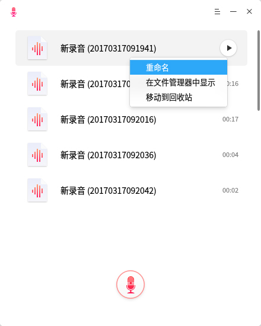
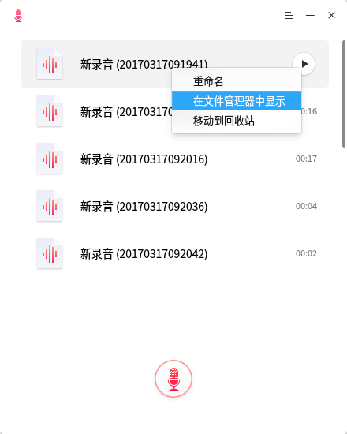
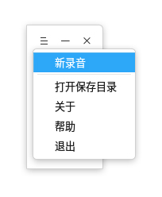

# 深度录音|../common/deepin-voice-recorder.svg|

## 概述

深度录音是一款设计简洁、美观易用的录音软件。无论您是想记录自己的歌声还是通话和会议录音，都可以使用深度录音来完成；它还支持可视化录音、录音回放、录音列表管理等功能，让您的声音看得见、被保存。

## 使用入门

您可以通过以下方式运行、关闭深度录音，同时还可以创建快捷方式。

### 运行深度录音

1. 点击桌面底部的 启动器  或将鼠标指针移到屏幕左上角，进入启动器界面。
2. 上下滚动鼠标滚轮，通过浏览找到  进行点击运行。
3. 将鼠标指针置于深度录音应用程序的图标上，右键点击图标，您可以：

- 点击 发送到桌面，在桌面创建快捷方式。
- 点击 发送到任务栏，将应用程序固定到任务栏。
- 点击 开机自动启动，将应用程序添加到开机启动项，在电脑开机时自动运行该应用程序。

> ：如果深度录音已经默认固定在任务栏上，您也可以点击任务栏上的 来运行。

### 关闭深度录音

- 在深度录音界面点击   ，退出深度录音。
- 在任务栏右键单击  ，选择 **关闭所有** 来退出深度录音。
- 在深度录音界面点击  ，选择 **退出** 来退出深度录音。

## 操作介绍

### 录制音频

轻松两步，完成一段录音，基本录音步骤如下：

1. 在深度录音界面上点击  图标，开始录音。
2. 点击  按钮完成录音。

> ：录音过程中您可以点击  按钮暂停录音，想继续录音时再点一下就可以了。

### 录音回放

录制完成后，录音以列表形式显示再深度录音界面上，鼠标移动到一个录音文件上之后点击出现的播放按钮就可以收听录音回放。

> ：收听录音回放时可以点击按钮暂停或停止播放录音。

### 录音重命名

录制完成后，录音文件自动保存成名为“新录音（时间）”的音频文件，您可以重命名录音文件。

1. 在深度录音界面上，右键单击一个录音文件。
2. 选择 **重命名**。
3. 输入文件名称。
4. 鼠标点击界面空白处或者按下键盘上的  键。

### 查看保存目录

录制完成后，录音文件会自动保存为wav格式，你可以通过以下方法查看文件保存位置：
- 在深度录音界面上，右键单击一个录音文件，选择 **在文件管理器中显示**。
- 在深度录音界面上，选择  > **打开保存目录**。

### 删除录音

1. 在深度录音界面上，右键单击一个录音文件。
2. 选择 **移动到回收站**。

## 主菜单

### 新录音

1. 在深度录音界面，点击   。
2. 点击 **新录音**。
3. 立即开始录制一个新录音，如果之前您正在录音，录音会自动保存并开始新录音。

### 帮助

您可以点击帮助获取深度录音的帮助手册，通过帮助进一步让您了解和使用深度录音。

1. 在深度录音界面，点击   。
2. 点击 **帮助**。
3. 查看关于深度录音的帮助手册。

### 关于

您可以点击关于查看深度录音的版本介绍。

1. 在深度录音界面，点击   。
2. 点击 **关于**。
3. 查看关于深度录音的版本和介绍。
