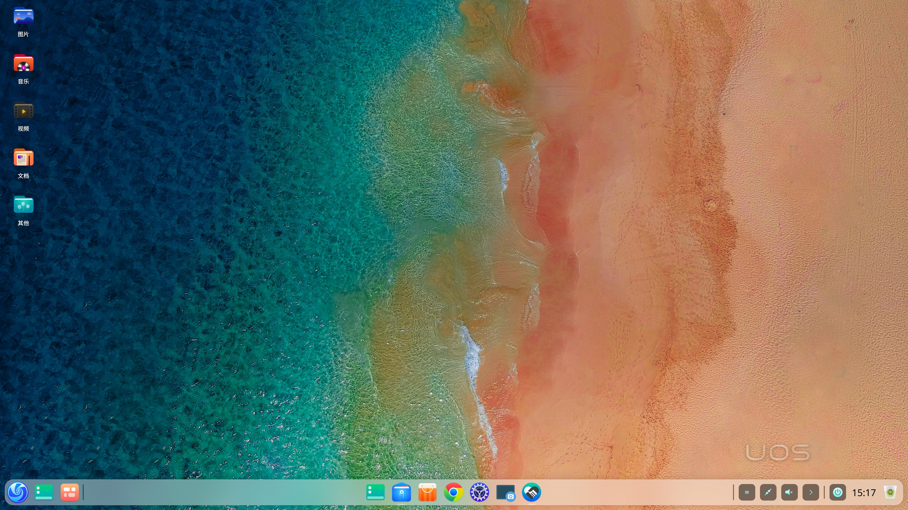
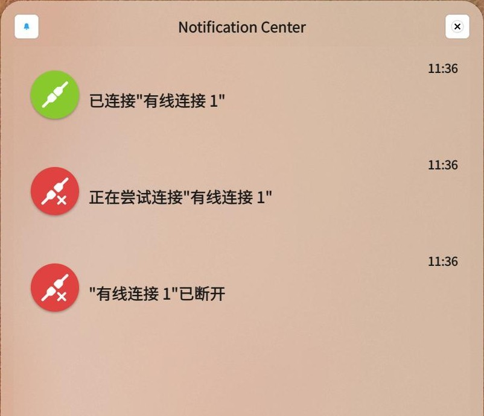
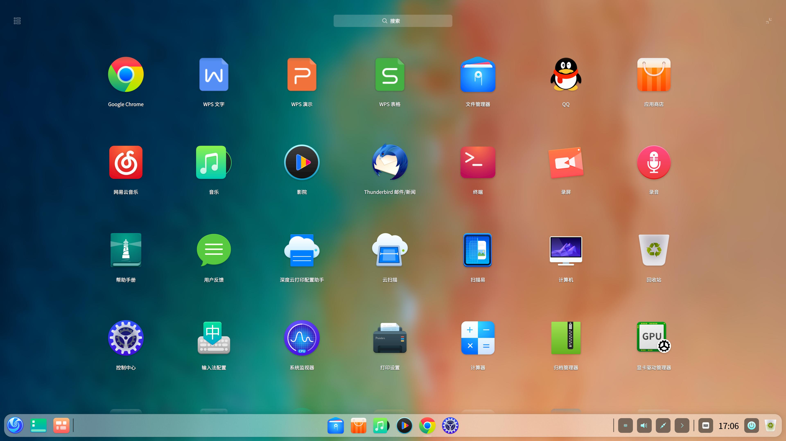
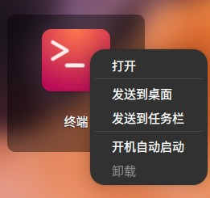
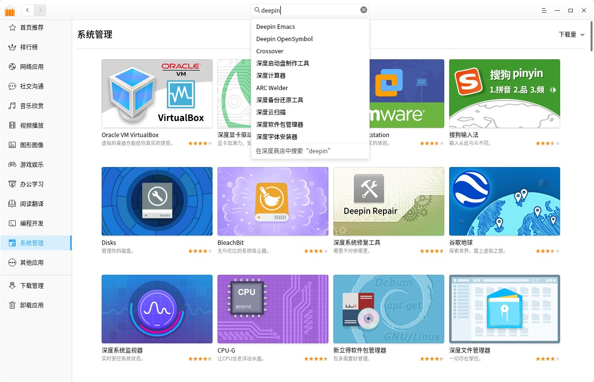
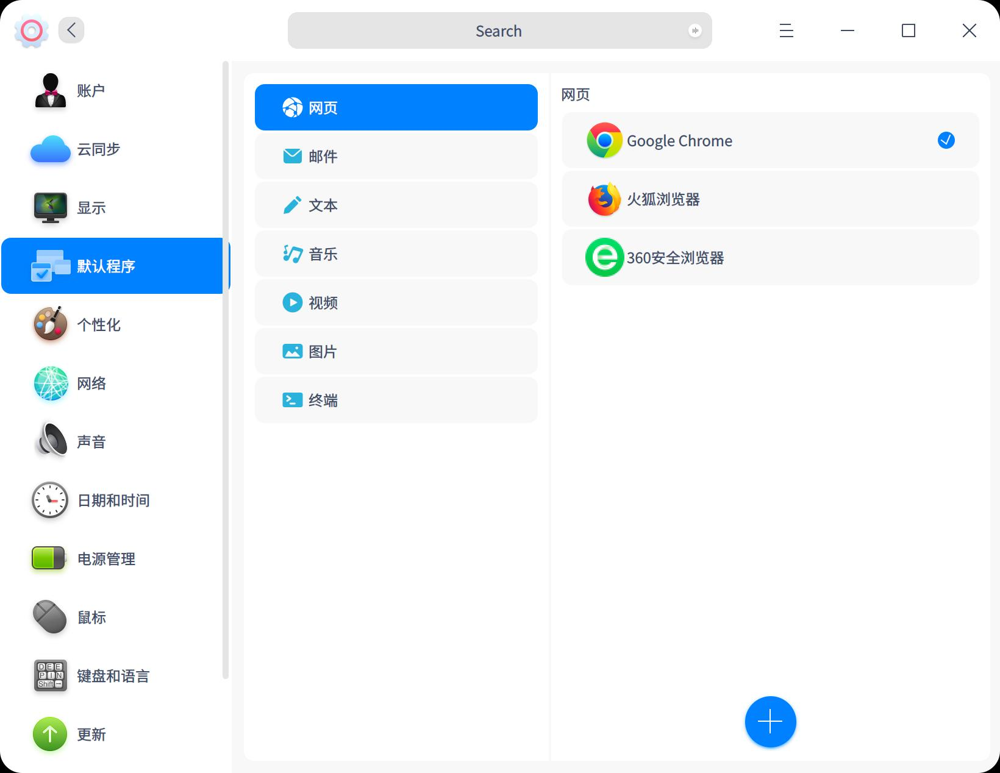
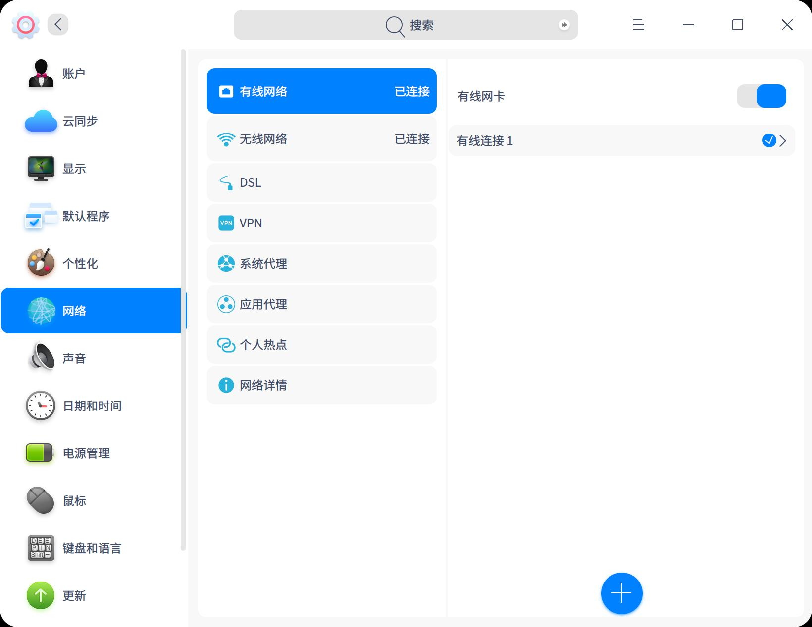
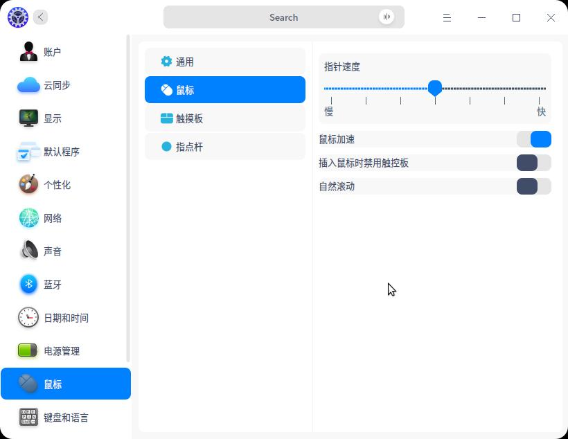
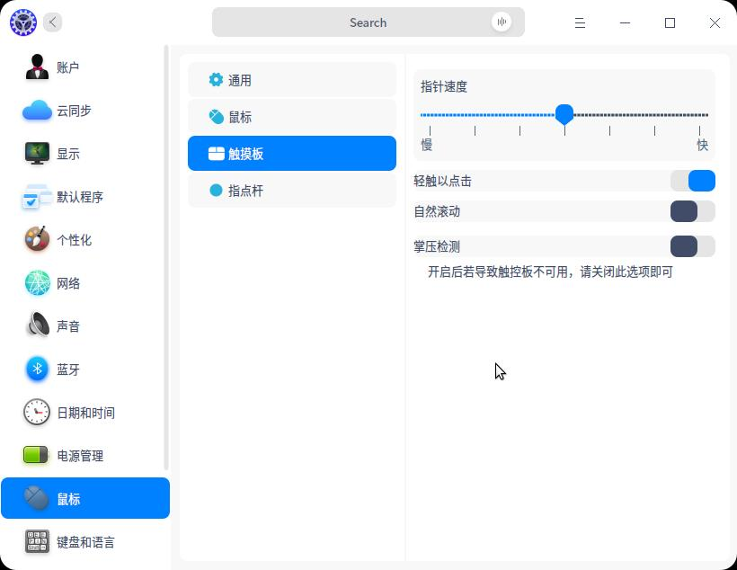
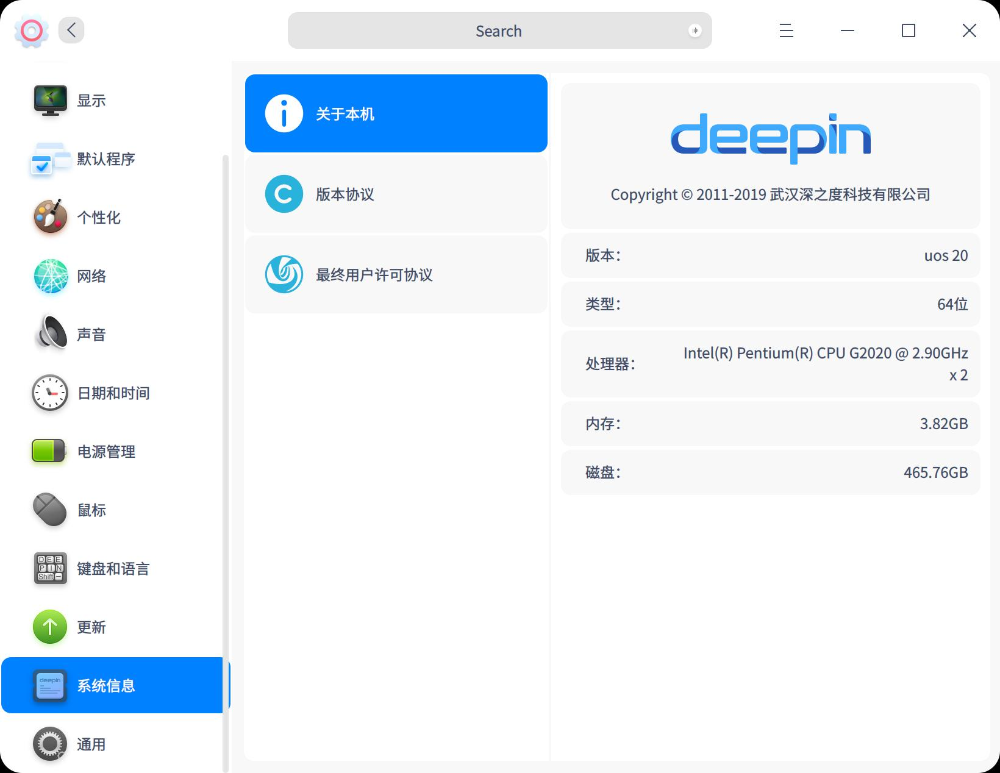

# Desktop Environment|../common/dde.svg|

## Overview
UOS is a beautiful, easy to use and reliable Linux desktop operating system. It offers Google Chrome, WPS Office, as well as thousands of applications in App Store to meet the learning, work, and entertainment needs of global users. With continual improvement, UOS is becoming one of the most popular open-source operating systems all over the world.

### Getting Started

When you log into the system for the first time, a welcome program will automatically start.  Watch the introduction video to get new features, customize your desktop, and know more about UOS.

Once login, you are experiencing UOS Desktop Environment, which is comprised of Desktop, Dock, Launcher, Control Center, and window manager. 

Read below and learn how to work in UOS Desktop Environment.

## Desktop

On the desktop, you can create a new file/folder, sort files, set hot corners, wallpaper, and screensaver, etc. 

### Create New Folder/Document
Just as in File Manager, you can create a new folder/document on the desktop, or do some operations for the files on it.

- Right click the desktop and select **New folder**, enter the name for it.

- Right click the desktop and select **New document**, select the type and enter its name.

- Right click a file or folder on the desktop, and use the features of File Manager as below:

  |                  |                                                              |
  | ---------------- | ------------------------------------------------------------ |
  | Open with        | Select an app to open it.                                    |
  | Cut              | Move to another location.                                    |
  | Copy             | Copy to another location.                                    |
  | Rename           | Change its name.                                             |
  | Delete           | Delete it and move it to trash.                              |
  | Compress/Extract | Compress the file or folder, or extract the compressed file. |
  | Create link      | Create a shortcut of the file or folder.                     |
  | Tag information  | Add a tag.                                                   |
  | Properties       | View the basic info, share it or change the permission.      |

### Sort Files
Sort the files on your desktop to make it organized and fit your needs.

1. Right click the desktop.
2. Click **Sort by**, you can:

 - Click **Name** to display files in name sequence.
 - Click **Time modified** to display files in the order of last modified date.
 - Click **Size** to display files in size sequence.
 - Click **Type** to display files in type.

> : Check **Auto arrange**, icons on the desktop will be listed in order automatically, and if an icon is removed, another one will fill in the blanks.

#### Auto Merge
Check “Auto merge” to keep your files on the desktop organized. 

When it is checked, all files and folders on the desktop will be automatically grouped into folders named by Videos, Music, Pictures, Documents, Applications, Others and Folders.

### Adjust Icon Size

1. Right click the desktop.
2. Click **Icon size**, and choose a proper size.

> : Press  + / to adjust icon size on the desktop and that in Launcher.

### Change Display Settings
You can set display scaling, screen resolution, brightness and so on from the desktop.

1. Right click the desktop.
2. Click **Display Settings** to open the settings in Control Center.

> : For specific operations, please refer to [Display Settings](#Display Settings).

### Set Hot Corners
Hot Corner helps you quickly enter Desktop, Launcher, Control Center, and simplifies your operations.

1. Right click the desktop.
2. Click **Corner Settings**, then the whole screen will get dark and the corresponding hot corner function will be displayed on the four corners.
3. Move the mouse pointer to a corner and select one option.
4. Click the desktop blank area to exit.

> : Please pay attention to the animation of corner settings.

### Change Wallpaper
Select some elegant and fashionable wallpapers to beautify your desktop and make it distinctive.

1. Right click the desktop.
2. Click **Wallpaper and Screensaver** to preview all the wallpapers.
3. Click your favorite one and it will apply in your desktop and lock screen.
4. You can also choose **Only desktop** or **Only lock screen**.

> : Check **Wallpaper Slideshow**, and set the time interval to change wallpaper automatically, or set to change the wallpaper when login or wakeup. 
> : You can also set your favorite picture as wallpaper in an image viewer.

### Set Screensaver
The screensaver was used to protect the monitor before, now it is mainly for protecting personal privacy from peeing.

1. Right click the desktop.
2. Click **Wallpaper and Screensaver**, and select **Screensaver** to preview all the screensavers.
3. Select one and click **Apply**, and set the waiting time for the screensaver to start.
4. You can also check the box of **Require a password on wakeup** for a better privacy protection.
5. After that idle time, the screensaver will start.

## Dock
Dock is at the bottom of the desktop by default to help you quickly open often used applications, which includes Launcher, applications, system tray, and plugins. In the dock, you can open launcher to find all installed applications, show the desktop, enter the workspaces, open and exit apps, set input methods, adjust the volume, connect to a wireless network, view the calendar and enter the shutdown interface.

### Dock Icons
In the Dock, there are icons of Launcher, applications, system tray, and plugins.

You can send application icons from Launcher to Dock so as to open it quickly.

|      |      |
| ---- | ---- |
|  | Launcher - click to view all the installed applications. |
|  | Click to show the desktop. |
|  | Multitasking View - click to show workspaces. |
|  | File Manager - click to view files and folders on the disk. |
|  | Google Chrome - click to open webpages. |
|  | Store - search and install applications. |
|  |  Music - play local songs.  |
|  | Movie - play local videos. |
|  |   Control Center - click to check or change system settings.   |
|  | Onboard virtual keyboard. |
|  | Notification Center - show all notifications from the system and applications. |
|  | Click to enter the shutdown interface. |
|  | Trash. |

> ：Move the mouse pointer to the running app in the Dock, you will see its preview window.

### Switch Display Mode
There are two display modes of Dock: fashion mode and efficient mode. The latter one displays application icons in smaller ones.

You can switch the display modes by the following operations:

1. On the desktop, move the mouse pointer over the Dock.
2. Right click and select **Mode**.
3. Select a display mode.

### Change Dock Location
You can place the Dock on any direction of your desktop.

1. Move the mouse pointer over the Dock.
2. Right click and select **Location**.
3. Select a location.

### Change Dock Height
1. Move the mouse pointer over the Dock.
2. Drag the top edge to increase or decrease the height.

### Show/Hide Dock

1. Move the mouse pointer over the Dock.
2. Right click and select **Status**.
3. On the submenu, you can select:
- **Keep Shown** - display the Dock all the time.
- **Keep Hidden** - hide the Dock and display it only when hovering on the dock area.
- **Smart Hide** -  hide the Dock automatically if the dock area is used.

### Show/Hide Plugins

1. Move the mouse pointer over the Dock.
2. Right click and select **Plugins**.
3. On the submenu, you can check or uncheck **Trash, Power, Show Desktop, Onboard, Notifications, Multitasking View, Datetime** to show or hide the corresponding icon in the Dock.

### View Notifications
When there are system or application notifications, they will shown in the middle of the screen. If there are buttons in the message, click buttons to do the actions; if there are not, click the message to close it.

Click  in the Dock to view all the notifications.

### Enter Shutdown Interface
There are two ways to enter the shutdown interface:

- Click  in the Dock.
- Click  at the bottom right corner of Launcher mini mode.

|                                                              |                                                              |
| ------------------------------------------------------------ | ------------------------------------------------------------ |
| Shut down        | Shut down the computer.                                      |
| Reboot               | Restart the computer.                                        |
| Suspend            | The computer will run with low consumption.                  |
| Lock                     | Lock the computer with the password. Or press + to lock it. |
| Switch user  | Log in with another user account.                            |
| Log out              | End all the processes and initialize the system.             |
| Start system monitor | View the running processes and end the one you want.         |

> :  will be shown if there are multiple accounts in the system.

### View Date and Time

- Move the mouse pointer over the time in the dock, you can get the current date, day and time.
- Click the time, you will open Calendar.

### Trash
You can find all deleted files in the trash, which can be restored or emptied.

#### Restore Files

1. Select the file in the trash.
2. Right click the file and select **Restore**.
3. The file will be in its original path.

> : To restore file/folder just deleted, press  +   to undo it.

#### Empty Trash
Empty trash to release the occupied space on your disk.

- In the trash, click **Empty** to permanently delete all the files in the trash.

## Launcher
Launcher   helps you manage all the installed applications, where you can quickly find an application by category navigation or by a search.

> : A newly installed application in Launcher is followed with a blue dot.

### Switch Launcher Modes

There are two display modes of Launcher: fullscreen mode and mini mode. Click the icon at the upper right corner to switch modes.

Both modes support searching applications and sending them to the desktop or the Dock.

The mini mode also supports opening File Manager, Control Center and shutdown interface directly.

### Sort Applications

In fullscreen mode, all applications in Launcher are listed by the installation time by default. You can sort the application icons as below ways:

- Drag and drop the application icon to arrange it freely.
- Click the category icon  on the upper left in Launcher to arrange the icons by category.

In mini mode,  applications are displayed according to using frequency by default.

### Find an Application

In Launcher, you can scroll up and down to find an application, or locate it with the category navigation.

If you already know the application name, just search for it.

### Set App Shortcut
The App shortcut helps start an application rapidly.

#### Create App Shortcut
Send the application icon to the desktop or the Dock to facilitate the follow-up operations.

In Launcher, right click an app icon, you can:

* **Send to desktop** to create a shortcut on the desktop.
* **Send to dock** to fix the application icon in the Dock.

> : You can drag the application icon from Launcher to Dock. But you cannot drag and drop the application while it is running. Then you can right click the application icon in the Dock and select **Dock** to fix it.

#### Delete App Shortcut
Delete an app shorcut from the desktop directly, or remove it from the Dock or Launcher.

Remove the shortcut from Dock:

- Drag and drop the icon far away from the Dock. 
- You cannot drag and drop the application icon while it is running. Then you can right click the application icon in the Dock and select **Undock** to remove it.

Remove the shortcut from Launcher:

In Launcher, right click the icon, you can:
- **Remove from desktop** to delete the shortcut from the desktop.
- **Remove from dock** to remove the application icon from the Dock.

> : The above operations only delete the shortcut, not uninstalling the applications.

### Install Applications
Search and install more applications you want in App Store.

### Run Applications
For the applications whose shortcuts have been created on the desktop or Dock, you can open them in the following ways:

- Double click the desktop icon or right click it and select **Open**.
- Click the application icon in the Dock or right click it and select **Open**.

To open the application only shown in Launcher, click the icon or right click it and select **Open**.

> : For the frequently used applications, right click the app icon and select **Add to startup** to run it when the computer boots.

### Uninstall Applications
Uninstall the applications you no longer use to save disk space.

1. In Launcher, right click the application icon.
2. Click **Uninstall**.

> : In **Fashion mode**, drag the application icon in Launcher fullscreen mode to  in the Dock to uninstall the application.

## Control Center
Manage the system settings in Control Center, including account management, network settings, date and time, personalization, display settings, system and application update, etc. After logging into the system, click  to open Control Center.

### Homepage Introduction
The homepage of Control Center provides several setting modules, click one to enter the detailed settings. 

Once you open a setting module in Control Center, the navigation appears on the left. Click the left navigation to quickly switch to other settings.

#### Title Bar

The title bar contains the back button, search box, main menu and the window buttons.

- Back button: Click  to go back to the homepage.
- Search box: Input a keyword and search the related settings.
- Main menu: Click  to enter the main menu where you can set the window theme, view the manual and exit.

### Account Settings
You have already created an account when installing the system. Here you can modify account settings or create a new one.

#### Create New Account

1. On the homepage of Control Center, click .
2. Click .
3. Input a username, and a password twice.
4. Click **Create**.
5. Input the password of  the current user account in the authentication dialog, and the new account will be added to the account list.

#### Change Account Avatar

1. On the homepage of Control Center, click .
2. Click an existing account in the list.
3. Click the user avatar.
4. Select a avatar or upload a local avatar.

#### Set Full Name
The account full name is shown in account list and system login interface, set it if you want.

1. On the homepage of Control Center, click .
2. Click an existing account in the list.
3. Click  after **Full Name**, and input a name.

#### Modify Account Password

1. On the homepage of Control Center, click .
2. Click the current account.
3. Click **Change Password**.
4. Input a new password twice and confirm.

#### Auto Login
If "Auto Login" is enabled, you can log into the system directly, without inputting a password when the computer reboots or starts next time. But you still have to enter the password after locking or logging out the computer.

1. On the homepage of Control Center, click .
2. Click the current account.
3. Switch on **Auto Login**.

#### Login Without Password
If "Login Without Password" is enabled, you only need to click  to log into the system without inputting a password. 

1. On the homepage of Control Center, click .
2. Click the current account.
3. Switch on **Login Without Password**, you can log into the system without a password.

> : If both **Auto Login** and **Login Without Password** are enabled, once reboot or start, your computer will enter the desktop directly without requiring a password.

#### Set Fingerprint Password

Fingerprint password is used in system login, application authorization, and other scenarios. Scan your fingerprint when user password is required.

1. On the homepage of Control Center, click .
2. Click the current account.
3. Click **Add Fingerprint**.
4. Put your finger on a fingerprint reader, do as the instructions repeatedly until your fingerprint is added successfully.

> : You can add multiple fingerprint passwords for one account; Click **Delete fingerprint** to remove all fingerprint passwords. 

#### Delete Account

1. On the homepage of Control Center, click .
2. Click the other account.
3. Click **Delete Account**.
4. In the confirm dialog, click **Delete**.

> : The logged in account cannot be deleted.

### Cloud Sync

By signing in Deepin ID, you can sync the current system settings to the cloud, including network settings, sound settings, mouse settings, update settings, power settings, corner settings, theme, wallpaper, launcher, and Dock. To sync the settings from the cloud to another computer, just sign in the same Deepin ID on that computer.

> : When "Auto Sync" is enabled, you can uncheck the unwanted options; when it is disabled, all settings will not be synced.

### Display Settings
Set screen resolution, brightness, direction and display scaling properly to have the best visual effect.

#### Single Screen Settings

##### Change Resolution

1. On the homepage of Control Center, click .
2. Click **Resolution**.
3. Select a proper resolution in the list.
4. Click **Save**.

##### Adjust Brightness

1. On the homepage of Control Center, click .
2. Click **Brightness**.
   - Drag the slider to set screen brightness.
   - Switch on **Night Shift**, the screen hue will be auto-adjusted according to your location.
   - Switch on **Auto Brightness**, the monitor will change the brightness automatically according to ambient light (shown only if PC has a light sensor).

##### Set Display Scaling

Set a proper display scale to have a normal display.

1. On the homepage of Control Center, click .
2. Click **Display Scaling**.
3. Change the display scaling, log out and log in again to see the changes.

> : When a HiDPI screen is detected, the display scaling will be automatically adjusted.

> : For the applications that do not support scaling, right click it in Launcher and select **Disable display scaling** to get a better display.

##### Change Refresh Rate
1. On the homepage of Control Center, click .
2. Click **Refresh Rate**.
3. Select a proper one, and **Save**.

##### Change Display Direction

1. On the homepage of Control Center, click .
2. Click .
3. Every time you click, the screen will rotate 90 degrees counterclockwise.
4. To restore to the original direction, click the right button to exit; to use the current direction,  press + to save it.

#### Multiple Screen Settings
Expand your desktop by multiple screens! Use VGA/HDMI/DP cable to connect your computer to other display devices.

1. On the homepage of Control Center, click .
2. Click **Multiple Displays**.
3. Select a display mode:
    - **Duplicate**: display the same image on other screens.
    - **Extend**: expand the desktop across the screens.
    - **XXX only**: display the screen content only on one screen.
    - **Customize**: customize the display settings for multiple screens.

> : In multiple displays, press  +  to show its OSD. Hold  , and press  or click to select the options. Once releasing the keys, the selected mode will take into effect.

##### Custom Settings

1. On the homepage of Control Center, click .
2. Click **Multiple Displays** > **Customize**.
3. Choose **Merge** or **Split** the screens, specify the main screen, set the resolution and refresh rate, and rotate screen if you want.
4. Click **Save**.

> : "Merge" means duplicate mode, "Split" means extend mode. 

### Default Application Settings
If you have installed several applications with similar functions, such as text editor, choose one of them to be the default application to open that type of file.

#### Set Default Application

1. Right click the file, choose **Open with** > **Set default program**.
2. Select one app and click **Confirm**.
3. The app will automatically be added to the default application list in Control Center.

#### Change Default Application

1. On the homepage of Control Center, click .
2. Click the file type.
3. Select another one in the list as the default application.

#### Add Default Application

1. On the homepage of Control Center, click .
2. Click the file type.
3. Click  below to add a desktop file (ususally at /usr/share/applications) or a specified binary file as the default application.

#### Delete Default Application

In the default application list, you can only delete the app you added. To remove other apps from the list,  the only way is to uninstall them. Once uninstalled, they will automatically deleted from the list.

To delete the default application you added, do as below:

1. On the homepage of Control Center, click .
2. Click the file type.
3. Click  after the application name to delete it.

### Personalization Settings
You can change the appearance of desktop and windows here by adjusting the transparency of Launcher (in mini mode) and Dock, and using different window, icon, cursor themes and fonts, etc. 

#### Set Window Theme
1. On the homepage of Control Center, click .
2. Click **General**.
3. Select one window theme, which will be used as system theme.

> : "Auto" means changing window theme automatically according to the sunset and sunrise time. After sunrise, it is light theme; after sunset, it is dark theme.

#### Change Accent Color
Accent color refers to the color used when you select one option or file in the system.

1. On the homepage of Control Center, click .
2. Click **General**.
3. Pick a color under **Accent Color** and view its effects.

#### Adjust Transparency
Move the slider to set the transparency of Launcher (in mini mode) and Dock. When the slider is on left, it is transparent.

1. On the homepage of Control Center, click .
2. Click **General**.
3. Click the bar to adjust the transparency and view it in real time.

#### Enable Window Effect
Enable window effect to make the desktop and the windows more beautiful and delicate.

1. On the homepage of Control Center, click .
2. Click **General**.
3. Switch on **Window Effect**.

#### Set Icon Theme

1. On the homepage of Control Center, click .
2. Click **Icon Theme**.
3. Select an icon style.

#### Set Cursor Theme

1. On the homepage of Control Center, click .
2. Click **Cursor Theme**.
3. Select a set of cursors.

#### Change Font

1. On the homepage of Control Center, click .
2. Click **Font**.
3. Set the font and font size for the system.

### Network Settings
After login, you should connect to a network first and then surf the Internet! 

> : Check your network status by hovering over the network icon in the Dock.

#### Wired Network

Wired network is secure and stable, usually used in an office. Connect to a wired network as follow steps. 

1. Plug the cable into the network slot of computer.
2. Plug another end of the cable into the router or network port.
3. On the homepage of Control Center, click .
4. Click **Wired Network**.
5. Switch on **Wired Network Adapter** to enable wired network.
6. If successfully connecting to the network, there will be a prompt "Wired Connection connected".

You can also edit and add a new wired network in the setting page.

#### Wireless Network

Wireless network helps you surf the network without cables, more flexible and supports more devices.

##### Connect to Wi-Fi Network

1. On the homepage of Control Center, click .
2. Click **Wireless Network**.
3. Switch on **Wireless Network Adapter** to enable the wireless network.
4. The computer will auto search the nearby available wireless network.
5. Select the wireless network to connect.
   - If the network is open, it will auto connect to the network.
   - If the network is encrypted, please enter the password and click **Connect**.

##### Connect to Hidden Network

To prevent others from scanning your network and cracking your password, you can hide the wireless network in the router settings, and connect to the hidden Wi-Fi as below.

1. On the homepage of Control Center, click .
2. Click **Wireless Network**.
3. Switch on **Wireless Network Adapter** to enable the wireless network.
4. Click **Connect to Hidden Network**.
5. Enter the name, SSID, and other required info.
6. Click **Save**.

#### Hotspot

Hotspot changes the connected network signal to Wi-Fi hotspot, so that other devices nearby can connect to the hotspot and surf the internet. To enable hotspost, your computer must connect to a network and have a wireless network adapter.

1. On the homepage of Control Center, click .
2. Click **Personal Hotspot**.
3. Switch on **Hotspot**.
4. Create a hotspot and save the settings.

#### Mobile Network
If you are at a place without network, mobile network adapter is a useful tool to help you connect to the internet as long as you can make a call.

1. Plug the mobile network adapter into your computer USB port.
2. Your computer will auto connect to the network.
3. On the homepage of Control Center, click .
4. Click **Mobile Network** to view the detailed network info.

#### DSL/PPPoE Connections

DSL is a dial-up connection using a standard phone line and analog modem to access the Internet. 

##### Create a PPPoE Connection

1. On the homepage of Control Center, click .
2. Click **DSL**.
3. Click .
4. Enter the name, your account and password the operator provides.
5. Click **Save**. The connection will automatically start.

#### VPN

VPN (Virtual Private Network) extends a private network across a public network, and enables users to send and receive data across shared or public networks as if the computing devices were directly connected to the private network. 

1. On the homepage of Control Center, click .
2. Click **VPN.**
3. Click  or  to create or import VPN settings.
4. After created, you can click **Export** to export the configuration file. 

> : If you don't want to use the VPN as the default routing, switch on **Only applied in corresponding resources**.

#### System Proxy

1. On the homepage of Control Center, click .
2. Click **System Proxy**.
 - Click **None** and **Save** to disable the proxy.
 - Click **Manual** and input the address and port of proxy servers.
 - Click **Auto** and input a URL to configure the proxy info.

#### Application Proxy

1. On the homepage of Control Center, click .
2. Click **Application Proxy**.
3. Select a proxy type, and fill in IP address, port, etc.
3. Click **Save** to save the proxy settings.

> : After configured, right click an application in Launcher and check **Use a proxy**, then the application will be opened by proxy.

#### Network Info

You can view MAC, IP address, gateway and other network info in network details. 

1. On the homepage of Control Center, click .
2. Click **Network Details**.
3. View the network info of the current wired or wireless network.

### Sound Settings
Set your speaker and microphone properly to make you hear more comfortable and sound better.

#### Speaker

1. On the homepage of Control Center, click .
2. Click **Speaker**.
3. Switch on **Speaker** to enable the speaker.
4. Adjust the output volume and left/right balance.

> : If "Speaker" is switched off, you will not hear any sound.

#### Microphone

1. On the homepage of Control Center, click .
2. Click **Microphone**.
3. Switch on **Microphone** to enable the microphone.
4. Adjust the input volume.

> : Here is how to set input volume: Speak to your microphone at a normal volume and view "Input Level". If the indicator changes obviously according to the volume, then the input volume is at a proper level. Note that a high input volume will make the sound distorted.

#### Advanced Settings

1. On the homepage of Control Center, click .
2. Click **Advanced**.
3. Select the input and output devices.

#### System Sound Effects

1. On the homepage of Control Center, click .
2. Click **Sound Effects** to enter the setting page, check or uncheck the sound effects as you like.

> : Click the line to listen to the sound effect.

### Bluetooth Settings
Bluetooth helps you make a short-distance wireless communication between Bluetooth devices without cable or network. The common Bluetooth devices are Bluetooth keyboard, Bluetooth mouse, Bluetooth earphones, Bluetooth speakers, etc.

> : Most laptops have Bluetooth, just enable and use it; but most desktop computers do not have it, you can purchase one Bluetooth adapter and plug it into computer USB port to get the function.

#### Change Bluetooth Name

1. On the homepage of Control Center, click .
2. Click  after the Bluetooth name, and enter a new name for your computer.

> : Your computer new name will be broadcasted automatically, and other devices should rescan to find it.

#### Connect to a Bluetooth Device

1. On the homepage of Control Center, click .
2. Switch on **Bluetooth** to turn on Bluetooth.
3. The system will scan the nearby devices automatically and list them in **Other Devices**.
4. Click the device you want to connect, and input the PIN code if required.
5. After pairing successfully, the device will be connected and added to **My Device** list.
6. In the list, click the device, you can **Disconnect** the device, or change its name.

### Date and Time
Set your timezone properly to have correct date and time. You can also change them manually.

#### Change Timezone
You have selected the timezone during system installation, to change it, do as follows.

1. On the homepage of Control Center, click .
2. Click **Timezone List**.
3. Click **Change System Timezone**, select a timezone by searching or clicking on the map.
4. Click **Confirm**.

#### Add Timezone
Add another timezone to see the date and time there.

1. On the homepage of Control Center, click .
2. Click **Timezone List**.
3. Click , select a timezone by searching or clicking on the map.
4. Click **Confirm**.

#### Delete Timezone

1. On the homepage of Control Center, click .
2. Click **Timezone List**.
3. Click **Edit** after "Timezone List".
4. Click  to remove the timezone.

#### Change Date and Time
Note that the auto-sync function will be disabled after changing date and time.

1. On the homepage of Control Center, click .
2. Click **Time Settings**.
3. Enter the correct date and time.
4. Click **Confirm**.

### Power Management

Power management turns the system to a low-power state when inactive, thus making a long battery endurance for laptop users, and protects your privacy as well.

> : If you are using a desktop computer, you will not see Power Saving Mode and On Battery. 

#### Power Saving Mode
To reduce the power consumption of your laptop, turn on power saving mode to reduce screen brightness.

1. On the homepage of Control Center, click .
2. Click **General**.
3. Switch on **Power Saving Mode** to enter power saving mode.
4. Switch on **Auto Mode Switch**, your laptop will enter power saving mode automatically when unplugged, and revert to normal mode when plugged in.

> : Power saving mode is only for laptops.

#### Password Required on Wakeup

1. On the homepage of Control Center, click .
2. Click **General**.
3. Switch on **Password is required to wake up the monitor** and **Password is required to wake up the computer** to improve the security.

####  Time to Turn Off Monitor

1. On the homepage of Control Center, click .
2. Click **Plugged In** and **On Battery**.
3. Set the time to turn off the monitor.

> : The time to turn off monitor, suspend and lock screen can be different in the settings of "Plugged In" and "On Battery".

#### Time to Suspend

1. On the homepage of Control Center, click .
2. Click **Plugged In** and **On Battery**.
3. Set the time to suspend.

> : There is an option for laptops plugged in - **Suspend on lid close**. Switch it on according to your needs. 

#### Time to Lock Screen
1. On the homepage of Control Center, click .
2. Click **Plugged In** and **On Battery**.
3. Set the time to lock screen.

### Mouse and Touchpad
Mouse and Touchpad are common computer input devices. They control cursors in the GUI and allow you to do various operations on your computer. 

#### General Settings

1. On the homepage of Control Center, click .
2. Click **General**.
3. Switch on **Left Hand**, and adjust **Scrolling Speed**, **Double-click Speed** for both mouse and touchpad.

> : If switching on "Left Hand", left click and right click exchange.

#### Mouse
Adjust your mouse settings here to make it fit your habits.

> : If there is no touchpad, “Disable touchpad when a mouse is connected” will not be shown.

1. On the homepage of Control Center, click .
2. Click **Mouse**.
3. Adjust **Pointer Speed**, and switch on **Natural Scrolling**/**Mouse Acceleration** if you want.

> : Pointer Speed is the speed at which the mouse pointer moves when moving the mouse.

> : Mouse Acceleration is a form of pointer acceleration that determines how fast the pointer moves in response to movements of the mouse or finger on a touchpad. It can make your pointer more precise in some situations, but it can make the pointer less precise in many others. 

> : If switching on Natural Scrolling, when you scroll down, the page will scroll down, when you scroll up, the page will scroll up as well. The scrolling direction of the page is the same as that of the mouse wheel. 

#### Touchpad

If you are using a laptop, to avoid misoperation on the touchpad, switch on **Disable touchpad while typing**, **Disable touchpad when a mouse is connected**,  and turn on **Palm Detection** to set **Minimum Contact Surface** and **Minimum Pressure Value**. 

You can also change **Pointer Speed**, and switch on **Natural Scrolling** for the touchpad.

#### TrackPoint
TrackPoint, also called pointing stick, is a small joystick used as a pointing device, typically mounted centrally in a laptop keyboard and used to control pointer movements on the screen.

1. On the homepage of Control Center, click .
2. Click **TrackPoint**.
3. Adjust **Pointer Speed** to a proper level.

### Drawing Tablet
Drawing tablet, also called graphics tablet and pen tablet, is a computer input device that enables a user to hand draw images, animations and graphics with a special pen-like stylus. 

> : This part will be shown only if a drawing tablet is connected.

1. On the homepage of Control Center, click .
2. Choose **Pen** mode.
3. Adjust **Pressure Sensitivity** for the pen.

### Keyboard and Language
Set keyboard properties and select your keyboard layout to keep your typing habit. You can also change system language, and customize shortcuts here.

#### Keyboard Properties

1. On the homepage of Control Center, click .
2. Click **General**.
3. Adjust **Repeat Delay**/**Repeat Rate**.
4. Click "Test here" and hold down a key to test repeat rate.
5. Switch on **Numeric Keypad** and **Caps Lock Prompt** if you want.

#### Keyboard Layout
You have set a keyboard layout during system installation, but you can add more for other purposes. 

##### Add Keyboard Layout

1. On the homepage of Control Center, click .
2. Click **Keyboard Layout**.
3. Click .
4. Click a keyboard layout to add it.

##### Delete Keyboard Layout

1. On the homepage of Control Center, click .
2. Click **Keyboard Layout**.
3. Click **Edit** >  to delete keyboard layout.

##### Switch Keyboard Layout

1. On the homepage of Control Center, click .
2. Click **Keyboard Layout**.
3. Click the layout you want to switch to.

> : You can also select one or more shortcuts to switch the keyboard layouts in order. Set the range the layout applies to: the whole system or the current application.

#### System Language

##### Add System Language
Add multiple langugages into the list to change language conveniently.

1. On the homepage of Control Center, click .
2. Click **System Language**.
3. Click  to enter the language list.
4. Select the language you want, and it will be added into system language list automatically.

##### Change System Language

1. On the homepage of Control Center, click .
2. Click **System Language**.
3. Select the language, and the language package will be installed automatically.
4. After successfully installed, log out and log in again to view the changes.

> : The keyboard layout may also be changed if switching the system language. Please make sure that you select a correct keyboard layout to enter the login password.

#### Shortcuts
The shortcut list includes all shortcuts in the system. View, modify and customize the shortcuts here as you want.

##### View Shortcuts

1. On the homepage of Control Center, click .
2. Click **Shortcuts**.
3. View the default shortcuts for system, window and workspace.
4. You can also input a keyword in the search box to find the shortcuts.

##### Modify Shortcuts

1. On the homepage of Control Center, click .
2. Click **Shortcuts**.
3. Click the shortcut you want to modify.
4. Press new shortcut to change it.

> : To disable a shortcut, please press  on the keyboard. To cancel modifying, press , or click Restore Defaults at the bottom.

##### Customize Shortcuts

1. On the homepage of Control Center, click .
2. Click **Shortcuts**.
3. Click .
4. Enter the name, command and shortcut.
5. Click **Add**.
6. After successfully added, click **Edit** >  to delete the custom shortcut.

> : To change the shortcut, click it and press a new shortcut to change it directly. To edit the name and command of the custom shortcut, click **Edit ** >  near the shortcut name to enter the shortcut settings.

### Update Settings
When there are system updates, it will be notified on the home page of Control Center. Click it to download and install system and application updates. You can also set to download the updates automatically, and switch on **Smart Mirror Switch** to auto connect to the quickest mirror site, which makes your download faster.

> : If you do not want to get the updates prompt, switch off "Updates Notification" in Update Settings.

#### Update and Upgrade

1. On the homepage of Control Center, click .
2. Click **Update** to check if there is an update.
 - If there is no update, you will see "Your system is up to date".
 - If there is an update, you will see **Download and install updates** button, changelog and other messages.
3. Click the button to download and install updates.
4. After updated successfully, shut down or reboot your computer to make the updates come into effect.

> : You can click the button to pause and resume the downloading process. 

#### System Repository Detection
The system repository is that in /etc/apt/sources.list. If changed, you may counter some problems and do not have a stable system, so you are advised to switch on "System Repository Detection" to check if you are using the official repository. 

1. On the homepage of Control Center, click .
2. Click **Update Settings**.
3. Switch on **System Repository Detection**.
4. Once the content of sources.list file is changed, next time you log in, you will get the prompt that "Your system is not using the official repository, please restore...".
5. Click **Restore** to restore the system repository to default.

#### Auto Download Updates

1. On the homepage of Control Center, click .
2. Click **Update Settings**.
3. Switch on **Auto Download Updates**.
4. When there are system updates, they will be automatically downloaded.

> :  Switch on **Auto Clear Package Cache** to remove the downloaded package caches regularly. 

#### Smart Switch Mirror

1. On the homepage of Control Center, click .
2. Click **Update Settings**.
3. Switch on **Smart Switch Mirror**.
4. The system will detect the speed and auto connect to the quickest mirror site for you.

> : You can also switch off "Smart Switch Mirror", enter the mirror list to test the connecting speed, and select a fast mirror site.

### System Info
You can view system version, hardware info, and the agreements here.

#### System Info

1. On the homepage of Control Center, click .
2. Under **System Information**, you can view:
 - System version, 64 bit/32 bit type, kernel version;
 - Hardware info: CPU, processor, motherboard, memory, disk, etc.

#### License and Agreements

1. On the homepage of Control Center, click .
2. Click **Edition License** or **End User License Agreement**.
3. View the detailed information.

### General Settings

#### Boot Menu
Boot menu is the grub menu for users to select an operating system to start. After selecting and confirming the boot option, your computer will load the system.

##### Startup Delay

When there are multiple systems in the computer, Startup Delay will be switched on by default, and the grub menu will keep 5 seconds for users to select.

When there is only one system in the computer, Startup Delay will be switched off by default, and the grub menu will keep only 1 second.

##### Default Boot Entry

1. On the homepage of Control Center, click .
2. Click **Boot Menu**.
3. Click the option in the preview window to set it as the first boot.

##### Boot Menu Theme

1. On the homepage of Control Center, click .
2. Click **Boot Menu**.
3. Switch on **Theme** to use it as the theme of boot menu.

> : You can drag and drop an image to the preview window to change the background of boot menu.

#### User Experience Program
User Experience Program collects your hardware, application and system information, helping us better understand the user needs and thus improve user experiences. To have a better operating system, you are recommended to join the User Experience Program. And you are free to join and exit the program anytime.

1. On the homepage of Control Center, click .
2. Switch on **User Experience Program**, and read the privacy policy.
3. If you agree, check **Agree and Join User Experience Program**, and **Confirm**.

## Window Manager
Window manager controls the placement and appearance of windows. It allows you to switch between your virtual desktops and manage the windows in various workspaces.

### Open Workspace
Manage your desktop windows in different workspaces to enlarge your working areas.

On the desktop, press  +  or click  to open the workspace interface.

### Add Workspace
On the workspace interface, you can add workspace in the following ways:

- Click  below.
- Press  on the keyboard.

> : When the workspace number has reached its limit, you cannot add more workspaces. 

### Switch Workspace
On the workspace interface and desktop, you can switch workspace in the following ways:

- On the desktop, press  +  /  to switch to Previous/Next workspace.
- On the desktop, press  + Numeric keys (1-7)  to switch to a specified workspace.
- On the workspace interface, scroll up or down to switch to Previous/Next workspace.
- On the workspace interface, press  /  to switch to Previous/Next workspace directly.
- On the workspace interface, click the preview window or press the numeric keys (1-7) to switch to a specified workspace.

### Delete Workspace
After deleting a workspace, all windows in the workspace will be moved to a nearby workspace. You cannot delete the workspace when there is only one.

- On the workspace interface, click  below or press  key to delete a workspace.

### Quit Workspace
After finishing the operations on the workspace interface, you can quit in the following ways:

- Press .
- Click the blank area on the workspace interface.
- Press  +  again.

### View All Windows
View all the windows in the workspaces in the following ways:

- On the desktop, press  +  to view the windows in all workspaces.
- On the desktop, press  +  to view the windows in the current workspace.

#### Move Windows among Workspaces
Move the windows to other workspaces in the following ways:

- On the workspace interface, drag and drop the window to another workspace.
- On the desktop, press  +  +  /  to move the current window to the previous/next workspace.
- On the desktop, press  +  + Numeric Keys to move the current window to the specified workspace.
- On the desktop, press  +  or right click the window title bar to open the window menu, and select **Always on Visible Workspace** or **Move to Workspace Left/Right** to move the current window to the specified workspace.

> : In the window menu, you can also minimize, maximize, move, resize, stick or close the window.

### Switch Desktop Windows
Switch desktop windows in the current workspace as below.

#### Fast Switch with Nearby Windows

- On the desktop, press  +  at the same time and release, to switch between the current window and the nearby window quickly;
- On the desktop, press  +  +  at the same time and release, to fast switch between current window and the nearby window reversely;

#### Fast Switch with Windows of the Same Type

- On the desktop, press  +  at the same time and release, to switch between the current window and other windows of the same type quickly;
- On the desktop, press  +  +  at the same time and release, to fast switch between current window and other windows in same type reversely;

#### Switch between All Windows

- On the desktop, press and hold  and press  continually, it will show the right windows one by one; 
- On the desktop, press and hold  +  and press  continually, it will show the left windows one by one.

#### Switch between Windows of the Same Type
- On the desktop, press and hold  and press  continually, it will show the same type of windows one by one.
- On the desktop, press and hold  +  and press  continually, it will show the same type of windows one by one reversely.

### Split Screen
A split-screen allows the simultaneous presentation of related graphical and textual information on a computer display, reduces switching windows and improve your productivity.

1. Drag the window to the left or right part of the screen until the cursor touches the screen edge and the white transparent background appears, drop the window and it will be on the left or right part of the screen.
2. Other windows will be shown in the other half part. Click one of them to fill that part of the screen.
3. Drag the middle connection to adjust the width of both left and right windows.
4. You can also put another window on top of the left or right window.

> : To remove the window from the left or right part, just drag it from the screen edge.