# 桌面环境|../common/dde.svg|

## 概述
统一操作系统(UOS)是一款美观易用、安全可靠的国产桌面操作系统。UOS预装了文件管理器、应用商店、看图、影院等一系列原生应用。它既能让您体验到丰富多彩的娱乐生活，也可以满足您的日常工作需要。随着功能的不断升级和完善，统一操作系统已成为国内最受欢迎的桌面操作系统之一。

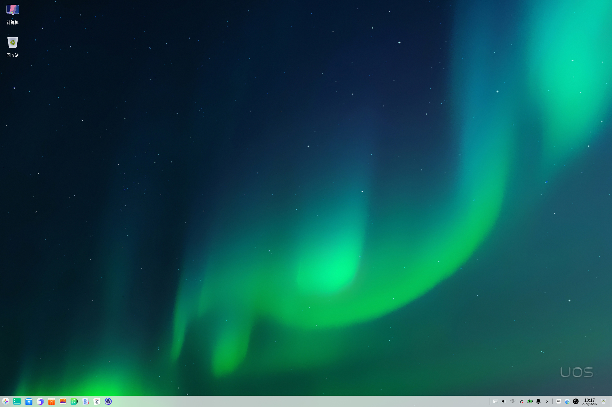

### 系统简介
初次进入统一操作系统，会自动打开欢迎程序。您可以观看视频了解系统功能，选择桌面模式和图标主题，进一步了解该系统。

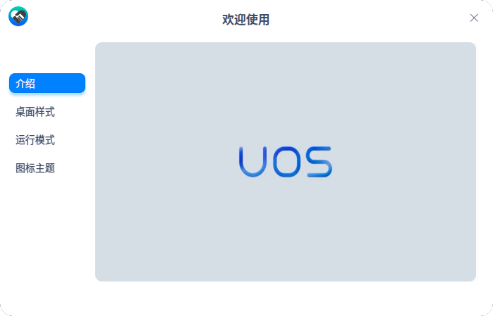

成功登录系统后，即可体验UOS桌面环境。桌面环境主要由桌面、任务栏、启动器、控制中心和窗口管理器等组成，是您使用该操作系统的基础。

## 桌面
桌面是您登录后看到的主屏幕区域。在桌面上，您可以新建文件/文件夹、排列文件、打开终端、设置壁纸和屏保等，还可以通过 [发送到桌面](#设置快捷方式) 向桌面添加应用的快捷方式。

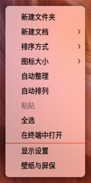

### 新建文件夹/文档
在桌面新建文件夹或文档，也可以对文件进行常规操作，和在文件管理器中一样。

- 在桌面上，点击鼠标右键，点击 **新建文件夹**，输入新建文件夹的名称。
- 在桌面上，点击鼠标右键，点击 **新建文档**，选择新建文档的类型，输入新建文档的名称。

在桌面文件或文件夹上，点击鼠标右键，您可以使用文件管理器的相关功能：

|功能| 说明 |
| ----------- |------------------------------------------ |
| 打开方式    | 选定系统默认打开方式，也可以选择其他关联应用程序来打开。 |
| 剪切      |移动文件或文件夹。             |
| 复制      |复制文件或文件夹。             |
| 重命名      |重命名文件或文件夹。            |
| 删除        |删除文件或文件夹。              |
| 创建链接    |创建一个快捷方式。                         |
| 标记信息    |添加标记信息，以对文件或文件夹进行标签化管理。      |
| 压缩/解压缩 |压缩文件或文件夹，或对压缩文件进行解压。 |
| 属性        |查看文件或文件夹的基本信息，共享方式，及其权限。      |

### 设置排列方式
您可以对桌面上的图标按照需要进行排序。

1. 在桌面上，点击鼠标右键。
2. 点击 **排序方式**，您可以：
  - 点击 **名称**，将按文件的名称顺序显示。
  - 点击 **大小**，将按文件的大小顺序显示。
  - 点击 **类型**，将按文件的类型顺序显示。
  - 点击 **修改时间**，文件将按最近一次的修改日期顺序显示。

> ：您也可以勾选 **自动排列**，桌面图标将从上往下，从左往右按照当前排序规则排列，有图标被删除时后面的图标会自动向前填充。

#### 自动整理文件

勾选 **自动整理**，桌面上的文件和文件夹将按照音乐、视频、图片、文档、应用、其他、文件夹这几个类型自动归类到相应的文件夹。

### 调整图标大小
1. 在桌面上，点击鼠标右键。
2. 点击 **图标大小**。
3. 选择一个合适的图标大小。

> ：您也可以用 **Ctrl** + //鼠标滚动来调整桌面和启动器中的图标大小。

### 设置显示器
从这里快速进入控制中心设置显示器的缩放比例、分辨率和亮度等。

1. 在桌面上，点击鼠标右键。
2. 点击 **显示设置**，快速进入控制中心的显示设置界面。

> ：关于显示的设置，具体操作请参阅 [显示设置](#显示设置) 。

 ### 更改壁纸
您可以选择一些精美、时尚的壁纸来美化桌面，让您的电脑显示与众不同。

1. 在桌面上，点击鼠标右键。
2. 点击 **壁纸与屏保**，在桌面底部预览所有壁纸。
3. 选择某一壁纸后，壁纸就会在桌面和锁屏中生效。
4. 您可以点击 **仅设置桌面** 和 **仅设置锁屏** 来控制壁纸的生效范围。

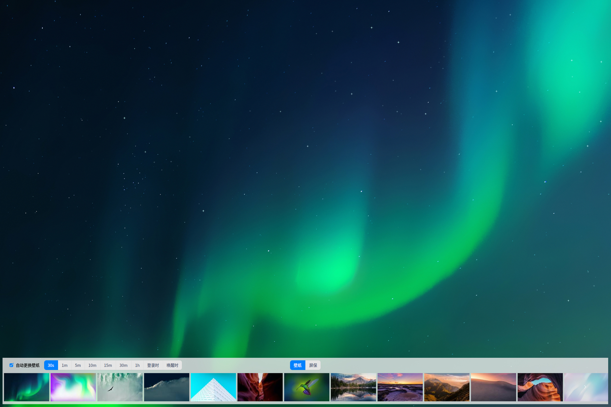

> ：勾选 **自动更换壁纸**，设置自动更换壁纸的时间间隔。您还可以设置在“登录时”和“唤醒时”自动更换壁纸。

> ： 您还可以在图片查看器中设置您喜欢的图片为桌面壁纸。

### 设置屏保
屏幕保护程序原本是为了保护显像管，现在一般用来防范他人偷窥您电脑上的一些隐私。

1. 在桌面上，点击鼠标右键。
2. 点击 **壁纸与屏保**，点击 **屏保**，在桌面底部预览所有屏保。
3. 选择其中一个屏保，点击 **设置屏保**，在上方选择 **闲置时间**。
4. 您可以勾选 **恢复时需要密码**，以便更好地保护您的隐私。
5. 待电脑空闲指定时间后，将启动您选择的屏幕保护程序。

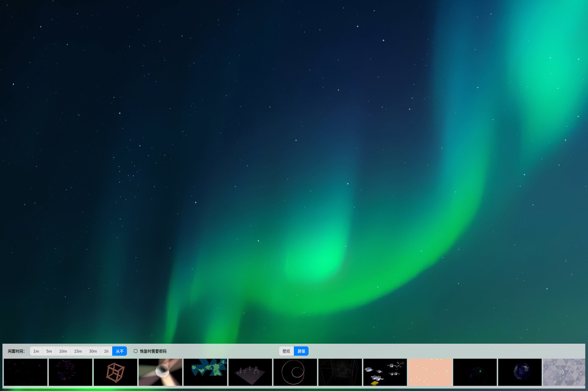

### 剪贴板
剪贴板展示当前用户登录系统后复制和剪切的所有文本、图片和文件。使用剪贴板可以快速复制其中的某项内容。注销或关机后，剪贴板会自动清空。

1. 使用快捷键 **Ctrl** + **Alt** + **V** 唤出剪贴板。
2. 双击剪贴板内的某一区块，会快速复制当前内容， 且当前区块会被移动到剪贴板顶部。
3. 选择目标位置粘贴。
4. 鼠标移入剪贴板的某一区块，点击上方的，删除当前内容；点击顶部的 **全部清除**，清空剪贴板。

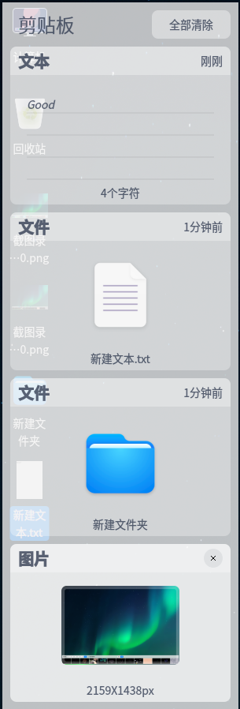

## 任务栏
任务栏是指位于桌面底部的长条，主要由启动器、应用程序图标、托盘区、系统插件等组成。在任务栏，您可以打开启动器、显示桌面、进入工作区，对其上的应用程序进行打开、新建、关闭、强制退出等操作，还可以设置输入法，调节音量，连接Wi-Fi，查看日历，进入关机界面等。

### 认识任务栏图标
任务栏图标包括启动器图标、应用程序图标、托盘区图标、系统插件图标等。

| 图标 | 说明 | 图标 | 说明 |
| ------------------------------------------------------------ | :---------------------------------- | -------------------------------------------------------- | --------------------------------------------------- |
|                         | 启动器 - 点击查看所有已安装的应用。 |  | 显示桌面。                                          |
|  | 多任务视图 - 点击显示工作区。       |            | 文件管理器 - 点击查看磁盘中的文件、文件夹。         |
|                     | 浏览器 - 点击打开网页。             |              | 商店 - 搜索安装应用软件。                           |
|                       | 相册 - 导入并管理照片。             |                    | 音乐 - 播放本地音乐。                               |
|                  | 联系人 - 好友通讯，视频会议。       |                    | 日历 - 查看日期、新建日程。                         |
|                      | 控制中心 - 点击进入系统设置。       |                    | 通知中心 - 显示所有系统和应用的通知。               |
|                                     |   桌面智能助手 - 使用语音或文字来发布指令或进行询问。     | | 屏幕键盘 - 点击使用虚拟键盘。 |
|                         | 电源 - 点击进入关机界面。            |                             | 回收站。                                            |

&nbsp;&nbsp;&nbsp;&nbsp;&nbsp;&nbsp;&nbsp;&nbsp;&nbsp;&nbsp;&nbsp;&nbsp;&nbsp;
> ：在高效模式下，点击任务栏右侧可显示桌面。将鼠标指针移到任务栏上已打开窗口的图标时，会显示相应的预览窗口。

### 切换显示模式
任务栏提供两种显示模式：时尚模式和高效模式，显示不同的图标大小和应用窗口激活效果。

&nbsp;&nbsp;&nbsp;&nbsp;&nbsp;&nbsp;&nbsp;&nbsp;&nbsp;&nbsp;&nbsp;&nbsp;&nbsp;
您可以通过以下操作来切换显示模式：

1. 右键单击任务栏。
2. 在 **模式** 子菜单中选择一种显示模式。

### 设置任务栏位置
您可以将任务栏放置在桌面的任意方向。

1. 右键单击任务栏。
2. 在 **位置** 子菜单中选择一个方向。

### 调整任务栏高度 
鼠标拖动任务栏边缘，改变任务栏高度。

### 显示/隐藏任务栏
任务栏可以隐藏，以便最大程度的扩展桌面的可操作区域。

1. 右键单击任务栏。
2. 在 **状态** 子菜单中您可以：
  - 选择 **一直显示**，任务栏将会一直显示在桌面上。
  - 选择 **一直隐藏**，任务栏将会隐藏起来，只有在鼠标移至任务栏区域时才会显示。
  - 选择 **智能隐藏**，当占用任务栏区域时，任务栏自动隐藏。

### 显示/隐藏插件
1. 右键单击任务栏。
2. 在 **插件** 子菜单中勾选或取消勾选 **回收站、电源、显示桌面、屏幕键盘、多任务视图、时间、桌面智能助手**，可以设置这些插件在任务栏上的显示和隐藏效果。

### 查看通知
当有系统或应用通知时，会在桌面上方弹出通知消息。若有按钮，点击按钮执行对应操作；若无按钮，点击关闭此消息。

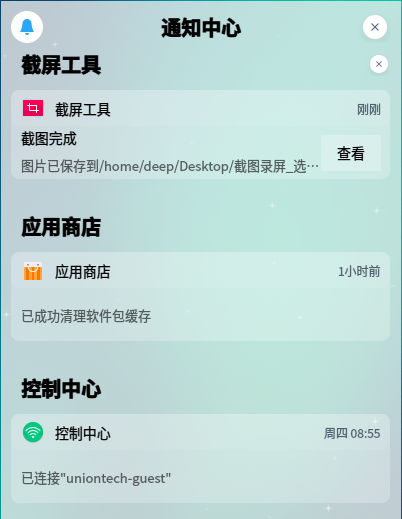

&nbsp;&nbsp;&nbsp;&nbsp;&nbsp;&nbsp;&nbsp;&nbsp;&nbsp;&nbsp;&nbsp;&nbsp;&nbsp;
您还可以点击任务栏上的 ， 打开通知中心，查看所有通知。

### 使用智能助手

智能助手是系统预制的程序，它支持语音和文字输入，支持查找信息、操作指令等功能。

使用以下方法可以唤醒智能助手：

- 通过快捷键 Super + q ，唤出助手对话框界面。
- 支持固定语“你好，小华”或“你好，小华+命令语”唤起桌面智能助手，唤出助手对话界面。

使用智能助手文字输入、语音输入的操作步骤如下。

1. 点击任务栏上的 ， 打开桌面智能助手。
2. 连接录音设备后，使用语音与智能助手直接对话，如更换壁纸、调节屏幕亮度，查询信息等。
3. 等输入框出现后，还可以输入文字指令。

 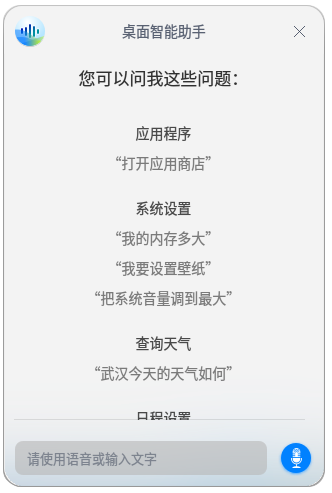

> ：选中文字按下 **Ctrl** + **AIt** + **P** 可以进行语音播报；连接录音设备后，输入框内按下**Ctrl** + **AIt** + **O** 进入听写模式，把语音输入转换为文字。

#### **设置语音听写**

在控制中心默认设置语音听写功能，默认是开启状态，可以设置关闭。

选中文本输入框后可通过快捷键唤起语音听写功能，开始听写输入文本。 

#### 设置语音朗读

在控制中心默认设置语音朗读功能，只有开启了语音朗读功能后，才能唤起朗读。 

仅朗读当前选中文本，语音朗读的操作步骤如下 。

1.  选中文本， 在键盘上按下快捷键 **Ctrl** + **AIt** + **O** 或在右键菜单中选择 **语音朗读** ，点击后唤起朗读。
2. 如果需要中断朗读时， 可以点击图标喇叭中止朗读，也可以右键点击 **停止朗读**。 

> ：如在朗读中，再次选中其他文本，则朗读图标显示在最新选中文本的位置。点击图标或快捷键、右键菜单选择语音朗诵，打断正在朗读的文本转而朗读最新选中的文本。

#### 设置翻译功能

在控制中心默认设置（开启）翻译功能，只有开启了翻译功能后，才可以唤起翻译功能。

仅翻译当前选中文本， 根据翻译设置语音翻译，翻译的操作步骤如下 。

1. 选中文本， 在键盘上按下快捷键 **Ctrl** + **AIt** + **U** 或在右键菜单中选择 **翻译**， 弹出翻译浮窗。 

> ：当前仅支持中英互译。

### 查看日期时间

- 鼠标指针悬停在任务栏的时间上，查看当前日期、星期和时间。
- 点击时间，打开日历。

### 进入关机界面
您可以点击任务栏上的  进入关机界面，也可以在启动器的小窗口模式中点击 。

|功能|说明|
|--|---|
|关机|关闭电脑。|
|重启|关机后再次重新运行您的电脑。|
|待机|整个系统将处于低能耗运转的状态。|
|锁定|锁定电脑，或按下键盘上的 **Super** + **L** 组合键锁定。|
|切换用户|选择另一个用户帐户登录。|
|注销|清除当前登录用户的信息。|
|系统监视器|快速启动系统监视器。|

> ：当系统存在多个账户时才显示 。

### 回收站
电脑中临时被删除的所有文件您都可以在回收站中找到，回收站中的文件可以被恢复或清空。

#### 还原文件
对于已删除的文件，您可以进入回收站进行还原，或使用 **Ctrl** + **Z** 还原刚删除的文件。

1. 在回收站中，选择要恢复的文件。
2. 点击鼠标右键，选择 **还原**。
3. 还原文件到原来的存储路径下。

> ：如果原来所在的文件夹已经删除，还原文件时会自动新建文件夹。

#### 清空回收站
在回收站中，点击 **清空**，将彻底删除回收站的所有内容。

## 启动器
启动器  帮助您管理系统中已安装的所有应用，在启动器中使用分类导航或搜索功能可以快速找到您需要的应用程序。

> ：您可以进入启动器查看新安装的应用。新安装应用的旁边会出现一个小蓝点提示。

### 切换模式
启动器有全屏和小窗口两种模式。点击启动器界面右上角的图标来切换模式。

两种模式均支持搜索应用、设置快捷方式等操作。

小窗口模式还支持快速打开文件管理器，控制中心和进入关机界面等功能。

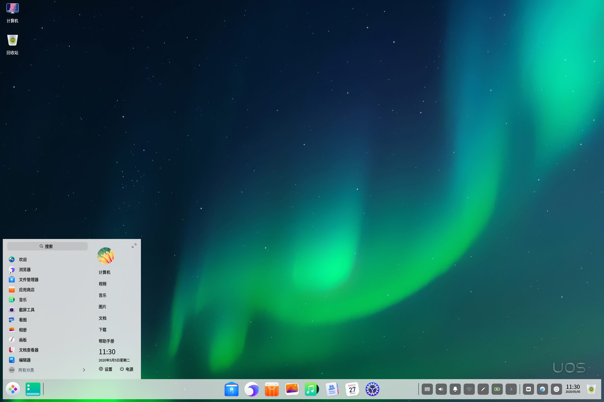

### 排列应用

在全屏模式下，系统默认按照安装时间排列所有应用。

- 将鼠标悬停在应用图标上，按住鼠标左键不放，将应用图标拖拽到指定的位置自由排列。
- 点击启动器界面左上角分类图标进行排列。

&nbsp;&nbsp;&nbsp;&nbsp;&nbsp;&nbsp;&nbsp;&nbsp;&nbsp;&nbsp;&nbsp;&nbsp;&nbsp;
在小窗口模式下，默认按照使用频率排列应用。

### 查找应用

在启动器中，您可以滚动鼠标滚轮或切换分类导航查找应用。

如果知道应用名称，直接在搜索框中输入关键字，快速定位到需要的应用。

### 设置快捷方式
快捷方式提供了一种简单快捷地启动应用的方法。

#### 创建快捷方式
将应用发送到桌面或任务栏上，方便您的后续操作。

在启动器中，右键单击应用图标，您可以：

- 点击 **发送到桌面**，在桌面创建快捷方式。

- 点击 **发送到任务栏**，将应用固定到任务栏。

> ：您还可以从启动器拖拽应用图标到任务栏上放置。但是当应用处于运行状态时您将无法拖拽固定，此时您可以右键单击任务栏上的应用图标，选择 **驻留** 将应用固定到任务栏，以便下次使用时从任务栏上快速打开。

#### 删除快捷方式
您既可以在桌面直接删除应用的快捷方式，也可以在任务栏和启动器中删除。

**从任务栏上删除**

- 在任务栏上，按住鼠标左键不放，将应用图标拖拽到任务栏以外的区域移除快捷方式。
- 当应用处于运行状态时您将无法拖拽移除，此时可以右键单击任务栏上的应用图标，选择 **移除驻留** 将应用从任务栏上移除。

**从启动器中删除**

在启动器中，右键单击应用图标，您可以：

- 点击 **从桌面上移除**，删除桌面快捷方式。
- 点击 **从任务栏上移除**，将固定到任务栏上的应用移除。

> ：以上操作，只会删除应用的快捷方式，而不会卸载应用。

### 安装应用
如果启动器中没有您需要的应用，可以在应用商店一键下载安装。

### 运行应用
对于已经创建了桌面快捷方式或固定到任务栏上的应用，您可以通过以下途径来打开应用。

- 双击桌面图标，或右键单击桌面图标选择 **打开**。
- 直接点击任务栏上的应用图标，或右键单击任务栏上的应用图标选择 **打开**。

在启动器中，直接点击应用图标打开，或右键单击应用图标选择 **打开**。

> ：对于经常使用的应用，您可以在启动器中，右键单击应用图标选择 **开机自动启动**。

### 卸载应用
对于不再使用的应用，您可以选择将其卸载，以节省硬盘空间。

1. 在启动器中，右键单击应用图标。
2. 点击 **卸载**。

> ：在 **时尚模式** 下，您还可以在启动器的全屏模式界面，按住鼠标左键不放，将应用图标拖拽到任务栏的  中卸载应用。

## 控制中心
统一操作系统通过控制中心来管理系统的基本设置，包括帐户管理、网络设置、日期和时间、个性化设置、显示设置、系统升级等。当您进入桌面环境后，点击任务栏上的 即可打开控制中心窗口。

### 首页介绍
控制中心首页主要展示各个设置模块，方便日常查看和快速设置。

打开控制中心的某一设置模块后，可以通过左侧导航栏快速切换到另一设置模块。

#### 标题栏
标题栏包含返回按钮，搜索框，主菜单及窗口按钮。

- 返回按钮：若要返回首页，点击 。
- 搜索框：输入关键字或点击  后输入语音（语音会转化为文字显示在搜索框中），回车，搜索相应设置。
- 主菜单：点击 进入主菜单。在主菜单中，您可以设置窗口主题，查看版本，或退出控制中心。

### 账户设置
在安装系统时您已经创建了一个账户。在这里，您可以修改账户设置或创建一个新账户。

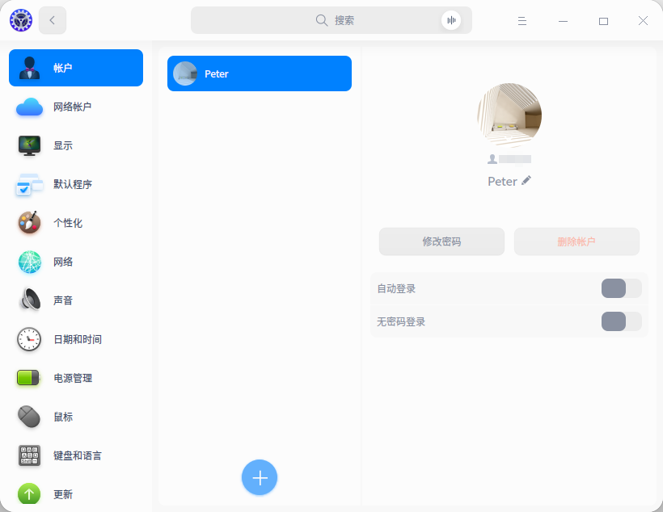

#### 创建新帐户

1. 在控制中心首页，点击 。
2. 点击。
3. 输入用户名、密码和重复密码。
4. 点击 **创建**。
5. 在授权对话框输入当前账户的密码，新账户就会添加到账户列表中。

#### 更改头像

1. 在控制中心首页，点击 。
2. 点击列表中的帐户。
3. 点击账户头像，选择一个头像或添加本地头像，头像就替换完成了。

#### 设置全名

账户全名会显示在账户列表和系统登录界面，可根据需要设置。

1. 在控制中心首页，点击 。
2. 点击列表中的帐户。
3. 点击 **设置全名** 后的 ，输入账户全名。

#### 修改密码

1. 在控制中心首页，点击 。
2. 点击当前帐户。
3. 点击 **修改密码**，进入修改密码页面。
4. 输入当前密码、新密码和重复密码。

#### 自动登录
开启“自动登录”后， 下次启动系统时（重启、开机）可直接进入桌面。在锁屏和注销后再次登录需要密码。
1. 在控制中心首页，点击。
2. 点击当前帐户。
3. 打开 **自动登录** 开关，开启自动登录功能。

#### 无密码登录
开启“无密码登录”后，下次登录系统时（重启，开机，和在注销后再次登录），不需要密码，点击  即可登录系统。
1. 在控制中心首页，点击。
2. 点击当前帐户。
3. 打开 **无密码登录** 开关，开启后可以不用输入密码登录系统。

> ： 若“无密码登录”和“自动登录”同时打开，下次启动系统（重启、开机）则直接进入桌面。

> ：默认勾选“清空钥匙环密码”，在无密码登录情况下登录已经记录密码的程序时不需要再次输入系统登录密码，反之则每次都需要输入系统登录密码。

#### 设置指纹密码

指纹密码可以用来登录系统、解锁屏幕、特殊操作授权。当需要输入账户密码时，请扫描您的指纹。

1. 在控制中心首页，点击 。
2. 点击当前帐户。
3. 点击 **添加指纹** 。
4. 使用指纹设备录入指纹。
5. 待指纹添加成功之后点击 **完成**。

> ：您可以添加多个指纹密码；**清除指纹** 会将指纹密码全部清空。

#### 删除帐户

1. 在控制中心首页，点击 。
2. 点击其他未登录的帐户。
3. 点击 **删除账户** 。
4. 在弹出的确认界面中点击 **删除**。

> : 已登录的账户无法被删除。

### 网络帐户

登录网络帐户后，您可以使用云同步、应用商店、邮件客户端、浏览器等相关云服务功能。

开启云同步，可自动同步各种系统配置到云端，如网络、声音、鼠标、更新、任务栏、启动器、壁纸、主题、电源等。若想在另一台电脑上使用相同的系统配置，只需登录此网络帐户，即可一键同步以上配置到该设备。

> ： 当“自动同步配置”开启时，可以选择同步项；关闭时，全部不能同步。

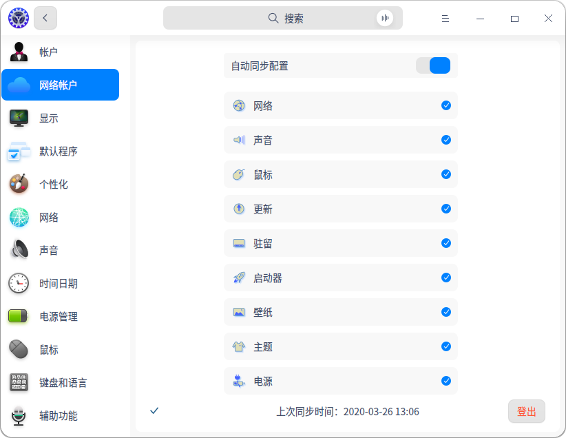

### 显示设置
设置显示器的分辨率、亮度、屏幕方向以及缩放倍数，让您的电脑显示到达最佳状态。

#### 单屏设置

##### 更改分辨率

1. 在控制中心首页，点击 。
2. 点击 **分辨率**，进入分辨率设置界面。
3. 在列表中选择合适的分辨率参数。
4. 点击 **保存**。

##### 调节亮度

1. 在控制中心首页，点击 。
2. 点击 **亮度**，进入亮度设置界面。
 - 拖动亮度条滑块，调节屏幕亮度。
 - 打开 **自动调节色温** 开关，开启进入护眼模式，自动调节色温。
 - 打开 **自动调节亮度** 开关，自动调节屏幕亮度 （仅支持有光线传感器的设备）。

##### 设置屏幕缩放

当桌面和窗口显示过大或过小时，您可能需要调节屏幕缩放，以便正常显示。

1. 在控制中心首页，点击 。
2. 点击 **屏幕缩放**， 点击调整缩放倍数。
3. 注销后重新登录以便缩放生效。

> ：当检测到屏幕为高分屏时，会自动调整缩放倍数。

> ：部分应用可能不支持屏幕缩放，您可以在启动器中右键单击该应用，选择 **禁用屏幕缩放**，以获得更好的显示效果。

##### 设置屏幕刷新率

1. 在控制中心首页，点击 。
2. 点击 **刷新率**。
3. 选择一个合适的刷新率，点击 **保存**。

##### 改变屏幕方向

1. 在控制中心首页，点击 。
2. 点击  。
3. 每点击一下鼠标左键，屏幕逆时针旋转90°。
3. 要还原为之前的屏幕方向，点击鼠标右键退出；要使用当前屏幕方向，请按下组合键+保存。

#### 多屏设置

多屏显示，让您的视野无限延伸！使用VGA、HDMI、DP等线缆将您的电脑和另一台显示器、投影仪等连接起来，同时在多个屏幕显示您电脑上的内容。

1. 在控制中心首页，点击 。
2. 点击 **多屏显示模式**。
3. 选择一种显示模式。
 - **复制 **将主屏的显示内容复制到其他屏幕。
 - **扩展** 将主屏的显示内容扩展到其他屏幕，扩大桌面区域。
 - **只在xxx显示 **只在某个屏幕显示内容。
 - **自定义** 设置显示模式，主屏、分辨率、刷新率和屏幕旋转方向。

> ：在多屏环境下，您还可以按下 **Super** + **P **调出多屏显示模式的OSD。按住 **Super** 不放，按下 **P** 或鼠标点击来进行模式选择。松开按键，确认选择，模式生效。

> ：当多屏显示模式为为扩展模式时，仅主屏支持桌面图标显示、右键菜单操作等功能，而副屏不支持。

##### 自定义设置

1. 在控制中心首页，点击 。
2. 点击 **多屏显示模式** > **自定义**。
3. 点击 “识别”，查看屏幕名称。
4. 选择”合并“或”拆分“，然后对多个屏幕进行设置，如主屏、分辨率、刷新率，旋转屏幕等。
5. 点击 **保存**。

> ：合并即复制模式，拆分即扩展模式。

### 默认程序设置
当安装有多个功能相似的应用程序时，可以选择其中的一个应用作为对应文件类型的默认启动程序。

#### 设置默认程序

1. 右键点击文件，选择 **打开方式** > **选择默认程序**。
2. 选择一个应用，自动勾选"设为默认"，点击 **确定**。
3. 该应用将自动添加到控制中心的默认程序列表。

#### 更改默认程序

1. 在控制中心首页，点击 。
2. 选择一个文件类型进入默认程序列表。
3. 在列表中选择另一个应用程序。

#### 添加默认程序

1. 在控制中心首页，点击 。
2. 选择文件类型进入默认程序列表。
3. 点击列表下的，选择desktop文件（一般在/usr/share/applications)，或特定的二进制文件。
4. 该程序将添加到列表，并自动设置为默认程序。

#### 删除默认程序

在默认程序列表中，您只能删除自己添加的应用程序，不能删除系统已经安装的应用。要删除系统已经安装的应用，只能卸载应用。卸载后该应用将自动从默认程序列表中删除。

可用以下方法删除自己添加的默认程序。

1. 在控制中心首页，点击 。
2. 选择文件类型进入默认程序列表。
3. 点击程序后面的，删除默认程序。

### 个性化设置
在这里，您可以设置透明度：调节启动器（小窗口模式）、任务栏的透明度；还可以设置系统主题、活动用色、字体、窗口特效等，改变桌面和窗口的外观，设置成您喜欢的显示风格。

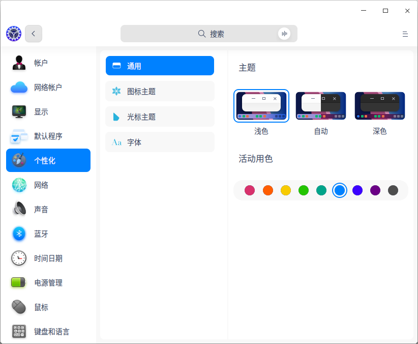

#### 设置窗口主题
1. 在控制中心首页，点击 。
2. 点击 **通用**，选择一种窗口主题。
3. 该主题即为系统窗口主题。

> ：自动主题表示根据当前时区的时间，根据日出日落的时间自动更换窗口主题。日出后是浅色，日落后是深色。

#### 更改活动用色
活动用色是指选中某一选项时的强调色。

1. 在控制中心首页，点击 。
2. 点击 **通用**。
3. 点击 **活动用色** 下的一种颜色，可实时查看该颜色效果。

#### 调节透明度

您可以设置任务栏、和启动器（小窗口模式）的透明度。滑块越靠左越透明，越靠右越不透明。

1. 在控制中心首页，点击 。
2. 点击 **通用**。
3. 点击 **透明度调节**，可实时体验透明效果。

#### 开启窗口特效
开启窗口特效可以让桌面和窗口更美观精致。

1. 在控制中心首页，点击 。
2. 点击 **通用**。
3. 打开 **窗口特效** 开关，开启窗口特效。

#### 设置图标主题

1. 在控制中心首页，点击 。
2. 点击 **图标主题**，选择一款图标样式。

#### 设置光标主题

1. 在控制中心首页，点击 。
2. 点击 **光标主题**，选择一款光标样式。

#### 更改系统字体

1. 在控制中心首页，点击 。
2. 点击 **字体**，进入设置字体界面。
3. 设置系统字号和字体。

### 网络设置
登录系统后，您需要连接网络，才能接收邮件、浏览新闻、下载文件、聊天、网上购物等。

> ：您可以点击任务栏托盘区的网络图标，查看当前网络状态。

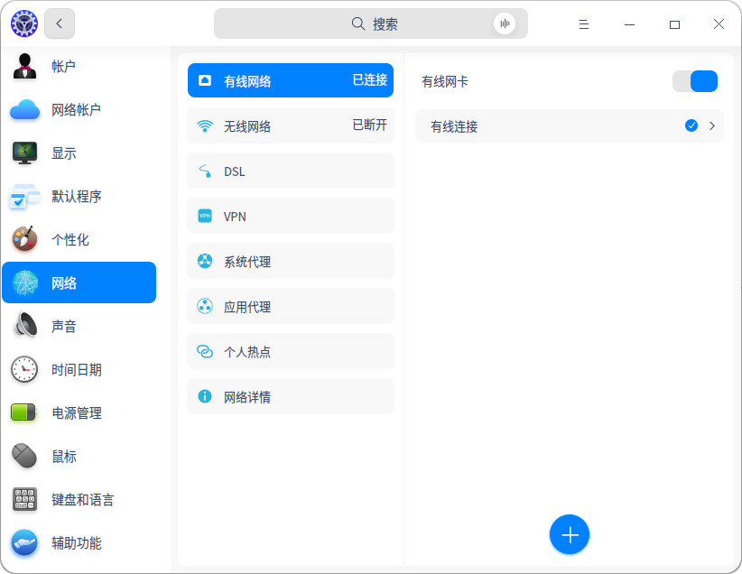

#### 有线网络

有线网络安全快速稳定，是最常见的网络连接方式。当您设置好路由器后，把网线两端分别插入电脑和路由器，即可连接有线网络。

1. 将网线插入电脑上的网络插孔。
2. 将网线的另一端插入路由器或网络端口。
3. 在控制中心首页，点击  。
4. 点击 **有线网络**，进入有线网络设置界面。
5. 打开 **有线网卡**，开启有线网络连接功能。
6. 当网络连接成功后，桌面右上角将弹出“已连接有线连接”的提示信息。

您还可以在有线网络的设置界面，编辑或新建有线网络设置。

#### 无线网络

无线网络帮助您摆脱线缆的束缚，上网形式更加灵活，支持更多设备使用。

##### 连接无线网络

1. 在控制中心首页，点击  。
2. 点击 **无线网络**，进入无线网络设置界面。
3. 打开 **无线网卡**，开启无线网络连接功能。
4. 电脑会自动搜索并显示附近可用的无线网络。
5. 选择需要连接的无线网络。
 - 如果该网络是开放的，将自动连接到此网络。
 - 如果该网络是加密的，请根据提示输入密码，点击 **连接**，然后将自动完成连接。

##### 连接隐藏网络

为了防止他人扫描到自己的WiFi，进而破解WiFi密码连接您的网络，您可以在路由器设置界面隐藏无线网络。设置后，您需要手动连接隐藏网络才能上网。

1. 在控制中心首页，点击  。
2. 点击 **无线网络**，进入无线网络设置界面。
3. 点击 **连接到隐藏网络**。
4. 输入网络名称、SSID和其他必填选项。
5. 点击 **保存** 。

#### 无线热点

无线热点将电脑连接的网络信号转换为WiFi热点，以供一定距离内的其他设备无线上网。要开启无线热点，电脑必须连接到网络并装有无线网卡。

1. 在控制中心首页，点击  。
2. 点击 **个人热点**。
3. 打开 **热点** 开关，设置热点信息。
4. 点击 **保存** 。

#### 移动网络

当您处于一个没有网络信号的地方时，可以使用无线上网卡来上网。在有电话信号覆盖的任何地方，无线上网卡通过运营商的移动数据网络接入宽带服务。

1. 将移动网卡插入电脑上的USB接口中。
2. 电脑将根据移动网卡和运营商信息，自动适配并自动连接网络。
3. 在控制中心首页，点击  。
4. 点击 **移动网络**，查看详细设置信息。

#### 拨号网络

拨号上网（DSL）是指通过本地电话拨号连接到网络的连接方式。配置好调制解调器，把电话线插入电脑的网络接口，创建宽带拨号连接，输入运营商提供的用户名和密码，即可拨号连接到Internet上。

##### 新建拨号连接

1. 在控制中心首页，点击  。
2. 点击 **DSL**，点击 。
3. 输入宽带名称、帐户、密码。
4. 点击 **保存**，系统自动创建宽带连接并尝试连接。

#### VPN

VPN即虚拟专用网络，其主要功能是在公用网络上建立专用网络，进行加密通讯。无论您是在外地出差还是在家中办公，只要能上网就能利用VPN访问企业的内网资源。您还可以使用VPN加速访问其他国家的网站。

1. 在控制中心首页，点击  。
2. 点击 **VPN**，选择  或 。
3. 选择VPN协议类型，并输入名称、网关、账号、密码等信息。（导入VPN会自动填充信息）
4. 点击 **保存**，系统自动尝试连接VPN网络。
5. 您可以将VPN设置导出，备用或共享给其他用户。

> ：打开 **仅用于相对应的网络上的资源** 开关，可以不将VPN设置为默认路由，只在特定的网络资源上生效。

#### 系统代理

1. 在控制中心首页，点击  。
2. 点击 **系统代理**，进入系统代理界面。
 - 点击 **无**，**保存**，关闭代理服务器功能。
 - 点击 **手动**，输入代理服务器的地址和端口信息。
 - 点击 **自动**，输入URL，系统将自动配置代理服务器的信息。

#### 应用代理

1. 在控制中心首页，点击  。
2. 点击 **应用代理**。
3. 设置应用代理参数。
4. 点击 **保存**。

> ：应用代理设置成功后，打开启动器，右键单击应用图标，可以选择 **使用代理**。

#### 网络详情

在网络详情界面，您可以查看MAC、IP地址、网关和其他网络信息。

1. 在控制中心首页，点击 。
2. 点击 **网络详情**，进入网络信息界面。
3. 查看当前有线网络或无线网络的信息。

### 声音设置
设置扬声器和麦克风，让您听得更舒适，录音更清晰。

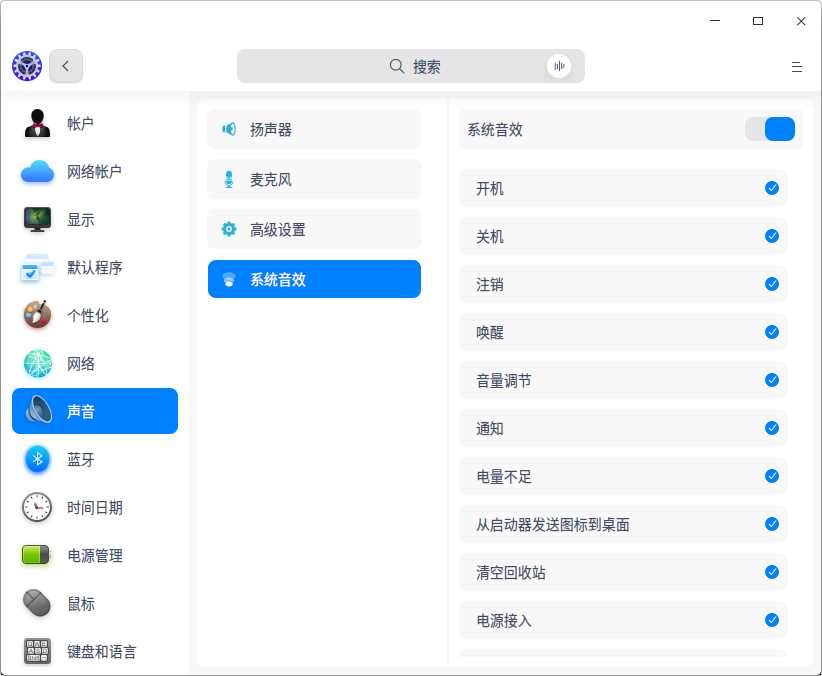

#### 扬声器

1. 在控制中心首页，点击 。
2. 点击 **扬声器**，进入扬声器设置界面。
3. 打开 **扬声器** 开关。
4. 调节输出音量，和左右声道平衡。

> ：若关闭扬声器，系统全部静音，您将无法听到系统音效和声音。

#### 麦克风

1. 在控制中心首页，点击 。
2. 点击 **麦克风**。
3. 打开 **麦克风** 开关。
4. 调节麦克风的输入音量。

> ：通常，需要调大输入音量，确保能够听到声源的声音，但是音量不宜过大，因为这会导致声音失真。可以对着麦克风以正常说话的音量讲话，并观察反馈音量的变化，变化较明显，则说明输入音量合适。

#### 高级设置

1. 在控制中心首页，点击 。
2. 点击 **高级设置**。
3. 选择输入和输出设备。

#### 系统音效

1. 在控制中心首页，点击 。
2. 点击 **系统音效**，勾选选项，开启某一事件发生时的声音效果。

> ：您可以点击试听音效。

### 蓝牙设置
蓝牙能够实现短距离的无线通信。通过蓝牙与附近的其它蓝牙设备连接，而无需网络或连接线。常见的蓝牙设备包括：蓝牙键盘、蓝牙鼠标、蓝牙耳机、蓝牙音响等。

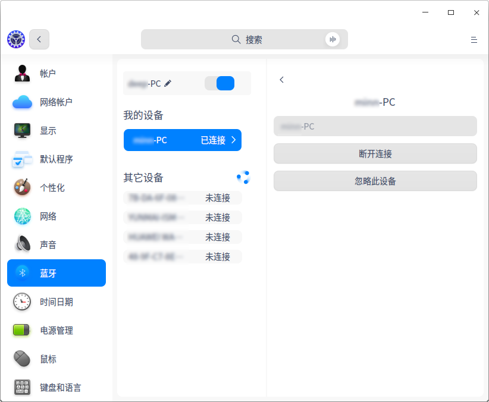

> ：大多数笔记本电脑都配备有蓝牙模块，您只需开启蓝牙开关；而大部分台式电脑都没有配备蓝牙，您可以购买蓝牙适配器，插入到电脑的USB端口中使用。

#### 修改蓝牙名称

1. 在控制中心首页，点击  。
2. 点击蓝牙名称旁的 ，输入本机新的蓝牙名称。

> ：修改蓝牙名称后，将自动对外广播蓝牙设备的新名字，需要其他设备重新进行搜索。

#### 连接蓝牙设备

1. 在控制中心首页，点击 。
2. 开启 **蓝牙**，系统将自动扫描附近的蓝牙设备，并显示在 **其他设备** 列表。
3. 点击想连接的蓝牙设备，在该设备上输入蓝牙配对码（若需要），配对成功后将自动连接。
4. 连接成功后，蓝牙设备会添加到 **我的设备** 列表中。
5. 在列表中点击该设备，您可以 **断开连接**，或修改设备名称。

### 时间日期
正确选择您所在的时区，一般即可显示正确的日期和时间。您也可以手动修改时间和日期。

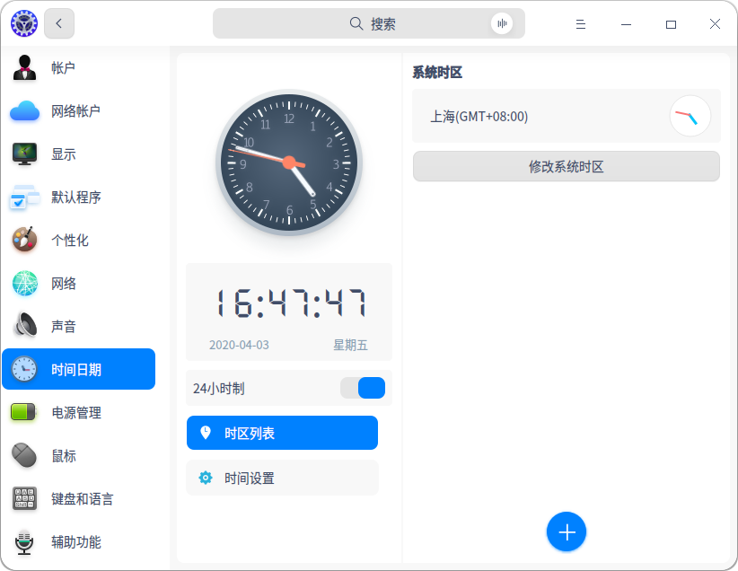

#### 修改时区
在您安装系统时，已选择了系统时区。若要修改系统时区，请按如下步骤设置。

1. 在控制中心首页，点击 。
2. 点击 **时区列表**。
3. 点击 **修改系统时区**， 通过搜索或点击地图选择时区。
4. 点击 **确定**。

#### 添加时区

您可以同时使用多个时区，以便查看另一时区的时间。

1. 在控制中心首页，点击 。
2. 点击 **时区列表**。
3. 点击，通过搜索或点击地图选择时区。
4. 点击 **添加**。

#### 删除时区

1. 在控制中心首页，点击 。
2. 点击 **时区列表**。
3. 点击时区列表后面的 **编辑**。
4. 点击 ，删除已添加的时区。

#### 修改时间和日期
默认情况下，系统通过网络自动同步该时区的本地时间和日期。您也可以手动修改时间和日期。手动设置后，自动同步功能会被关闭。
1. 在控制中心首页，点击 。
2. 点击 **时间设置** 。
3. 输入正确的时间和日期。
4. 点击 **确定**。

### 电源管理

对系统电源进行一些设置，让笔记本电池更耐用，让系统更安全。

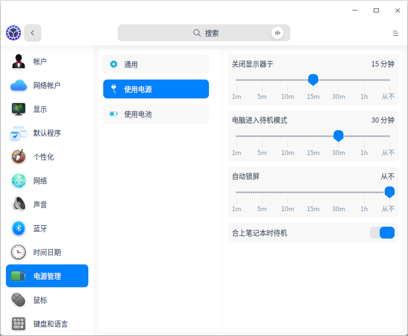

> ：如果您使用的是台式机，将不会看到节能模式设置和“使用电池”的选项。

#### 开启节能模式

为降低笔记本的耗电量，您可以打开节能模式，降低屏幕亮度。

1. 在控制中心首页，点击 。
2. 点击 **通用**。
3. 打开 **节能模式**。
4. 打开 **自动切换节能模式**，拔掉电源则直接进入节能模式，插上电源后自动退出节能模式。

> ：仅笔记本电脑有节能模式。

#### 唤醒时需要密码

1. 在控制中心首页，点击 。
2. 点击 **通用**。
3. 打开 **待机恢复时需要密码**/**唤醒显示器时需要密码**，开启相应安全设置。

#### 设置显示器关闭时间

1. 在控制中心首页，点击 。
2. 点击 **使用电源** 或 **使用电池**。
3. 选择关闭显示器的时间。

> ：笔记本电脑用户可以在“使用电源”和“使用电池”下对同一设置项分别设置不同的时间。

#### 设置电脑待机时间

1. 在控制中心首页，点击 。
2. 点击 **使用电源** 或 **使用电池**。
3. 选择电脑开始待机的时间。

> ：笔记本电脑用户还可以开启 **合上笔记本时待机**，以便在使用电源时合盖待机。

#### 设置自动锁屏时间

1. 在控制中心首页，点击 。
2. 点击 **使用电源** 或 **使用电池**。
3. 选择自动锁屏的时间。

### 鼠标和触控板

鼠标和触控板是计算机的常用输入设备。使用鼠标，可以使操作更加简便快捷。对于笔记本电脑用户，当没有鼠标时，也可以使用触控板代替鼠标进行操作。

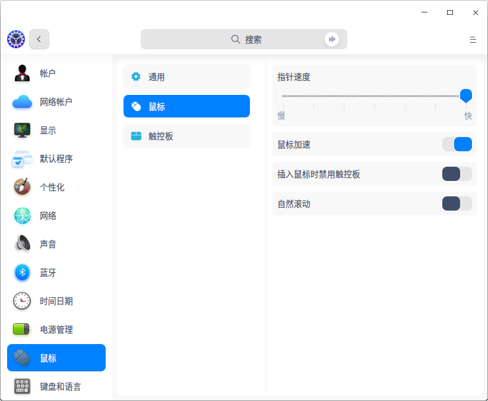

#### 通用设置

1. 在控制中心首页，点击 。
2. 点击 **通用**。
3. 开启 **左手模式**，调节鼠标和触控板的**滚动速度**，**双击速度**。

> ：开启左手模式后，鼠标和触控板的左右键功能互换。

#### 鼠标设置

插入或连接鼠标后，在控制中心进行相关设置，让其更符合您的使用习惯。

> ：当没有触控板时，不会显示 “插入鼠标时禁用触控板”。

1. 在控制中心首页，点击 。
2. 点击 **鼠标**。
3. 调节 **指针速度**， 控制鼠标移动时指针移动的速度。
4. 点击 **自然滚动** / **鼠标加速** 开关，开启相应功能。

> ：开启鼠标加速，提高了指针精确度，鼠标指针在屏幕上的移动距离会根据移动速度的加快而增加。可以根据使用情况开启或关闭。

> ：自然滚动开启后，鼠标滚轮向下滚动，内容会向下滚动；鼠标滚轮向上滚动，内容会向上滚动。

#### 触控板设置

若您使用的是笔记本电脑，可以开启 **输入时禁用触控板**，**插入鼠标时禁用触控板**，并开启 **掌压检测** 设置 **最小接触面** 和 **最小压力值**，以避免误触触控板。

您还可以调节触控板的 **指针速度**，控制手指移动时指针移动的速度；开启自然滚动，变更滚动方向。

#### 指点杆设置
指点杆，常称为小红帽，是一种主要应用于笔记本电脑的定点设备，可用来控制指针的移动。

1. 在控制中心首页，点击 。
2. 点击 **指点杆**。
3. 调节 **指针速度**， 控制使用指点杆时指针移动的速度。

### 数位板
数位板，又名绘图板、绘画板、手绘板等，主要用作绘画创作，是计算机的一种输入设备。
连接到电脑后，您可以设置数位板的压感力度，即笔尖和橡皮擦的压力感应值。

> ： 连接数位板设备后，该模块才会显示。

1. 在控制中心首页，点击 。
2. 选择 **笔** 模式。
3. 调节 **压感力度**。

### 键盘和语言
在此模块，您可以设置键盘属性，以便符合您的输入习惯，还可以根据国家和语言调整键盘布局，设置系统语言，以及自定义快捷键。

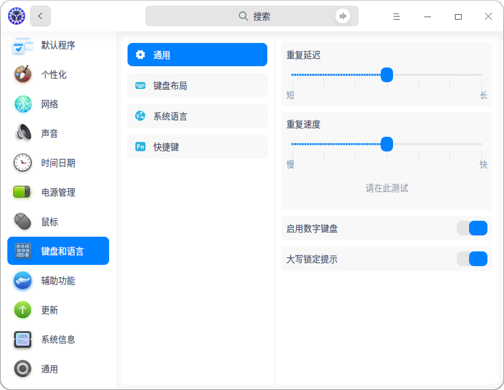

#### 键盘属性

1. 在控制中心首页，点击 。
2. 点击 **通用**。
2. 调节 **重复延迟**/**重复速度**。
3. 点击“请在此测试”，按下键盘上的任意字符不松开，查看调节效果。
4. 点击 **启用数字键盘**/**大写锁定提示** 开关，开启相应功能。

#### 键盘布局
设置键盘布局，可以为当前语言自定义键盘。按下键盘上的按键时，键盘布局会控制哪些字符显示在屏幕上。更改键盘布局后，屏幕上的字符可能与键盘按键上的字符不相符。 

一般在安装系统时，就已经设置了键盘布局，您也可以添加其他的键盘布局。

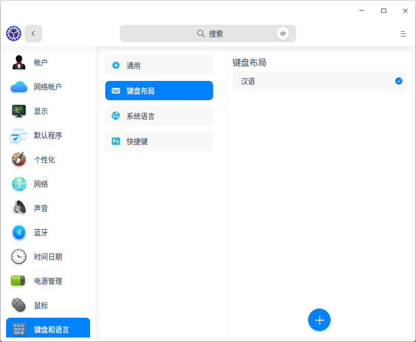

##### 添加键盘布局

1. 在控制中心首页，点击 。
2. 点击 **键盘布局**，进入键盘布局界面。
3. 点击，点击某一键盘布局即可添加到列表。

##### 删除键盘布局

1. 在控制中心首页，点击 。
2. 点击 **键盘布局**，进入键盘布局界面。
3. 点击”键盘布局“后的 **编辑**。
4. 点击 ，删除该键盘布局。

##### 切换键盘布局

1. 在控制中心首页，点击 。
2. 点击 **键盘布局**，进入键盘布局界面。
3. 选择一个键盘布局进行切换。
4. 切换成功后，该键盘布局将标记为已选择。

> ：您也可以选择一组或多组快捷键，按顺序切换已添加的键盘布局。选择 **切换方式**， 让切换后的键盘布局应用于整个系统或当前应用。

#### 系统语言

系统语言默认为您安装系统时所选择的语言，可以随时更改。

##### 添加系统语言
您可以添加多个语言到系统语言列表，以便切换系统语言。

1. 在控制中心首页，点击 。
2. 点击 **系统语言**，进入系统语言界面。
3. 点击  进入语言列表。
4. 选择语言，该语言将自动添加到系统语言列表。

##### 设置系统语言

1. 在控制中心首页，点击 。
2. 点击 **系统语言**，进入系统语言界面。
3. 选择要切换的语言，系统将自动开始安装语言包。
4. 语言包安装完成后，需要注销后重新登录，以便设置生效。

> ：更改系统语言后，键盘布局可能也会发生改变。重新登录时，请确保使用正确的键盘布局来输入密码。

#### 快捷键
快捷键列表显示了系统所有的快捷键。您可以在这里查看、修改和自定义快捷键。

##### 查看快捷键

1. 在控制中心首页，点击 。
2. 点击 **快捷键**，进入快捷键设置界面。
3. 搜索或查看默认的系统快捷键、窗口快捷键和工作区快捷键。

##### 修改快捷键

1. 在控制中心首页，点击 。
2. 点击 **快捷键**，进入快捷键设置界面。
3. 点击需要修改的快捷键。
4. 使用键盘输入新的快捷键。

> ：若要禁用快捷键，请按下键盘上的 。若要取消修改快捷键，按下， 或点击下方的”恢复默认”按钮。

##### 自定义快捷键
您可以为常用的应用自定义一个快捷键。

1. 在控制中心首页，点击 。
2. 点击 **快捷键**。
3. 点击，进入添加快捷键界面。
4. 输入快捷键名称、命令和快捷键。
5. 点击 **添加**。
6. 添加成功后，点击”自定义快捷键“后的 **编辑**。
7. 点击某个快捷键后 ， 删除自定义的快捷键。

> ：若要修改快捷键，点击输入新的快捷键即可。若要修改自定义快捷键的名称和命令，点击“自定义快捷键”后的 **编辑** ，点击快捷键名称后的 ，进入修改页面。

### 辅助功能

在辅助功能界面，您可以使用桌面智能助手、语音听写、语音朗读、文本翻译等功能。

#### 桌面智能助手

桌面智能助手可通过语言命令，帮助您处理各项事务，如查看天气、新建日程等。

- 设置语言：中文-普通话、英语
- 开启/关闭在任务栏中显示： 开启在任务栏中显示，关闭则不在任务栏中显示，仍可使用快捷键唤起。
- 语音检查： 可以检测语音输入状态是否正常。

#### 语音听写

- 语音听写：当有音频输入设备时，默认语音听写为开启状态；当没有音频输入设备时，则默认为关闭状态。
- 语言：设置语音识别语言，默认为中文-普通话，支持设置为中文-普通话、英语。

#### 语音朗读

- 开启/关闭语音朗读：当有音频输出设备时，默认语音朗读为开启状态；当没有音频输出设备时，则默认为关闭状态；如无音频输出设备则隐藏此项 。
- 开启/关闭朗读控件显示：默认为关闭状态，设置为不展示朗读控件时，仅不展示朗读控件，仍可以使用快捷键或在右键菜单中唤起。
-  音源：设置语音音源，默认为女声，可支持设置为男声。

#### 文本翻译
- 开启/关闭文本翻译：默认翻译为开启状态。
- 语言：支设置翻译语言，默认中译英，支持英译中。

### 系统更新
当系统存在更新时会在控制中心首页提示，点击  进入"检查更新"页面，检查完毕后，即可开始下载和安装更新。您还可以设置自动下载更新。

> ：如果您不想收到系统或应用更新的提示，可在“更新设置”中关闭“更新提醒”。

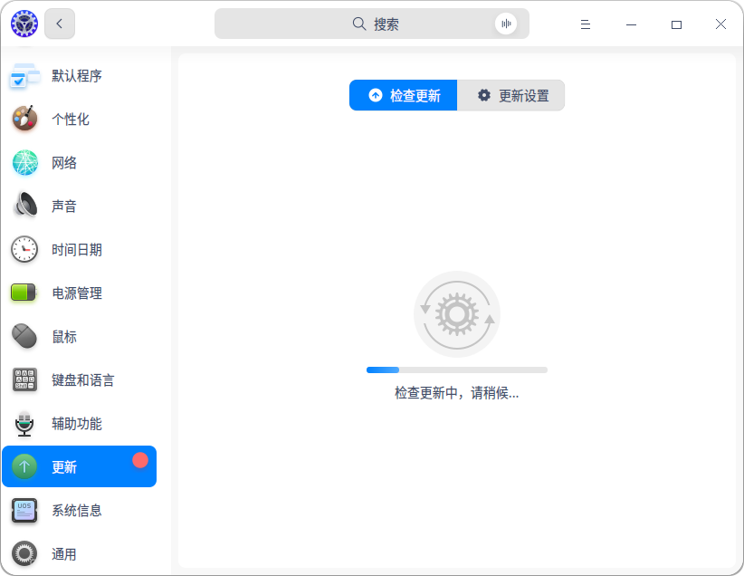

#### 更新和升级

1. 在控制中心首页，点击 。
2. 点击 **检查更新**，进入检查系统更新界面。
 - 如果系统没有更新将会提示“您的系统已经是最新的”。
 - 如果系统存在更新，将显示 **下载并安装更新** 按钮，下载数据大小和更新详情。
3. 点击按钮，系统将自动开始下载并安装更新。
4. 更新完成后，会出现”更新成功”提示。

> ：在下载过程中，您可以点击按钮暂停下载，再次点击按钮继续下载。更新完成后，会弹出对话框提醒用户 **重启** 或 **关机** 。

#### 自动下载更新

1. 在控制中心首页，点击 。
2. 点击 **更新设置**。
3. 打开 **自动下载更新**。
4. 当系统存在更新时，将自动下载数据。

> ：打开 **自动清除软件包缓存** 开关，系统会定期清理下载软件包导致的缓存。

### 系统信息

您可以查看系统版本、版本授权和电脑硬件等信息，以及该系统的一些协议。

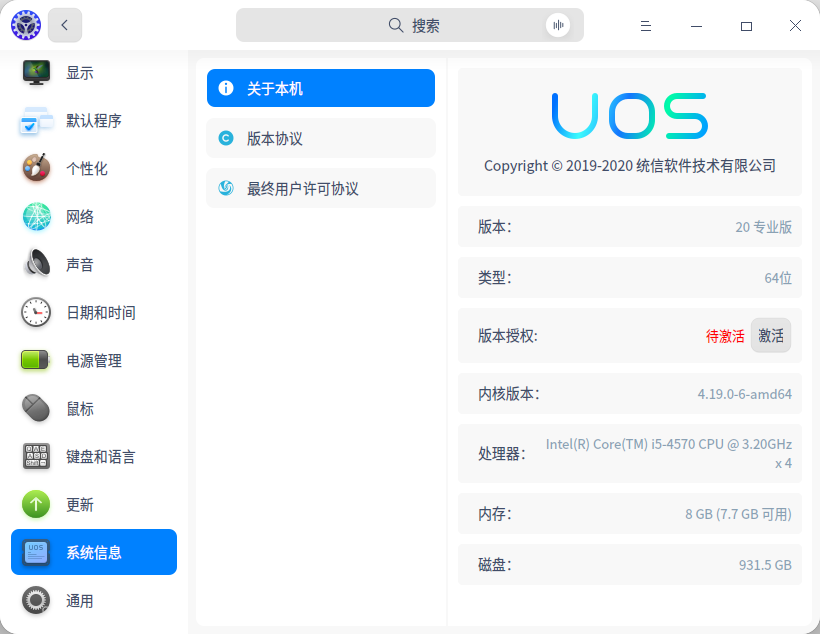

#### 关于本机

1. 在控制中心首页，点击 。
2. 在 **关于本机** 下，您可以查看当前系统版本、版本授权及电脑硬件信息；
3. 若系统未激活，可在此页面点击 **激活**，进行系统激活。

#### 版本协议

1. 在控制中心首页，点击 。
2. 在 **版本协议** 下，查看系统版本协议。

#### 最终用户许可协议

1. 在控制中心首页，点击 。
2. 在 **最终用户许可协议** 下，查看最终用户许可协议。

### 授权管理
授权管理是系统预装的工具，帮助您激活系统。主要介绍未激活界面、激活方式、激活成功及激活失败界面。

#### 未激活

1. 运行授权管理工具有两种方式：

   - 点击右下角托盘上的 进入界面。

   - 打开 **控制中心**，选择 **系统信息**，点击 **关于本机**。可查看版本授权栏，点击 **激活** 进入页面。

2. 未激活状态分为两种：未激活和过期未激活。

   - 未激活：界面包括产品名称、产品版本和授权状态信息。

   - 过期未激活：在截止时间内未激活系统，界面包括产品名称、产品版本、授权状态、授权对象和截止日期信息。

3. 可选择激活方式激活系统。

> ：如果系统未激活，授权管理图标 一直常驻在右下角托盘，开机即显示。

#### 激活方式

**在线激活**

在线激活的前提是系统网络连接正常。

试用期激活

每台设备仅有一次试用期激活机会，从激活当天算起，有效期为90天。试用期间可使用系统全部功能。

1. 点击右下角托盘上的 进入界面。

   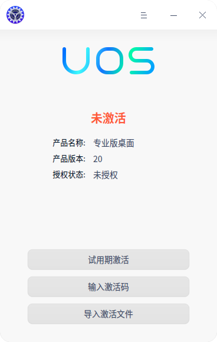

2. 点击 **试用期激活**，跳转到激活界面。

3. 点击 **立即激活**，会弹出二次确认弹框，点击 **确定**，弹出试用期激活成功界面，任务栏图标变为。

4. 在此界面，可查看试用到期时间等信息，也可以选择永久激活系统。

   

输入激活码

1. 点击右下角托盘上的 进入界面。

2. 点击 **输入激活码**，输入或复制正确的激活码，点击 **立即激活**。

   

3. 会弹出二次确认弹框，点击 **确定**，弹出激活成功界面。

导入激活文件

1. 点击右下角托盘上的 进入界面。

2. 点击 **导入激活文件**，弹出文件管理器，选择.key格式的激活文件。

   

3. 选择正确的文件，点击 **立即激活**。会弹出二次确认弹框，点击 **确定**，弹出激活成功界面。

**离线激活**

离线激活的前提是系统网络连接异常。

1. 选择输入序列号或导入授权文件激活时，系统检测网络连接异常，则跳转到离线激活界面。

2. 离线激活界面显示二维码、激活码、机器ID及离线激活码输入框。

   

3. 手机扫描二维码，手机端弹出激活界面，界面显示当前机器ID及激活码。

   

4. 点击 **立即激活**，会弹出二次确认弹框，点击 **确定**。

5. 跳转到激活成功界面，显示机器ID、激活码和离线激活码。

   

6. 手动将手机端的离线激活码输入电脑端的离线激活码输入框。

   

7. 点击 **离线激活**，跳转到激活成功界面。

#### 激活成功

1. 激活成功界面显示产品名称、产品版本和激活方式等信息。
 - 产品名称：操作系统的名称。
 - 产品版本：操作系统的版本。
 - 授权状态：授权状态分为未授权、已过期、已授权，激活成功显示已授权。
 - 授权对象：被授权的用户名称。
 - 激活方式：激活方式分为激活码、激活文件及离线激活码，根据实际激活方式体现。
 - 到期时间：超过了截止时间，系统会提醒授权即将到期。

2. 系统激活成功后，右下角托盘不再显示授权管理图标，可通过控制中心查看授权管理工具。

#### 激活失败

若激活文件已使用或已失效，则会弹出激活失败界面。

#### 激活服务器设置

如果当前的激活服务器崩溃了，可以打开授权管理工具，点击主菜单中的设置，则可以自定义新的激活服务器。

### 通用设置

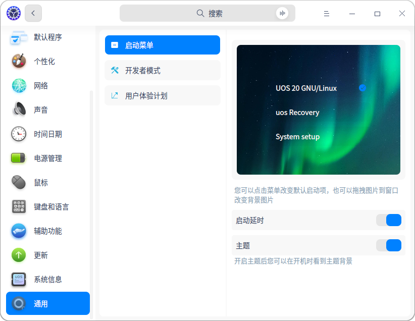

#### 设置启动菜单

启动菜单，指的是开机后选择操作系统的菜单。选择某一系统后，计算机就会引导进入该操作系统。

##### 设置启动延时

当系统存在多个系统时，“启动延时”默认开启，开机后在启动菜单停留5秒钟，您可以在启动菜单点击要进入的系统。

当系统仅存在一个系统时，“启动延时”默认关闭，开机后在启动菜单停留1秒钟，不需要进行选择。

##### 修改默认启动项

1. 在控制中心首页，点击 。
2. 点击 **启动菜单**，进入启动菜单界面。
3. 点击选中某一菜单项后，该项将成为默认启动项。

##### 更改启动菜单背景

1. 在控制中心首页，点击 。
2. 点击 **启动菜单**，进入启动菜单界面。
3. 开启 **主题**，使用该主题为启动菜单的背景。

> ：您也可以把图片拖拽到预览窗口，来更换启动菜单的背景。

#### 开发者模式
进入开发者模式您可以使用root权限，执行sudo操作，安装和运行未在应用商店上架的非签名应用。但可能破坏系统完整性，且不再享有官方报修服务，请谨慎加入。系统默认未进入开发者模式。

1. 在控制中心首页，点击 。
2. 点击 **开发者模式**，点击 **进入开发者模式** 按钮。
   - 若选择在线模式，请先登录网络帐户。仔细查看开发者模式免责声明，了解注意事项后，勾选 **同意并进入开发者模式**，点击 **确定**。待系统下发证书后，按钮变为 **已进入开发者模式**。
   - 若选择离线模式，根据提示下载证书，待系统导入证书后，即可进入开发者模式。
3. 在弹出的对话框中点击 **立即重启**， 重启系统后开发者模式生效。

> ：进入开发者模式后不可退出或撤销。系统所有帐号都将拥有root权限。

#### 用户体验计划
用户体验计划会收集您的硬件信息、应用信息和系统信息，帮助我们更好地了解用户的使用习惯，进而改善和提升用户体验。为了更好地使用该系统，建议您开启用户体验计划。您可以随时参与或退出该计划。

1. 在控制中心首页，点击 。
2. 打开 **用户体验计划** 开关，了解隐私协议。
3. 若同意，勾选 **同意并加入用户体验计划**，点击 **确定**。

## 窗口管理器
窗口管理器可以在不同的工作区内展示不同的窗口内容。通过窗口管理器您可以同时使用多个桌面，以便对桌面窗口进行分组管理。

### 打开工作区
工作区将您的桌面窗口进行分组管理，通过划分工作区可以增大您的工作区域。

按下**Super** + **S** 组合键，或点击  打开工作区界面。

### 添加工作区
在工作区界面，您可以通过以下方式添加工作区。

- 点击工作区上方的 。
- 按下键盘上的。

> ：当您添加的工作区达到最大值时，将不能再添加工作区。

### 切换工作区
在桌面和工作区界面，您可以通过以下方式切换工作区。

- 在桌面，按下键盘上的 **Super** +  /  组合键，切换到上一个/下一个工作区。
- 在桌面，按下键盘上的 **Super** + 数字键 (1-7) ， 切换到指定顺序的工作区。
- 在工作区界面，滚动鼠标滚轮切换到上一个/下一个工作区。
- 在工作区界面，按下键盘上的  / 键来切换到上一个/下一个工作区。
- 在工作区界面，点击对应的预览窗口或按下数字键（1-7）来切换到指定工作区。

### 删除工作区
当您执行删除工作区操作后，该工作区中的所有窗口将自动转移到相邻的工作区中显示，当桌面环境中只存在一个工作区时，将不能执行删除工作区的操作。

- 在工作区界面，点击 **X** 删除工作区。

### 退出工作区
当您在工作区界面完成相关操作后，可以通过以下方式退出工作区。

- 按下键盘上的 **Esc** 键。
- 在当前工作区界面区域内的任意位置点击一下鼠标。
- 再次按下键盘上的 **Super** + **S** 组合键。

### 查看所有窗口
您可以通过以下方式查看工作区的所有窗口。

- 按下键盘上的 **Super** + **A** 组合键，查看所有工作区的窗口。
- 按下键盘上的 **Super** + **W** 组合键，查看当前工作区的窗口。

### 移动工作区窗口
您可以通过以下方式移动窗口到另一工作区。

- 在工作区界面，拖拽窗口到指定的工作区。
- 在桌面，按下键盘上的 **Super** + **Shift** +  /  键，将当前窗口移动到上一个/下一个工作区。
- 在桌面，按下键盘上的 **Super** + **Shift** +数字键，将当前窗口移动到对应顺序的工作区。
- 在桌面，按下键盘上的 **AIt** + **Space** 或在窗口标题栏上点击右键，打开窗口快捷操作菜单，选择 **总在可见工作区**，或 **移至右边的工作区** 或 **移至左边的工作区**，将当前窗口移动到指定的工作区。

> ：在窗口快捷操作菜单，您还可以选择最小化，最大化，移动窗口，改变窗口大小，置顶窗口和关闭窗口。

### 切换桌面窗口
您可以通过以下方式切换当前工作区的桌面窗口。

#### 快速切换相邻窗口

同时按下 **AIt** + **Tab** 并快速释放，快速切换当前窗口和相邻程序窗口；

同时按下 **AIt** + **Shift** + **Tab** 并快速释放，快速反向切换当前窗口和相邻程序窗口。

#### 快速切换同类型窗口

同时按下 **AIt** +  并快速释放，快速切换当前同类型窗口；

同时按下 **AIt** + **Shift** +  并快速释放，快速反向切换当前同类型窗口。

#### 切换所有窗口
按住键盘上的 **AIt** 键不放，连续按下键盘上的  **Tab**键，所有窗口依次向右切换显示；

按住键盘上的 **AIt** + **Shift** 键不放，连续按下键盘上的  **Tab** 键，所有窗口依次向左切换显示。

#### 切换同类型窗口
按住键盘上的 **AIt**键不放，连续按下键盘上的  键，当前同类型窗口依次向右切换显示；按住键盘上的 **AIt** + **Shift** 键不放，连续按下键盘上的  键，窗口依次向左切换显示。

### 窗口分屏

使用窗口分屏，让多个应用和任务窗口同时显示在大屏幕上，既充分利用了大屏幕的空间，又能减少在多个应用窗口之间频繁切换，提高您的工作学习效率。

1. 拖拽窗口到屏幕左侧或者右侧，当光标接触到屏幕左右侧边缘时，会出现一个透明的白色背景，释放窗口，窗口将吸附在屏幕左半边或右半边；
2. 在另一半未被占据的屏幕中，会出现其他所有窗口的预览，点击其中一个就能让其显示在另一半的屏幕中，实现分屏浏览。
3. 分屏浏览时，将光标移动到屏幕中间两个窗口的连接处左右拖拽，同时修改两个窗口的宽度。也可以把其他窗口拖拽到两边，叠加分屏窗口。

> ：要取消窗口分屏，只需将窗口从屏幕一侧拖离即可。

## 键盘交互

您可以使用键盘在各个界面区域内切换，并选择对象，执行操作。

| 按键                                                         | 功能                                                         |
| :----------------------------------------------------------- | :----------------------------------------------------------- |
| **Tab**                                                      | 在不同区域或对话框按钮之间切换。                             |
|            | 在同区域内对不同的对象进行选择。使用  进入下级菜单,使用  返回上级菜单。使用 键进行上下切换 。 |
| **Enter**                                                    | 执行选定对象。                                               |
| **Space**                                                    | 在文件管理器中，预览选定对象；在影院和音乐中，开始/暂停播放；在下拉列表中，展开下拉选项（也可使用回车键）。 |

## 触控板手势

在触控板上，您可以使用以下手势代替鼠标操作。

> ： 您的触控板可能不支持以下部分手势，请确认触控板是否支持多点触控。

### 移动光标

移动手指即可移动光标。

### 单击

单指单击即是鼠标单击操作。

### 双击

单指双击即是鼠标双击操作。

### 滚动屏幕

二指向上移动，屏幕向下滚动。如果打开“自然滚动”选项，则是屏幕向上滚动；

二指向下移动，屏幕向上滚动。如果打开“自然滚动”选项，则是屏幕向下滚动。

### 返回/前进

二指向左移动，执行返回操作；二指向右移动，执行前进操作。

### 显示/隐藏控制中心

二指从触控板右边缘像左滑动，显示控制中心；

二指从触控板左边缘像右滑动，隐藏控制中心。

### 缩放和旋转

二指距离加大，放大内容，对应 **Ctrl** + 快捷键；

二指距离缩小，缩小内容，对应 **Ctrl** + 快捷键；

二指旋转，旋转内容，主要支持看图和截图应用的旋转操作；

二指双击，以200%的倍率放大和还原。

### 打开右键菜单

二指单击，显示右键菜单。

### 最大化/还原窗口

三指向上移动，最大化窗口，对应 **Super** +  快捷键；

三指向下移动，还原窗口，对应 **Super** +  快捷键。

### 左右分屏

三指从触控板右边缘像左移动，把当前窗口向左分屏；

三指从触控板左边缘像右移动，把当前窗口向右分屏。

### 显示所有窗口

三指距离加大或缩小， 显示所有窗口，对应 **Super** + **W** 快捷键。

### 移动窗口

1. 三指点击，激活当前窗口的移动状态，对应 **AIt** + **F7** 快捷键。
2. 当窗口处于移动状态后，再用一指快速移动窗口，在任意处单击退出窗口移动状态。

### 显示/隐藏工作区

四指/五指向上或向下移动， 显示/隐藏工作区，对应 **Super** + **S** 快捷键。

### 切换工作区

四指/五指向左移动，切换到前一个工作区，对应 **Super** +  快捷键；
四指/五指向右移动，切换到下一个工作区，对应 **Super** +  快捷键。

### 显示/隐藏桌面

四指/五指距离加大，显示/隐藏桌面， 对应 **Super** + **D** 快捷键。

### 显示/隐藏启动器

四指/五指距离缩小，显示/隐藏启动器， 对应 **Super** 快捷键。

## 触屏手势

如果您使用的是触屏电脑，可以使用以下触屏手势代替鼠标操作。

### 单击

在触摸屏上，单指单击即是鼠标单击操作。

### 双击

在触摸屏上，单指双击即是鼠标双击操作。

> ：在文本中，双击选中文字，然后手指在屏幕上拖拽来选择文字。

### 移动拖拽

在触摸屏上，单指选中不放，移动手指即是鼠标拖拽操作。

### 打开右键菜单

在触摸屏上，长按再抬起即打开当前对象的右键菜单。

### 打开工作区

从屏幕左侧划入，打开工作区。

### 打开控制中心

从屏幕右侧划入，呼出控制中心。

### 唤出任务栏

当任务栏设置为“一直隐藏”时，如果任务栏在底部，在屏幕边缘从下往上划入，唤出任务栏；如果任务栏在顶部，在屏幕边缘从上往下划入，唤出任务栏。

### 返回/前进

在浏览器中，向左滑动前进到下一页，向右滑动返回到上一页。

### 滚动屏幕

向上滑动，内容往上；向下滑动，内容往下；向左滑动，内容往左；向右滑动，内容往右。

### 缩放

双指捏合，缩小网页或图片；双指张开，放大网页或图片。
