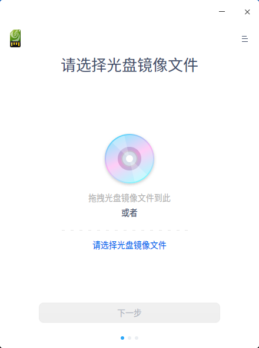
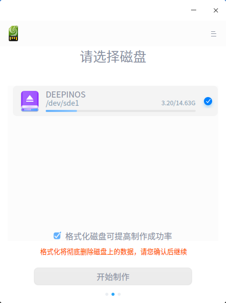
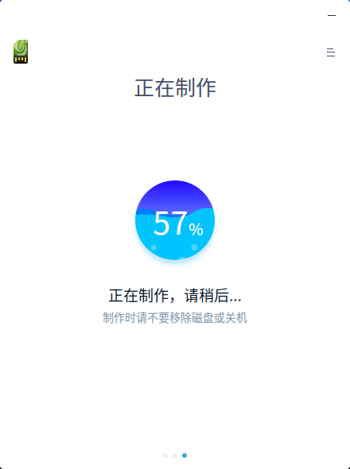
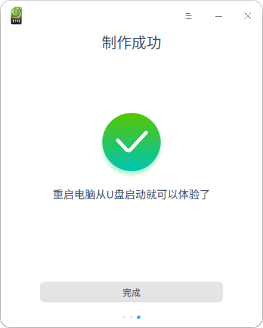
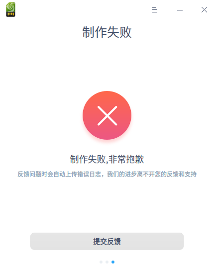

# 启动盘制作工具|../common/deepin-boot-maker.svg|

## 概述

启动盘制作工具是一款系统启动盘制作工具，具有界面简洁、操作简单的特点，它可以帮助用户简单便捷地制作启动U盘。

## 使用入门

通过以下方式运行或关闭启动盘制作工具，或者创建启动盘制作工具的快捷方式。

### 运行启动盘制作工具

1. 单击任务栏上的启动器 ，进入启动器界面。
2. 上下滚动鼠标滚轮浏览或通过搜索，找到启动盘制作工具 ，单击运行。
3. 右键单击   ，您可以：
 - 单击 **发送到桌面**，在桌面创建快捷方式。
 - 单击 **发送到任务栏**，将应用程序固定到任务栏。
 - 单击 **开机自动启动**，将应用程序添加到开机启动项，在电脑开机时自动运行该应用。

### 关闭启动盘制作工具

   - 在启动盘制作工具窗口，单击  ，退出启动盘制作工具。
   - 在任务栏右键单击  ，选择 **关闭所有** 来退出启动盘制作工具。
   - 在启动盘制作工具界面，单击  ，选择 **退出** 来退出启动盘制作工具。
## 操作介绍

### 准备工作

1. 到UOS官网下载最新的系统镜像文件。
2. 准备一个8GB的空白U盘。
3. 运行启动盘制作工具。
   - UOS系统中已经默认集成了启动盘制作工具，可以直接在启动器中找到并使用。
   - windows系统可以从光盘镜像中解压 xxx-boot-maker.exe 到电脑中使用。
   - 您也可以访问UOS官网下载指定版本的启动盘制作工具来使用。

### 选择镜像文件

您可以通过以下两种方式选择镜像文件：

- 点击 **选择光盘镜像文件**，选中已下载的镜像文件后点击 **下一步**。
- 直接将镜像文件拖拽到制作工具界面，然后点击 **下一步**。

> ：请提前校验镜像文件的MD5值，确认和官网的MD5值一致后使用。非官方下载的镜像文件或者文件下载不完成可能会导致制作失败。

### 选择制作U盘

选中制作启动盘使用的U盘，然后点击 **开始制作**。

> ：建议勾选 **格式化磁盘可以提高制作成功率**。

### 制作成功

制作过程需要一定的时间，请耐心等待，制作时请不要移除磁盘或关机。待进度条满格，出现 **制作成功** 的提示，表明启动盘已经制作完成。

&nbsp;&nbsp;&nbsp;&nbsp;&nbsp;&nbsp;&nbsp;&nbsp;&nbsp;&nbsp;&nbsp;&nbsp;&nbsp;

### 制作失败

如果制作失败，可能由如下情况导致：

- 磁盘格式错误

- 磁盘空间错误

- 磁盘挂载错误 (Linux系统才有的错误）

- 解压镜像错误

- 执行命令错误

- 未知错误

&nbsp;&nbsp;&nbsp;&nbsp;&nbsp;&nbsp;&nbsp;&nbsp;&nbsp;&nbsp;&nbsp;&nbsp;&nbsp;

当制作失败窗口中出现“提交反馈”的信息时，点击 **提交反馈**，打开社区网站的用户反馈页面，系统将自动上传错误日志。

## 主菜单

在主菜单中，您可以切换窗口主题、查看帮助手册，了解启动盘制作工具的更多信息。

### 主题

窗口主题包含浅色主题、深色主题和系统主题，其中系统主题为默认设置。

1. 在启动盘制作工具界面，点击。
2. 点击 **主题**，选择一个主题颜色。

### 帮助

查看帮助手册，通过帮助进一步让您了解和使用启动盘制作工具。

1. 在启动盘制作工具界面，点击 。
2. 点击 **帮助**。
3. 查看关于启动盘制作工具的帮助手册。

### 关于

1. 在启动盘制作工具界面，点击 。
2. 点击 **关于**。
3. 查看关于启动盘制作工具的版本和介绍。

### 退出

1. 在启动盘制作工具界面，点击 。
2. 点击 **退出**。

