# 设备管理器|../common/deepin-devicemanager.svg|

## 概述

设备管理器是查看和管理硬件设备的工具软件，可针对运行在操作系统的硬件设备，进行参数状态的查看、数据信息的导出等。

## 使用入门

您可以通过以下方式运行或关闭设备管理器，或者创建快捷方式。

### 运行设备管理器

1. 单击任务栏上的启动器 ，进入启动器界面。

2. 上下滚动鼠标滚轮浏览或通过搜索，找到设备管理器  ，单击运行。弹出授权框，需要输入系统登录密码认证。

   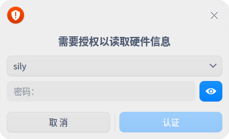

3. 右键单击 ，您可以：

   - 单击 **发送到桌面**，在桌面创建快捷方式。

   - 单击 **发送到任务栏**，将应用程序固定到任务栏。

   - 单击 **开机自动启动**，将应用程序添加到开机启动项，在电脑开机时自动运行该应用程序。

   

### 关闭设备管理器

- 在设备管理器界面，单击   ，退出设备管理器。
- 右键单击任务栏上的   图标，选择 **关闭所有** 来退出设备管理器。
- 在设备管理器界面单击  ，选择 **退出** 来退出设备管理器。

## 操作介绍
### 概况

1. 在设备管理器界面，单击 **概况。**
2. 界面显示 **设备**、**操作系统** 、**处理器** 等硬件列表，以及对应的详细信息如品牌、名称、型号和规格等信息。

### 处理器

1. 在设备管理器界面，单击 **处理器**。
2. 界面显示处理器列表，以及所有处理器的详细信息如名称、制造商、架构及型号等信息。

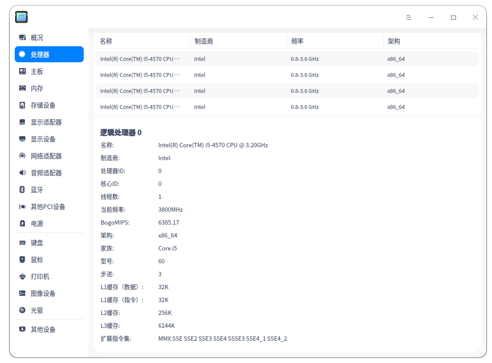

### 主板

1. 在设备管理器界面，单击 **主板**。
2. 界面显示主板、内存插槽、系统、Bios及机箱等信息。

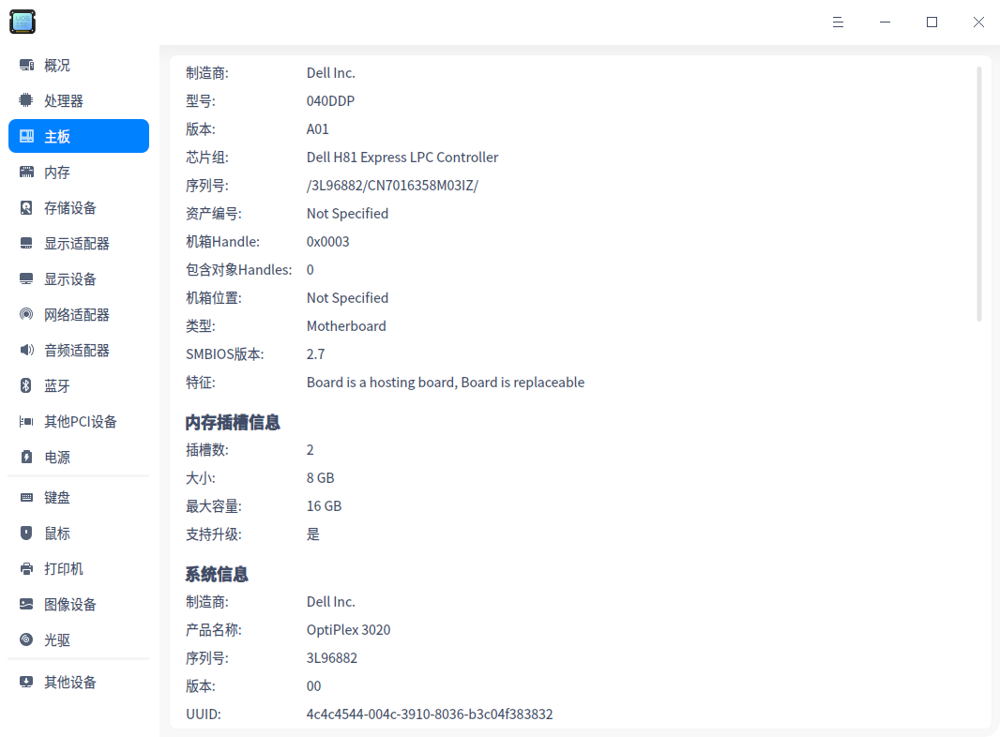

### 内存

1. 在设备管理器界面，单击 **内存**。
2. 界面显示内存列表，以及所有内存的详细信息如型号、制造商、大小、类型及速度等信息。

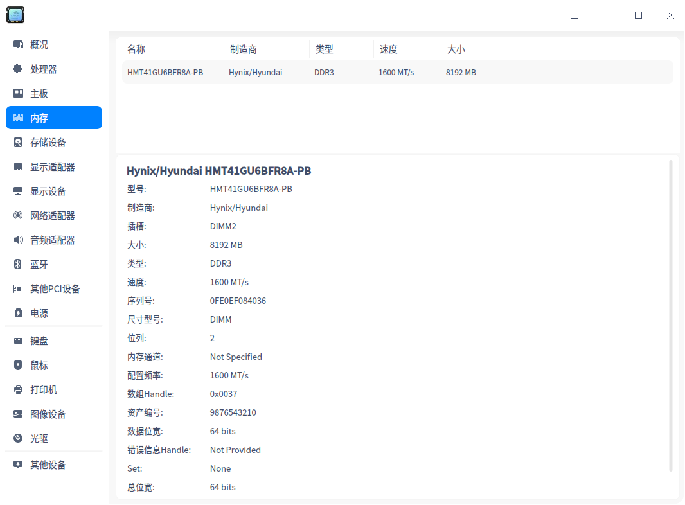

### 存储设备

1. 在设备管理器界面，单击 **存储设备**。
2. 界面显示存储设备列表，以及所有存储设备的详细信息如型号、制造商、介质类型、容量及速度等信息。

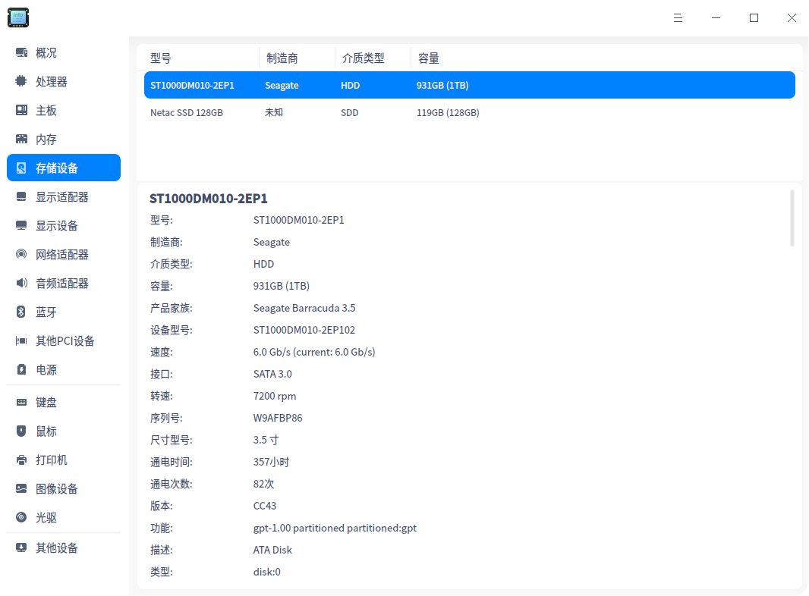

### 显示适配器

1. 在设备管理器界面，单击 **显示适配器**。
2. 界面显示设备的名称、制造商、显存、分辨率及驱动等信息。

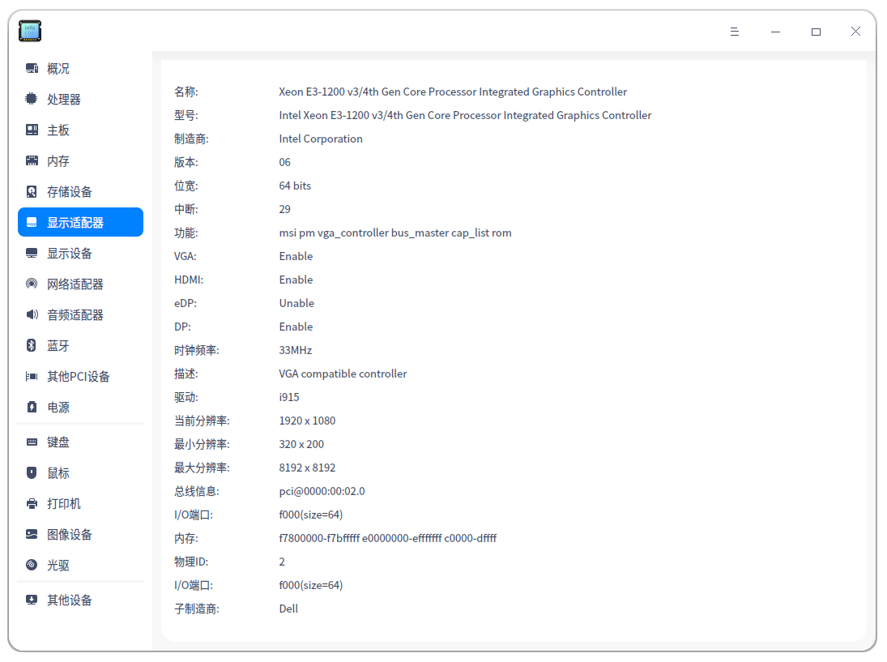

### 显示设备

1. 在设备管理器界面，单击 **显示设备 **。
2. 界面显示设备的名称、制造商、分辨率及连接类型等信息。

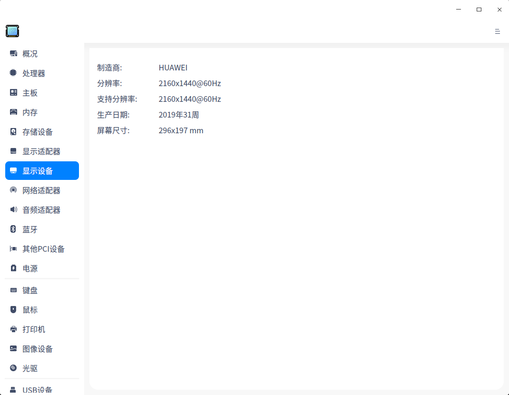

### 网络适配器

1. 在设备管理器界面，单击 **网络适配器 **。
2. 界面显示设备的名称、制造商、物理地址及速度等信息。

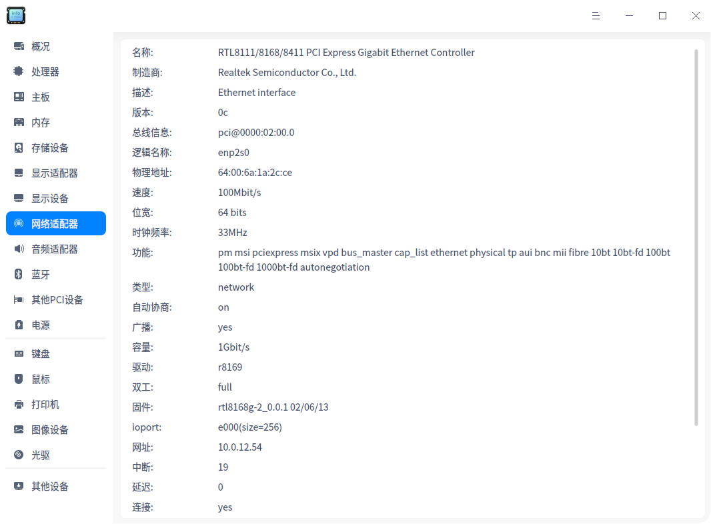

### 音频适配器

1. 在设备管理器界面，单击 **音频适配器 **。
2. 界面显示音频适配器列表，以及所有音频适配器的详细信息如名称、制造商、总线信息、位宽及驱动等信息。

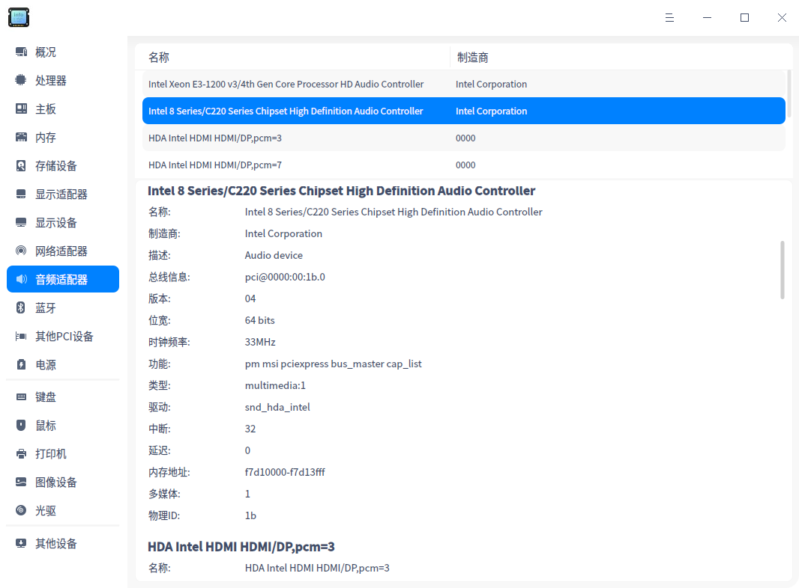

### 蓝牙

1. 在设备管理器界面，单击 **蓝牙 **。
2. 界面显示设备的名称、制造商、物理地址及连接模式等信息。

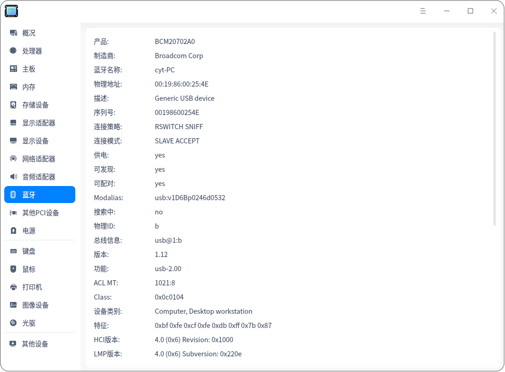

### 其他PCI设备

1. 在设备管理器界面，单击 **其他PCI设备 **。
2. 如果没有连接对应设备，则显示为 **未发现其他PCI设备**。

### 电源
1. 在设备管理器界面，单击 **电源 **。
2. 界面显示电源的名称、制造商、容量、类型等信息。

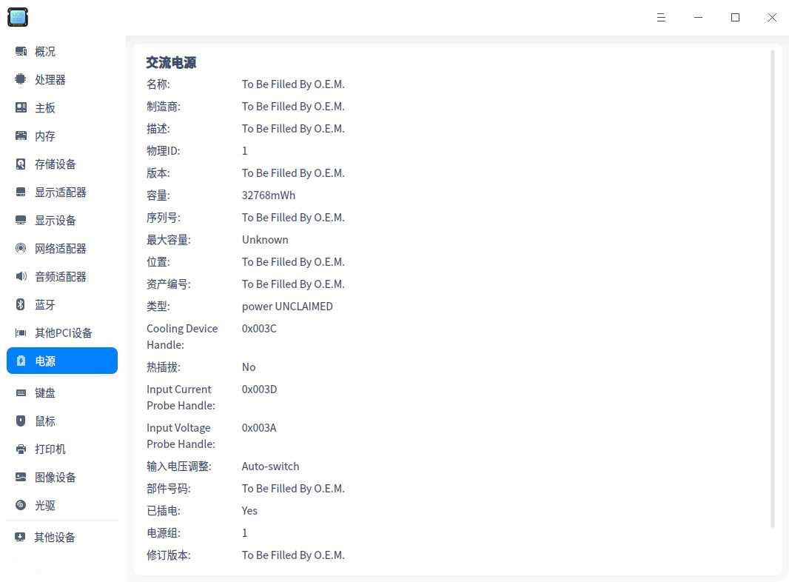

### 键盘

1. 在设备管理器界面，单击 **键盘 **。
2. 界面显示键盘的名称、制造商、总线信息、类型及驱动等信息。

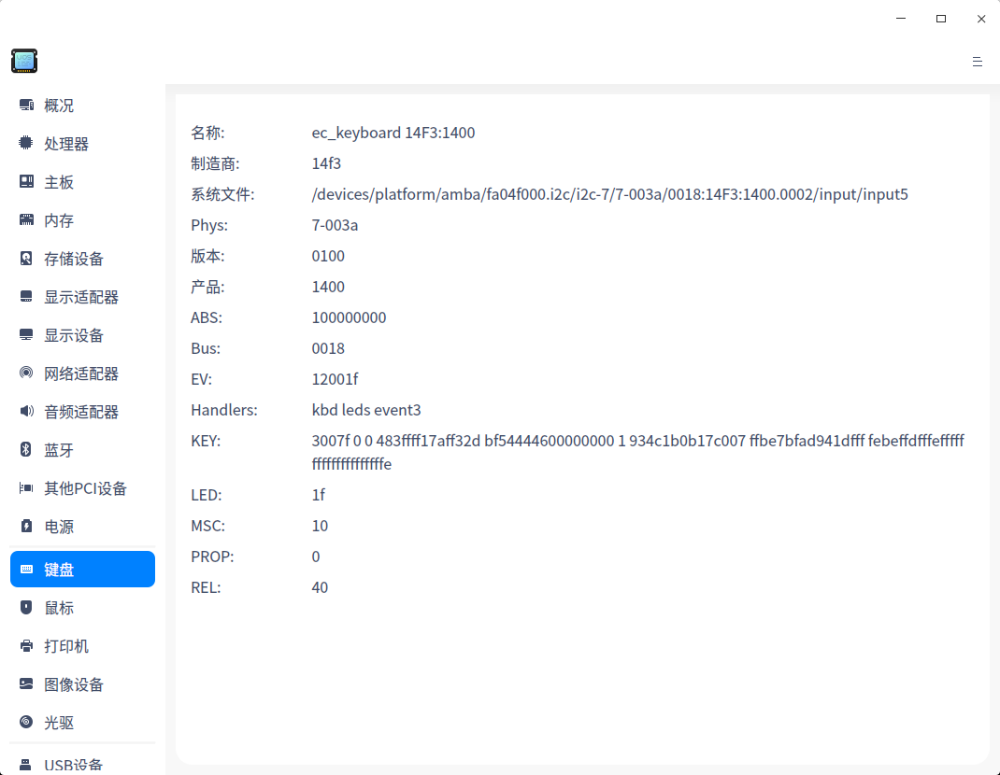

### 鼠标

1. 在设备管理器界面，单击 **鼠标 **。
2. 界面显示鼠标的名称、总线信息、类型、驱动及速度等信息。

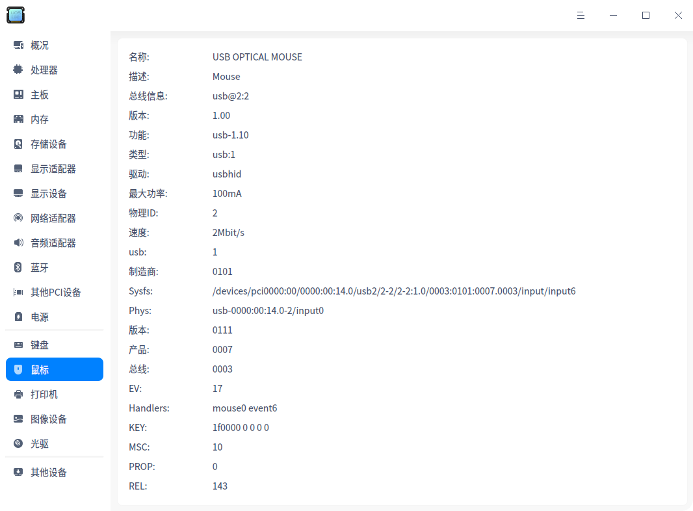

### 打印机

1. 在设备管理器界面，单击 **打印机 **。
2. 界面显示直连的打印机列表，以及所有打印机的详细信息如名称、制造商和型号、设备RUI等信息。

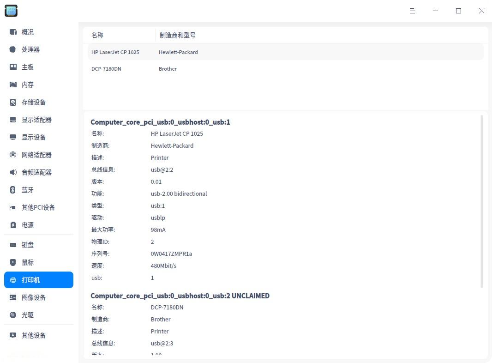

### 图像设备

图像设备包括任意接口的摄像头和扫描仪等。

1. 在设备管理器界面，单击 **图像设备 **。
2. 界面显示设备的名称、制造商及类型等信息。

### 光驱

设备管理器可以识别内置及外置光盘驱动器。

1. 在设备管理器界面，单击 **光驱 **。
2. 界面显示设备的型号、制造商及类型等信息。

>  :光驱是计算机读取光盘里数据的部件，光驱的能力取决于计算机的硬件配置。如果您的设备支持光盘刻录功能，可以定期将重要文件备份到光盘上，防止数据丢失。

### 其他设备

其他设备包括非PCI的其他接口的输入设备，如光笔、手写板、数位板和游戏杆等设备。

> ：如果检测到多个设备列表，选中某个，则会直接显示选中的设备信息。如果未检测到设备时，显示为未发现该设备。

### 右键操作

**复制**：右键单击 **复制**，可复制光标选中的内容。

**刷新**：右键单击 **刷新**，将重新加载操作系统当前所有设备的信息，快捷键为F5。

**导出**：右键单击 **导出**，弹出文件保存界面。选择所需保存的路径，确认保存的文件名称及格式（txt/docx/xls/html）后，单击 **保存** 则完成所有设备信息导出。

## 主菜单

在主菜单中，您可以切换窗口主题，查看帮助手册等操作。

### 主题

窗口主题包含浅色主题、深色主题和系统主题，其中系统主题为默认设置。

1. 在设备管理器界面，单击。
2. 单击 **主题**，选择一个主题颜色。

### 帮助

查看帮助手册，通过帮助进一步让您了解和使用设备管理器。

1. 在设备管理器界面，单击 。
2. 单击 **帮助**。
3. 查看关于设备管理器的帮助手册。

### 关于

1. 在设备管理器界面，单击 。
2. 单击 **关于**。
3. 查看关于设备管理器的版本和介绍。

### 退出

1. 在设备管理器界面，单击 。
2. 单击 **退出**。

