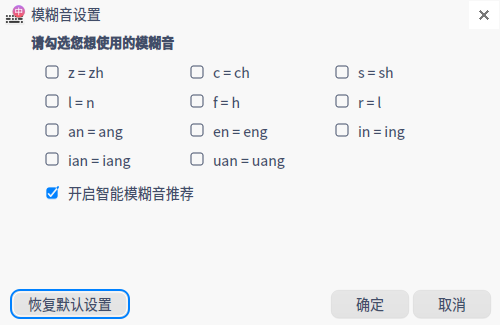
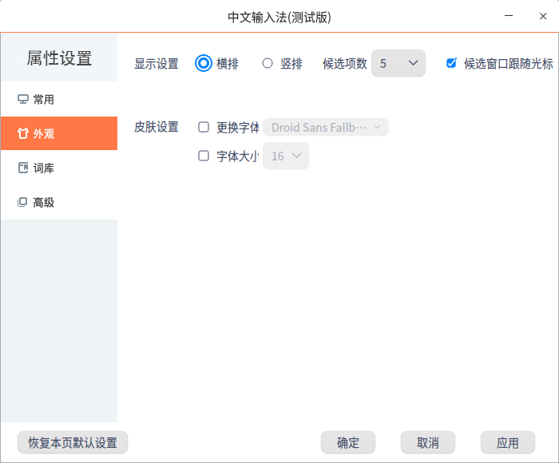
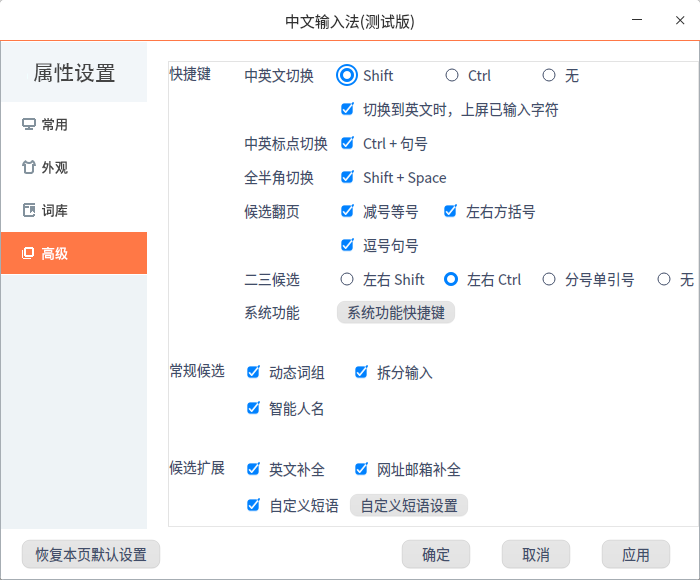
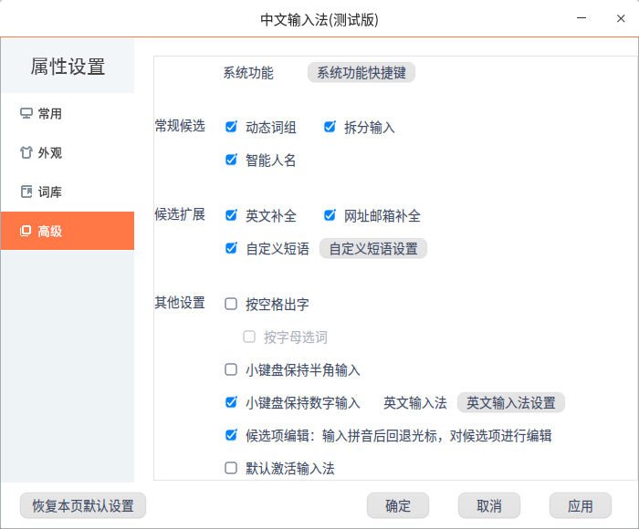

# 中文输入法|../common/fcitx.svg|

## 概述

中文输入法是一款满足多类型终端在不同场景使用的输入法，支持拼音、五笔和手写输入方式、云同步个性化词库管理、实体或虚拟键盘输入等。 

## 使用入门

### 切换输入法

1. 点击右下角托盘上的 进入输入法配置页面。
2. 点击 **输入法**，选择**中文输入法**，托盘中输入法图标变为，则表示切换成功。

## 状态栏

中文输入法切换成功后，屏幕右下角会出现状态栏。在状态栏中，可进行以下设置。

**中文&英文**：选择键入的内容形式，默认为中文。

**半角&全角**：中文输入法对键入的非汉字数字及字符内容，输出时进行全、半角格式的转换，默认为半角。

**中文&英文标点**：选择键入的标点形式，默认为中文标点。

**简体&繁体**：中文输入法在输出中文到操作系统的状态下，输出时进行简繁体的转换，默认为简体。

**手写输入**：点击，进入手写输入界面，可实现屏幕手写输入。同时提供标点、数字及字母键，可用鼠标点击键入。手写输入适用于物理及虚拟键盘使用场景。

**属性设置**：点击 ，进入属性设置界面，可对中文输入法进行设置。

## 属性设置

进入属性设置界面有两种方式，一种是右键点击中文输入法 ，弹出选框，选择 **属性设置**；另一种是在状态栏中点击 。在属性设置界面，可对中文输入法进行设置，设置项为常用、外观、词库及高级设置。

### 常用

#### **默认状态**

- 简体&繁体：中文输入法在输出中文到操作系统的状态下，输出时进行简繁体的转换，默认为简体。
- 半角&全角：中文输入法对键入的非汉字数字及字符内容，输出时进行全、半角格式的转换，默认为半角。
- 中文&英文：选择键入的内容形式，默认为中文。
- 隐藏状态栏：选择中文输入法状态栏是否隐藏，默认为不隐藏。

#### **特殊习惯**

- 全拼：勾选 **全拼** 选项，可勾选首字母简拼。全拼和双拼只能选择一种，默认为全拼。

- 双拼：勾选**双拼** 选项，全拼自动去勾选，可进行双拼方案设置。

   - 可勾选双拼展开提示。
   - 可勾选双拼下同时使用全拼。

- 拼音纠错：勾选 **拼音纠错**，可进行拼音纠错设置。

   

- 模糊音设置：可进行模糊音设置。

   

#### 标点符号

- 可勾选标点配对，自动补全成对标点。
- 可勾选调整数字后标点。

### 外观

#### 显示设置

在中文输入的时候，会出现选项框，可根据个人习惯设置。

- 横排：勾选 **横排** 选项，则横排显示，默认为横排。
- 竖排：勾选 **竖排** 选项，则竖排显示。
- 候选项数：候选项数可选择3到9，默认为5。
- 候选窗口跟随光标：勾选后，候选窗口跟随光标移动。

#### 皮肤设置

- 更换字体：勾选 **更换字体** 选项，下拉框中可选择需要的字体。
- 字体大小：勾选 **字体大小** 选项，下拉框中可选择字号。

### 词库

#### 基础词库

- 中文用户词库：可选择导入、导出、清空中文用户词库。
- 英文用户词库：可选择清空英文用户词库。
- 网址邮箱词库：可选择清空网址邮箱词库。
- 系统词库：可选择恢复被删除的系统词库。
- 一键恢复初始状态：选择一键恢复，将执行：清空中文、英文、网址邮箱用户词库，恢复系统词库。

#### 细胞词库

- 添加细胞词库：可从本地添加词库到列表，勾选、应用后才可生效。

- 查看：点击 **查看**，显示词库详细信息。

- 删除：点击 **删除** 并确定后，即可删除选中词库。

### 高级

#### 快捷键

- 中英文切换：可勾选 Shift 或 Ctrl 为快捷键；勾选无，则不设置快捷键；
- 中英标点切换：可勾选设置快捷键，快捷键固定为Ctrl + 句号。
- 全半角切换：可勾选设置快捷键，快捷键固定为Shift + Space。
- 候选翻页：可勾选多个选项为翻页快捷键，选项为减号等号、左右方括号、逗号句号。
- 二三候选：可勾选设置二三候选，选项为左右Shift、左右Ctrl、分号单引号；勾选无，则不设置快捷键；
- 系统功能：主要设置简繁切换、英文输入法快捷键。

#### 常规候选

常规候选可勾选多个选项，选项为动态词组、拆分输入、智能人名，适用于中文输入。

- 动态词组：勾选后，如果想要输入常用的句子，输入头几个字时，可带出下面常用的词组。
- 拆分输入：勾选后，可将不认识的字拆分为简单的部分输入，输入拼音时前面加u，候选窗口会显示由输入部分组成的复杂字。
- 智能人名：勾选后，输入人名后，候选窗口优先显示人名。

#### 候选扩展

候选扩展可勾选多个选项，选项为英文补全、网址邮箱补全、自定义短语。

- 英文补全：勾选后，输入英文单词时，输入首字母，候选框会显示对应首字母的英文单词。

 > ：使用前提是输入法设置为中文，点击Ctrl + Shift + E，输入英文单词时可补全。

- 网址邮箱补全：勾选后，第一次输入网址或邮箱，输入法会记忆。后续输入头几个字母，输入法会自动补全。

- 自定义短语：勾选后，可用缩写形式自定义常用的词组或符号。

  

#### 其他设置

可根据页面提供的选项进行个性化设置。

### 恢复本页默认设置

点击恢复本页默认设置，可恢复常用、外观、词库及高级页面中的设置。

