# 有道词典|../common/deepin-youdaodict.svg|

## 概述|../common/icon_overview.svg|

有道词典是网易有道和武汉深之度科技有限公司联合开发的基于Linux平台的翻译软件，不仅支持常规的英汉、法汉、日汉、韩汉互译以及全文翻译，还收录了各类词汇的网络释义、例句和百科知识。除此之外，有道词典还提供新闻、影视资讯、人物等丰富的在线网络资源，为您开辟了一条学习更多语言的新途径。

  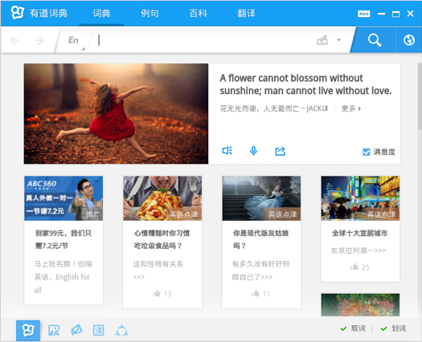  

## 使用入门|../common/icon_guide.svg|

### 运行有道词典

1. 点击桌面底部的  或将鼠标指针移到屏幕左上角，进入启动器界面。
2. 上下滚动鼠标滚轮，通过浏览找到  进行点击。

#### 通知区域的操作

有道词典启动后，在任务栏的通知区域将会显示 。右键单击任务栏通知区域的 ，您可以：

* 点击 **显示主窗口**，将显示有道词典的主窗口。
* 点击 **显示迷你窗口**，将显示有道词典的迷你窗口。
* 点击 **软件设置**，将打开有道词典的软件设置界面。
* 点击 **屏幕取词**，可以开启/关闭取词。
* 点击 **划词翻译**，可以开启/关闭划词。
* 点击 **退出**，将退出有道词典的运行。

>   ：如果需要有道词典在系统启动后随系统自动运行，您可以进入选项设置中去设置，具体操作请参阅 [启动设置](#启动设置)。

#### 了解主界面

如果您的电脑已经连入了网络，在有道词典的首页将每天为您展示图文更新和推荐：

- 点击每日的精品推荐，可以跳转到对应的网页查看详细内容。
- 点击  或 ，可以收听或跟读朗读语音。
- 点击 ，可以将喜爱的内容分享到社交网络，推荐给更多好友。
- 点击 **满意度** 来加入有道词典的满意度调查。
- 点击 ，可以为喜爱的内容点赞。

  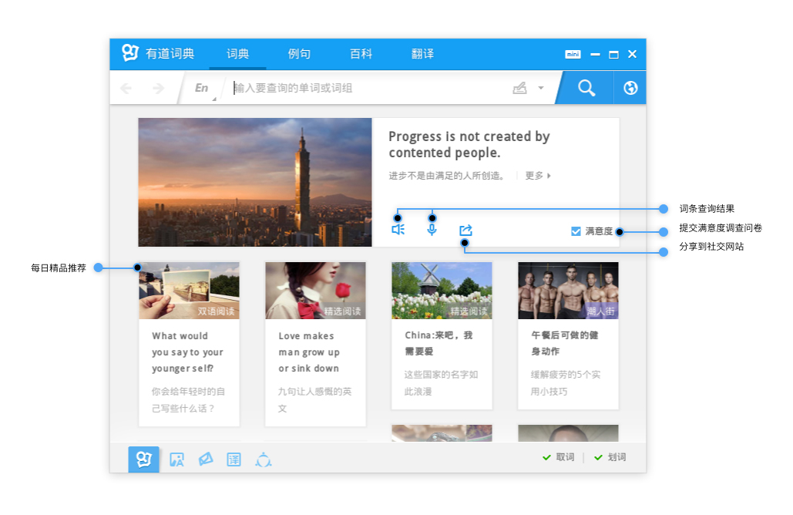

### 最大/最小化有道词典

#### 最大化

1. 在有道词典界面，点击右上角的 ，将有道词典最大化。
2. 如果要恢复显示，请再次点击 。

#### 最小化

1. 在有道词典界面，点击右上角的 ，将有道词典最小化到任务栏。
2. 如果要恢复显示，请点击任务栏上的 。

### 退出有道词典

如果要退出有道词典的运行，您可以：

- 右键单击任务栏上的 ，然后选择 **关闭所有**。
- 在有道词典界面，点击  或点击左下角的  > **退出**。

## 基本操作|../common/icon_basicoperation.svg|

### 字体设置

有道词典提供大、中、小三种字体显示，其中默认为小字体显示，您可以更改字体的显示大小。

1. 在有道词典界面，点击左下角的 。
2. 点击 **字体大小**。
3. 选择一种字体大小。

  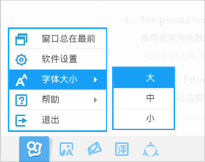

### 取词划词

有道词典默认为开启划词取词功能，当开启屏幕取词功能后，如果将鼠标指针置于词语上，该词语的查询结果将显示在下方；当开启屏幕划词功能后，如果选中词语，该词语的查询结果将显示在下方。

  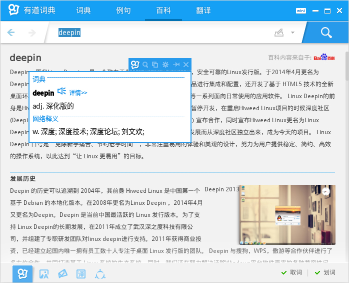

#### 开启/关闭取词划词

在有道词典界面，点击右下角的 **取词** 和 **划词**：

- 如果取词划词功能已经开启，**取词** 和 **划词** 的前面会显示 。
- 如果取词划词功能已经关闭，**取词** 和 **划词** 的前面会显示 。

 

> ：开启/关闭取词功能，也可以使用快捷键来操作，按下键盘上的   键即可以在开启/关闭之间来回切换。

#### 取词划词图标说明

<table>
    <caption>图标说明</caption>
    <tbody>
        <tr>
            <td></td>
            <td>点击可关闭取词划词的查询结果。</td>
            <td class="blank"></td>
            <td></td>
            <td>点击可将取词划词的查询结果置顶显示在桌面。</td>
        </tr>
        <tr>
            <td></td>
            <td>点击可进入取词划词的设置界面。</td>
            <td class="blank"></td>
            <td></td>
            <td>点击可将取词划词的查询结果复制到其他地方。</td>
        </tr>
        <tr>
            <td></td>
            <td>点击可进入有道搜索。</td>
            <td class="blank"></td>
            <td></td>
            <td>点击可打开有道词典</td>
        </tr>
    </tbody>
</table>

#### 设置取词划词

1. 在有道词典界面，点击左下角的 。
2. 点击 **软件设置**。
3. 点击 **取词划词**，您可以：
   - 勾选 **启用屏幕取词** 复选框，然后选择一种取词方式。
   - 勾选 **启用划词释义** 复选框，然后选择一种展示方式。

### 窗口置顶显示

如果要让有道词典一直置顶显示在桌面，您可以：

1. 在有道词典界面，点击左下角的 。
2. 点击 **窗口总在最前**。
3. 如果要取消置顶显示，请再次点击 **窗口总在最前**。

> ：如果希望窗口置顶显示，您也可以进入选项设置中去设置，具体操作请参阅 [主窗口设置](#主窗口设置)。

## 查询/翻译|../common/icon_querytranslation.svg|

### 语言设置

在使用有道词典的词典和例句功能之前，您需要先设置源语言和目标语言。目前，有道词典支持汉英、汉法、汉日和汉韩之间的互译，其中语言默认为汉英互译。

1. 在有道词典的 **词典** 或 **例句** 页签下，点击 。
2. 选择一种互译语言。

  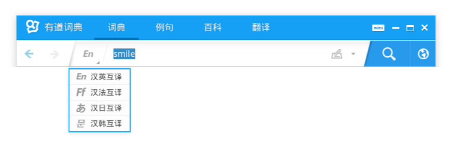

### 词典查询

有道词典收藏了海量词汇，为您提供专业的单词释义、网络释义和例句讲解等内容。

1. 在有道词典界面，点击 **词典**。
2. 在输入框中，输入单词。
3. 点击  或按下键盘上的  键。
4. 在 **词典** 页签下，点击左侧的内容导航，可以查看单词释义、权威词典、例句、百科等信息：
   - 将鼠标指针置于单词下方的  上，可以收听单词的读音。
   - 点击右下角的 ，可以返回到界面顶部。
   - 点击右下角的 ，可以返回到有道词典的首页。
5. 如果词典没有查询到任何的单词信息，您可以在有道词典界面看到相近的单词。

> ：如果您的电脑已经连入了网络，点击  可以跳转到网页来搜索输入词语的相关信息。

  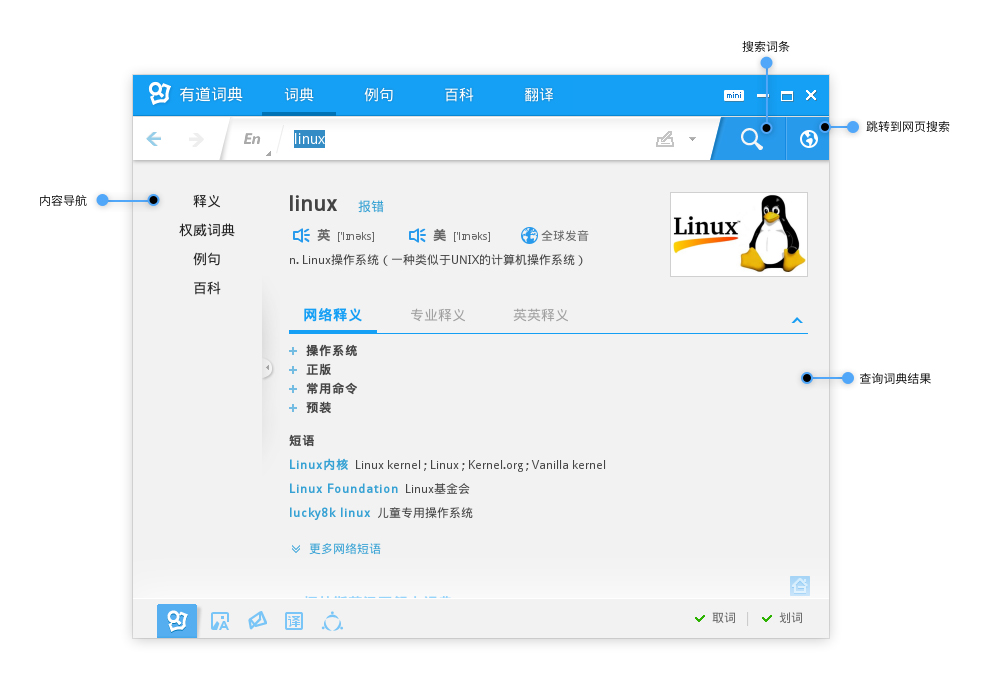

#### 更换单词图片

在词典页签的右上角，有些单词会显示图片信息，您可以更换单词的图片信息。

1. 在 **词典** 页签下，点击右上角的展示图片。
2. 选择一张图片进行更换。
3. 点击 **去图解词典**，您可以打开图解词典。

  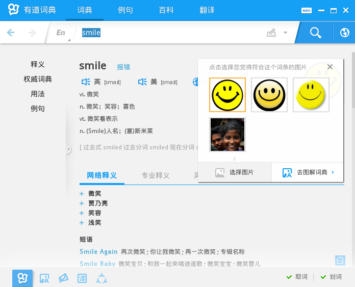

#### 报错

当查询的结果有误时，您可以将错误信息反馈给我们：

1. 在 **词典** 页签下，点击单词旁边的 **报错**。
2. 选择报错原因，填写错误描述。
3. 点击 **确定**，提交错误反馈信息。

### 例句查询

有道词典收录了大量的例句供您参考，通过查看词语的具体使用语境，可以让您更加快速的掌握单词。

1. 在有道词典界面，点击 **例句**。
2. 在输入框中，输入单词。
3. 点击  或按下键盘上的  键。
4. 在 **例句** 页签下，点击左侧的内容导航可以查看双语例句、原声例句和权威例句：
   - 将鼠标指针置于例句旁边的  上，可以收听朗读语音。
   - 将鼠标指针置于例句旁边的  上，可以跟读例句。

  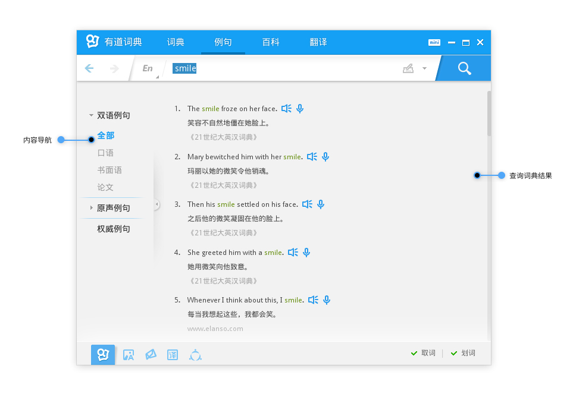

### 百科查询

百度百科详细介绍了单词信息，帮助您全面的掌握词语。

1. 在有道词典界面，点击 **百科**。
2. 在输入框中，输入单词。
3. 点击  或按下键盘上的  键。
4. 在 **百科** 页签下，您可以查看该词语的百科信息。

  

### 全文翻译

有道词典支持中、英、日、韩、法五国语言的全文翻译，其中语言默认为汉英互译。

  

#### 选择源语言和目标语言

1. 在有道词典界面，点击 **翻译**。
2. 点击 **自动检测**。
3. 选择源语言和目标语言。

#### 自动翻译

1. 在 **翻译** 页签下，将要翻译的段落或文章粘贴到原文框中。
2. 点击 **自动翻译**，在译文框中将显示翻译的结果，您可以：
   - 点击 **逐句对照**，在译文框中逐句对照显示原文和译文。
   - 点击 **复制译文**，将译文复制到其他的地方。
   - 点击 **参考例句**，查看更多的例句信息。
3. 如果要清空所有的翻译内容，请点击 **清空**。

> ：为了获得更好的翻译质量，您可以点击 **人工翻译**，跳转到有道人工翻译的网站来提交订单。

#### 收起/展开原文框

在翻译页签下，原文和译文默认为对照显示。您也可以通过设置将原文框收起，在界面中不显示原文信息，只显示译文信息。

1. 在 **翻译** 页签下，点击原文框边缘的  将原文框收起。
2. 如果原文框要恢复显示，请点击  来展开。

#### 更改界面显示

1. 在 **翻译** 页签下，点击右上角的 ，让原文和译文上下对照显示。
2. 点击 ，让原文和译文左右对照显示。

### 查询历史

#### 查看查询历史

在有道词典的词典、例句或百科页签下，您可以查看所有的查询记录。

1. 在有道词典的 **词典**、**例句** 或 **百科** 页签下，点击左上角的 ，可以查看上一个输入词语的查询结果。
2. 点击 ，可以查看下一个输入词语的查询结果。
3. 点击输入框中的 ，在下方将出现查询历史窗口。

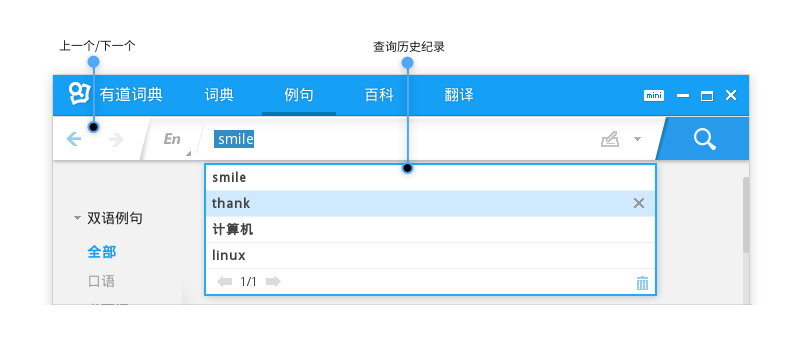

#### 删除查询历史

在查询历史界面，您可以看到当前所有的查询记录。

1. 在查询历史界面，选中一个查询记录，点击  将其删除。
2. 点击 ，可以清空所有的历史记录。

## 迷你模式|../common/icon_minimode.svg|

当有道词典切换到迷你模式后，在桌面仅显示迷你窗口，将释放更多的桌面空间给您进行其他的操作。

### 切换迷你模式

在有道词典界面，点击右上角的 ，切换到迷你模式。

  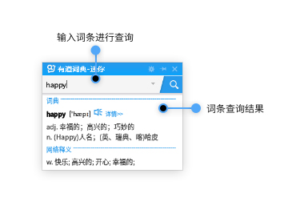

<table>
    <caption>迷你图标说明</caption>
    <tbody>
        <tr>
            <td></td>
            <td>点击可以关闭迷你显示窗口。</td>
            <td class="blank"></td>
            <td></td>
            <td>点击可以在桌面置顶显示单词的查询结果。</td>
        </tr>
        <tr>
            <td></td>
            <td>点击可以进行更多其他的设置。</td>
            <td class="blank"></td>
            <td></td>
            <td>点击可以查询单词。</td>
        </tr>
    </tbody>
</table>

### 迷你置顶显示

在迷你模式下，查询结果会显示在窗口下方。如果您在迷你窗口以外的区域点击鼠标，查询结果会自动缩起并隐藏。

1. 在迷你界面，点击右上角的 ，查询结果将置顶显示在桌面。
2. 如果要解除置顶显示，请点击 。

### 更多迷你设置

在迷你显示界面，点击右上角的 ，您可以：

* 点击 **屏幕取词**，开启/关闭取词功能。
* 点击 **划词翻译**，开启/关闭划词功能。
* 点击 **显示主窗口**，将显示有道词典的主窗口。
* 点击 **软件设置**，将打开有道词典的设置界面。
* 点击 **关闭迷你窗口**，将关闭有道词典的迷你窗口。

  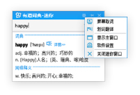

## 图解词典|../common/icon_picturedict.svg|

### 打开图解词典

图解词典细化为多个不同的主题，通过图片您可以直观的了解日常生活中的高频词汇，以加深对单词的记忆。

在有道词典界面，点击左下角的  可以打开图解词典。

 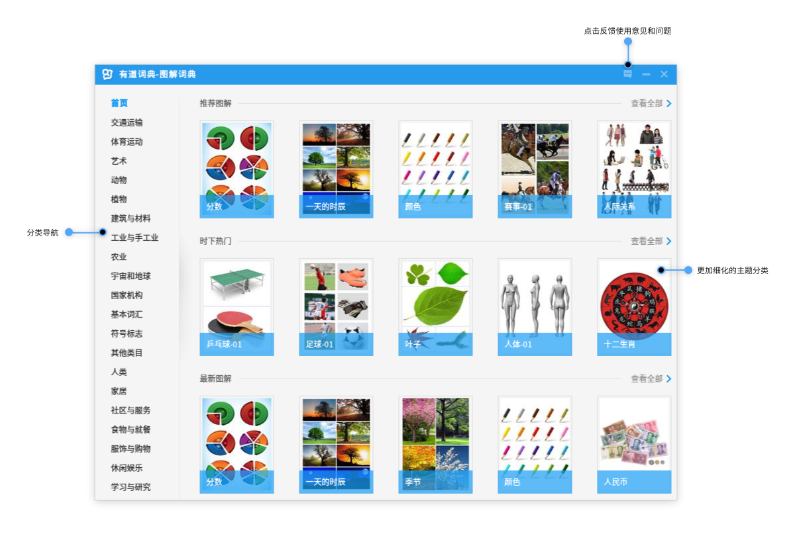

### 查看图解词典

1. 在图解词典界面，点击左侧的分类导航。
2. 选择要查看的主题，图解词典将自动切换到该主题界面。
3. 您可以看到该主题所包含的单词表和对应的图片：
   - 点击 **单词表** 中的词语，在图片的对应位置将显示该单词。
   - 将鼠标指针置于图片中的标注点上，单词表中的对应词语将高亮显示。
   - 点击 **相关单词**，可以查看更多关联词语。
   - 点击 **上一页** 或 **下一页**，可以翻页查看更多单词。

 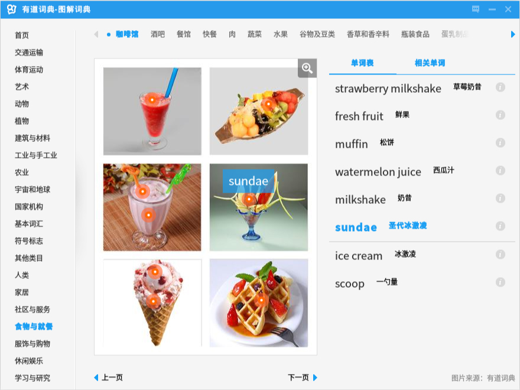

## 选项设置|../common/icon_optionsettings.svg|

### 启动设置

1. 在有道词典界面，点击左下角的 。
2. 点击 **软件设置**。
3. 点击 **基本设置** > **启动**，您可以：
   - 勾选 **开机时自动启动** 复选框，在电脑开机时将自动运行有道词典。
   - 勾选 **启动后最小化到系统托盘** 复选框，有道词典启动后将自动最小化到任务栏上运行。

### 主窗口设置

1. 在有道词典界面，点击左下角的 。
2. 点击 **软件设置**。
3. 点击 **基本设置** > **主窗口**，您可以：
   - 勾选 **窗口关闭时最小化到托盘** 复选框，当点击有道词典界面右上角的  时，有道词典将最小化到任务栏。
   - 勾选 **主窗口总在最上面** 复选框，有道词典将一直置顶显示在桌面。

## 有道应用|../common/icon_youdaoapps.svg|

更多扩展应用，等待您的体验。

在有道词典界面，您可以：

* 点击 ，将跳转到有道学堂页面进行英语在线学习。
* 点击 ，将跳转到有道人工翻译页面提交订单。
* 点击 ，将跳转到有道词典小组页面互相交流学习。

## 获取帮助|../common/icon_gethelp.svg|

如果您在使用有道词典的过程中遇到了问题，您可以在线寻求帮助，或者把您的问题和建议反馈给我们。

1. 在有道词典界面，点击左下角的 。
2. 点击 **帮助**，您可以：
   - 点击 **在线帮助**，将跳转到 FAQ 页面查看常见问题的解答。
   - 点击 **意见反馈**，将跳转到意见反馈页面提交您的意见和建议。
   - 点击 **关于**，查看有道词典的软件介绍。

 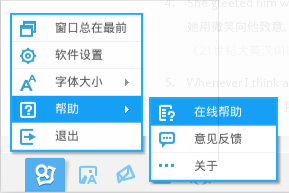

